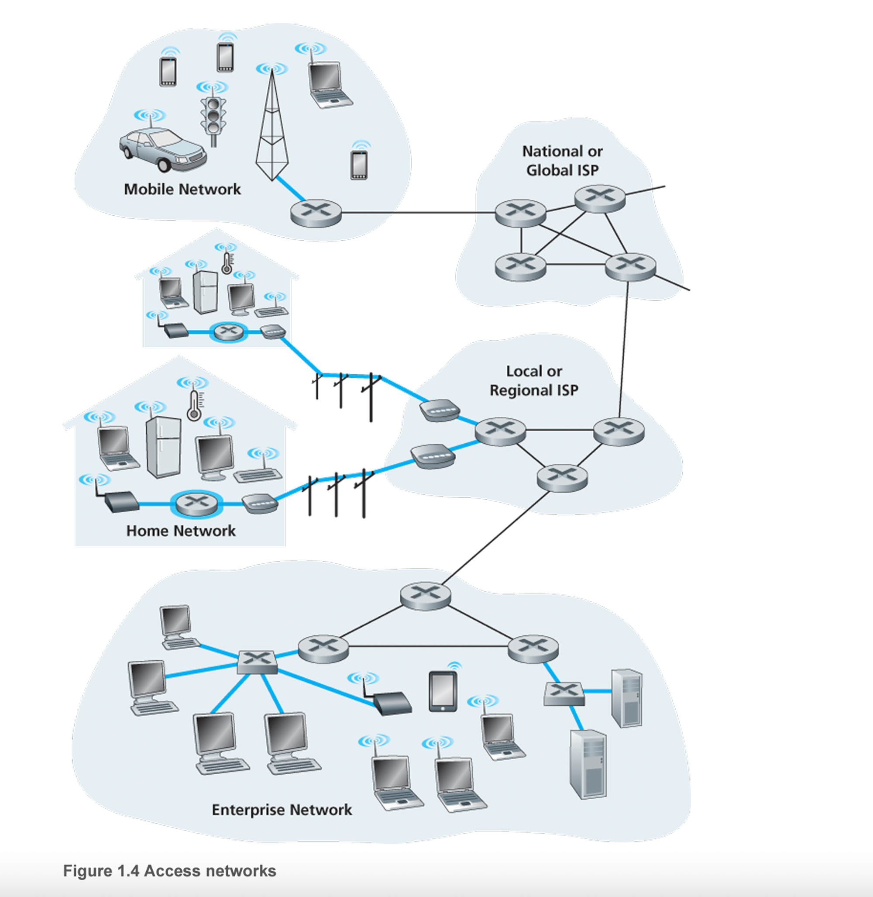
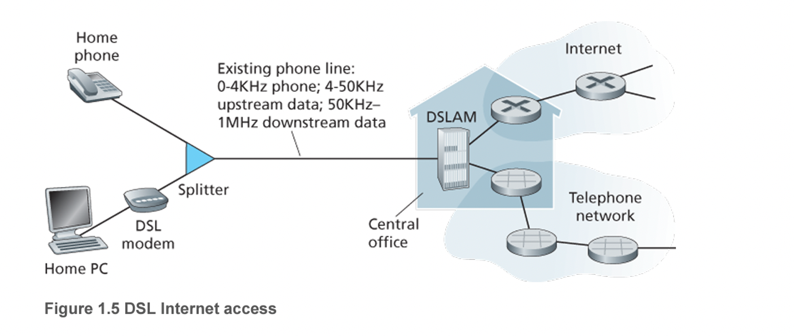
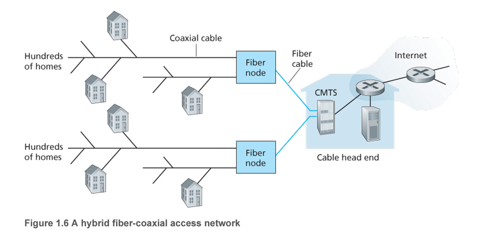
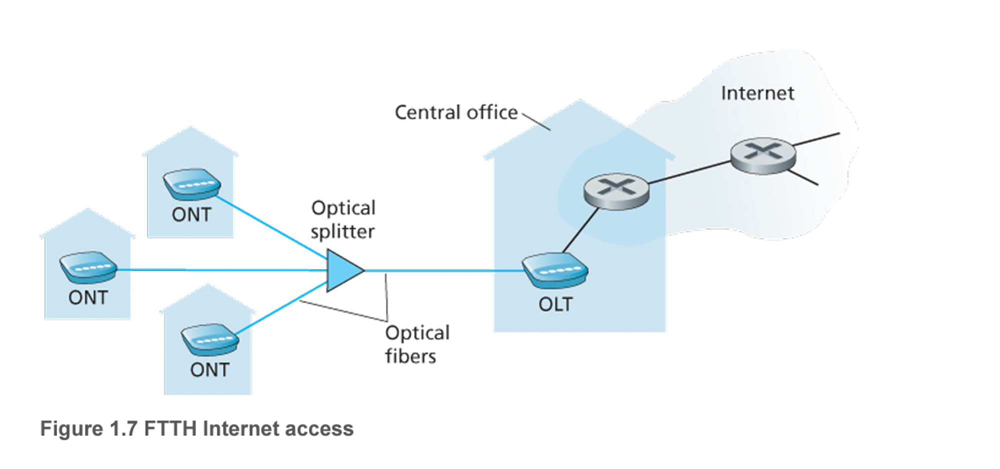
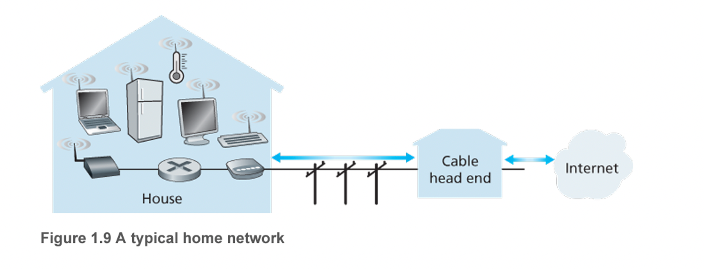
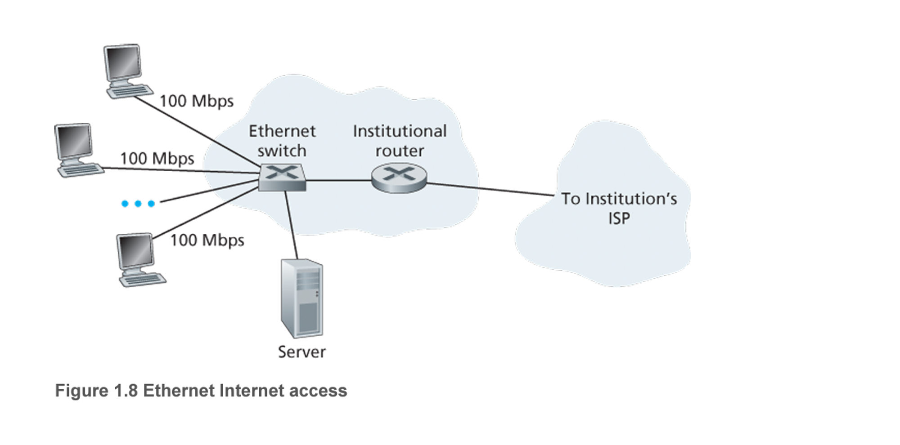

##### 1.2 네트워크의 가장자리

### 접속 네트워크

종단 시스템을 그 종단 시스템으로부터 먼 거리에 있는 다른 종단 시스템까지의 경로상에 있는 첫 번째 라우터에 연결하는 네트워크. 이 방식들 또한 가정, 기업, 광역 무선 접속으로 나뉨

오늘날 두 가지 가장 널리 보급된 광대역 가정 접속 유형. → DSL(Digital Subscriber Line)과 케이블

일반적으로 가정은 유선 로컬 전화 서비스를 제공하는 같은 지역 전화 회사로부터 DSL 인터넷 접속 서비스를 받는다. 따라서 DSL을 사용할 때 고객의 텔코가 ISP도 된다.

### 가정 접속: DSL, 케이블, FTTH, 5G 고정 무선

### DSL

- 일반적으로 Home은 유선 로컬 전화 서비스를 제공하는 (지역이 동일한) 전화 회사(telco)로 부터 DSL 인터넷 접속 서비스를 받는다.(sk, lg u+, kt)
- 각 고객의 DSL 모뎀은 텔코의 지역 중앙국에 위치한 DSLAM과 데이터를 교환하기 위해 기존 전화 회선을 이용한다. 가정의 DSL 모뎀은 디지털 데이터를 받아서 전화선을 통해 CO로 전송하기 위해 고주파 신호로 변환한다. 여러 가정으로부터의 아날로그 신호는 DSLAM에서 디지털 포맷으로 다시 변환된다.
- 고객 쪽에 있는 스플리터는 가정에 도착하는 데이터와 전화 신호를 분리하고 데이터 신호를 DSL 모뎀으로 전송한다. 텔코 쪽의 CO에 있는 DSLAM은 데이터와 전화 신호를 분리하고 데이터를 인터넷으로 송신한다. 수백 혹은 수천 개의 가정들이 하나의 DSLAM에 연결
- 다운스트림과 업스트림 속도가 다르기 때문에 이 접속 방식을 비대칭(asymmetric)이라고 한다.
- 생각보다 차이가 작을 수는 있음 → 제공자가 전송률을 의도적으로 제한하거나 최대 전송률이 가정과 CO간의 거리, 꼬임상선의 규격, 전기적 간섭의 정도에 따라 제한될 수 있음
- 일반적으로 이걸 만들 때 가정과 CO간의 거리를 짧다고 생각하고 만들었기에 만약 16km 이상이란면 다른 방법을 고려

### 케이블

DSL의 경우 텔코의 기존 로컬 전화 인프라스트럭처를 이용하는 반면, 케이블 인터넷 접속은 케이블 TV 회사의 기존 케이블 TV 인프라스트럭처를 이용한다. 가정은 케이블 TV 서비스를 제공하는 같은 회사로부터 인터넷 접속 서비스를 받는다. 일반적으로 우리가 아는 광케이블과 동축케이블 모두 이 시스템에서 채택하고 있기 때문에 흔히 HFC(hybrid fiber coax)라고 부른다.

케이블 인터넷 접속은 케이블 모뎀이라고 하는 특별한 모뎀이 필요. DSL 모뎀처럼 외장형 장치이고 이더넷 포트를 통해 가정 pc에 연결된다. 케이블 모뎀은 HFC 네트워크를 2개의 채널, 다운스트림과 업스트림 채널로 나눈다. DSL처럼 비대칭이며 보통 다운스트림 채널이 업스트림 채널보다 빠른 전송률이 할당된다.

케이블 인터넷의 한 가지 중요한 특성은 공유 방송 매체라는 것.헤드엔드에서 보낸 모든 패킷이 모든 링크의 다운스트림 채널을 통해 모든 가정으로 전달된다. 그리고 가정에서 보낸 모든 패킷은 업스트림 채널을 통해 헤드엔드로 전달한다.

최근에는 FTTH라는 기술이 더 빠른 속도를 제공한다.

- 지역 중앙국(Central Office, CO)로부터 가정까지 **직접 광섬유 경로를 제공한다.**
- 잠재적으로 Gbps의 인터넷 접속 속도를 제공할 수 있다.
- 광신호 분배 기술 : CO로부터 가정까지 광신호를 분해하는 기술들을 말한다.

---

## 기업과 그리고 가정: 이더넷과 와이파이

### LAN(Local area network)

- 종단 시스템을 가장자리 라우터에 연결하는데 사용
- 여러 유형의 기술이 있지만 이더넷 기술이 가장 널리 사용되는 기술

### 이더넷

- 이더넷 스위치에 연결하기 위해 꼬임쌍선을 이용한다.
- 이더넷 스위치 혹은 상호연결된 스위치들의 네트워크는 다시 더 큰 인터넷으로 연결된다.
- 이더넷 접속에서 사용자는 보통 이더넷 스위치에 100Mbps ~ 10Gbps까지의 속도로 접속하고 서버는 1Gbps ~ 10Gbps까지의 속도로 접속한다.

그러나 최근에는 점차 무선으로의 접속이 늘어나고 있음(대표적으로 랩톱, 스마트폰, 태블릿 등). 무선 랜 환경에서 무선 사용자들은 기업 네트워크에 연결된 AP(Access Point)로 패킷을 송신/수신하고 이 AP는 유선 네트워크에 다시 연결된다. 그렇기에 사용자는 AP 반경 내에 있어야함. 대표적인게 와이파이

위에 보이는 가정용 네트워크처럼 케이블 모뎀과 무선 랜 기술을 결합해서 사용한다.

### 광역 무선 접속: 3G,LTE 4G, 5G

- 아이폰, 갤럭시와 같은 이동 장치들은 이동 전화망 사업자들이 운영하는 기지국을 통해 패킷을 송수신하는 데 사용하는 것과 같은 무선 인프라스트럭처를 채택하고 있다. 와이파이와 달리, 사용하는 기지국의 수십 킬로미터 반경내에 있으면 된다.

→ 해당 셀에서 다른 셀로 이동할 경우 해당 아이피도 변경되는 것인가?

→ 모바일 아이피 기술

[모바일 IP](https://ko.wikipedia.org/wiki/모바일_IP)

---

## 물리 매체

앞에서 봤던 것은 네트워크 접속 기술. 여기서 말하는 것은 거기서 사용하는 물리 매체에 대한 설명.

‘한 종단 시스템에서 여러 링크와 라우터를 거쳐 다른 종단 시스템으로 한 비트가 전달된다고 가정’

- 이 비트는 여러 번에 걸쳐 전송(즉, 여러 라우터를 거친다.) → (첫 번째 라우터 → 두 번째 라우터 → … →  목적지)
- 따라서 비트가 출발지에서 목적지로 전달될 때, 일련의 송신기-수신기 쌍을 거친다.
- 여기서 비트는 물리매체 상에 전자파나 광 펄스를 전파하여 전송
- 물리 매체는 여러 형태이며 경로상의 각 송신기-수신기 쌍에 대해 같은 유형일 피리요가 없음
- ex) 꼬임쌍선, 동축케이블, 다중모드 광섬유 케이블, 지상파와 위성파
- 두 부류로 나뉨
    - 유도매체: 광섬유 케이블, 꼬임쌍선 혹은 동축 케이블 같은 견고한 매체를 따라 파형을 유도
    - 비유도 매체: 무선 랜 혹은 디지털 위성 채널의 경우처럼 대기와 야외 공간으로 파형을 전파

### 꼬임쌍선

- 가장 싸고 가장 많이 이용하는 전송 매체
- 전화기에서 전화국 스위치까지 유선 연결의 99% 이상이 꼬임쌍선 이용
- 꼬임쌍선은 2개의 절연 구리선이고 각각은 약 1mm의 굵기로 규칙적인 나선 형태로 배열
- 이웃하는 쌍들 간에 전기 간섭을 줄이기 위해 선들이 꼬여있다.
- 일반적으로 여러 쌍이 보호물에 싸여 한 케이블 안에 함께 묶여있다(UTP)
- 전송률: 전송선의 두께와 송신기와 수신기 사이의 거리에 따라 다름

### 동축케이블

- 꼬임쌍선처럼 동축케이블은 2개의 구리선으로 되어 있으나 두 구리선이 평행하지 않고 동심원 형태를 이루고 있음. 꼬임쌍선보다 더 높은 데이터 전송률을 얻을 수 있음
- 동축케이블은 유도 공유 매체로 사용할 수 있다. 특히 , 여러 종단 시스템은 케이블에 직접 연결할 수 있고 모든 종단 시스템은 다른 종단 시스템이 전송하는 모든 것을 수신한다.

### 광섬유

- 광섬유는 비트를 나타내는 빛의 파동을 전하는 가늘고 유연한 매체
- 단일 광섬유는 초당 10~100기가 비트율을 지원
- 이들은 전자기성 간섭에 영향을 받지 않으며 100km까지는 신호 감쇠 현상이 매우 적고 태핑(도청)하기가 어려움
- 이런 특성 때문에 광역 유도 전송 매체로 널리 이용, 특히 해저 링크에 이용

### 지상 라디오 채널

- 스펙트럼으로 신호를 전달
- 물리 선로를 설치할 필요가 없고, 벽을 관동할 수 있고, 이동 사용자에게 연결성을 제공하고 먼 거리까지 신호를 전달할 수 있다는 가능성 때문에 매력있는 매체
- 특성
    - 전파 환경과 신호가 전달되는 거리에 많은 영향을 받는다.
- 분류
    - 1~2m의 매우 짧은 거리에서 동작하는 채널(개인 장치들)
    - 십에서 수백 미터에 걸쳐 근거리 네트워크로 동작하는 채널(무선 랜 기술)
    - 수십 킬로미터에 걸쳐 광역에서 작동하는 채널(셀룰러 접속 기술)

### 위성 라디오 채널

- 통신 위성은 지상 스테이션이라는 둘 이상의 지상 기반 마이크로파 송신기/수신기를 연결
- 위성은 한 주파수 대역으로 전송 신호를 수신하고 리피터를 이용하여 그 신호를 재생하며 그 신호를 다른 주파수 대역으로 전송
- 전송률
    - 초당 기가비트의 전송률
- 분류
    - 정지 위성: 일정 위치에 계속 머무르게. DSL 접속 혹은 케이블 기반 인터넷 접속을 할 수 없는 지역에서 사용.
    - 저궤도 위성: 저지구에 가깝게 위치하고 지구 상공 어느 한 곳에 고정되지 않는다. 한 지역에 대한 지속적인 서비스를 위해서는 많은 위성이 궤도안에 있어야함.(스타링크)