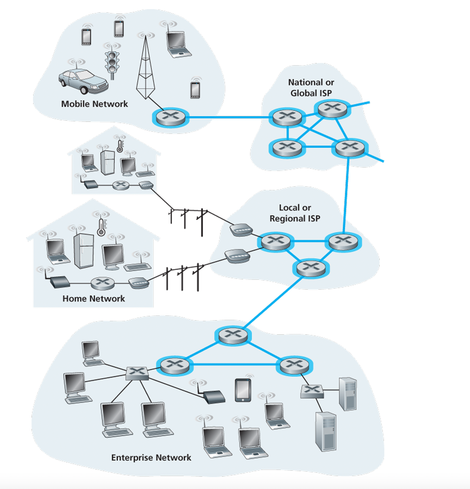
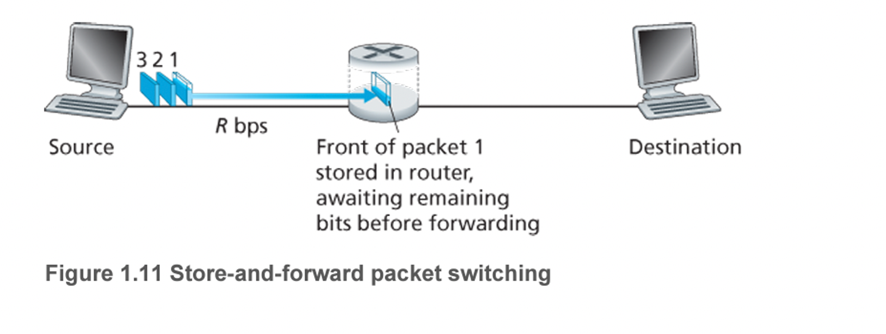
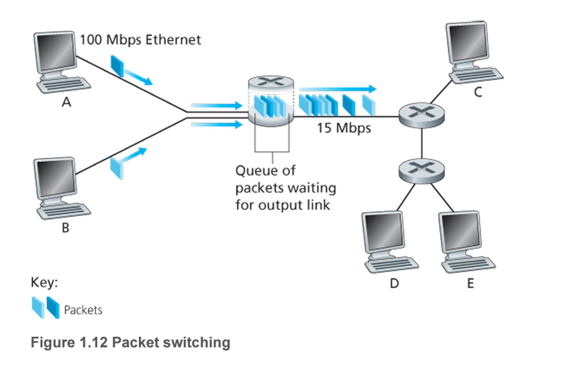
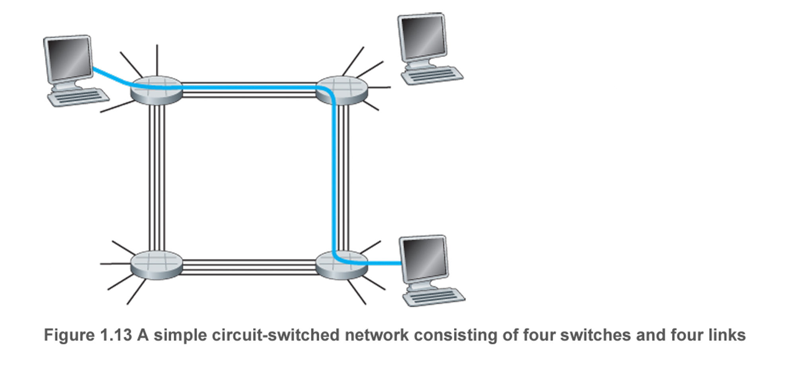
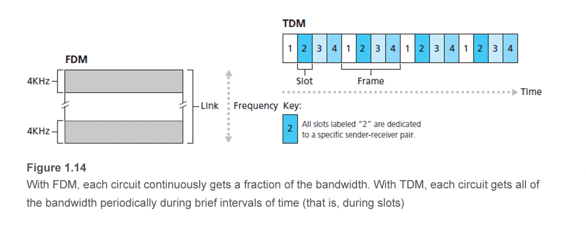
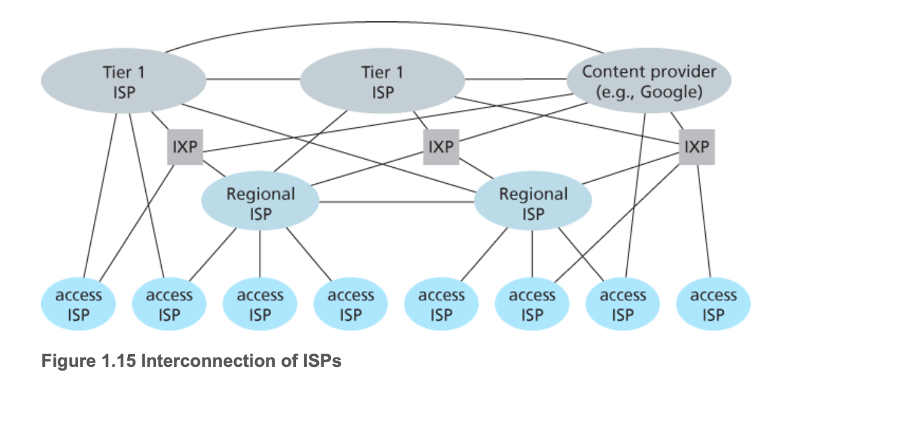

# 1.3 네트워크 코어

여기서는 인터넷의 종단 시스템을 연결하는 패킷 스위치와 링크의 그물망을 좀 더 자세히 살펴봄

<p align="center">

## 패킷 교환

- 출발지 종단 시스템에서 목적지 종단 시스템으로 메시지를 보내기 위해 송신 시스템은 긴 메시지를 패킷이라고 하는 작은 데이터 덩어리로 분할.
- 송신 측과 수신 측 사이에서 각 패킷은 통신 링크와 패킷 스위치를 거치게 된다
- 패킷 스위치 유형
    - 라우터
    - 링크 계층 스위치
- 패킷은 링크의 최대 전송률과 같은 속도로 각각의 통신 링크에서 전송
- 출발지 종단 시스템 혹은 패킷 스위치가 R비트/초의 속도로 링크에서 L비트의 패킷을 전송한다면 그 패킷을 전송하는 걸리는 시간은 L/R초

### 저장-후-전달 방식

- 대부분의 패킷 스위치 방식
- 스위치가 출력 링크로 패킷의 첫 비트를 전송하기 전에 전체 패킷을 받아야함을 의미

<p align="center">

- 2개의 종단 시스템이라고 가정을 해보자
- 출발지는 3개의 패킷을 갖고 이쓰며 각각 L비트로 구성된다.
- 그럼 그림처럼 패킷 1의 일부분을 전송했고 1의 앞쪽이 이미 라우터에 도착한 상황
- 해당 방식에서는 아직 수신하지 못하고 남은 패킷의 비트를 저장한 후, 라우터가 패킷의 모든 비트를 수신한 후에만 출력 링크로 그 패킷을 전송하기 시작한다.

그럼 출발지에서 목적지까지 수신할 때의 경과 시간은?(전파 지연은 고려x)

- 출발지는 0에 전송
- L/R초에 출발지는 전체 패킷을 전송했고 전체 패킷이 라우터에 수신되고 저장되었다.
- L/R초에 라우터가 목적지로 전송하기 시작
- 2L/R 시각에 라우터는 전체 패킷을 전송했고 수신 시스템이 전체 패킷을 수신
- 전체 지연 시간은 2L/R
- 그렇기에 이걸 가정하여 3개를 보낸다면 4L/R이 걸림
- 원래는 2L/R이 걸릴게 2L/R의 지연시간으로 4L/R이 걸린거임
- 종단간 지역 시간(d) = N*L/R

### 큐잉 지연과 패킷 손실

- 각 패킷 스위치는 접속된 여러개의 링크를 가짐
- 각 링크에 대해 패킷 스위치는 출력 버퍼(= 출력 큐)를 갖고 있으며 그 링크로 송신하려고 하는 패킷을 저장

<p align="center">

- 도착하는 패킷이 한 링크로 전송되어야 하는데 그 링크가 다른 패킷을 전송하고 있다면 도착하는 패킷은 출력 버퍼에서 대기
- 따라서 저장-후-전달 지연뿐만 아니라, 출력 버퍼에서 큐잉 지연 시간도 가짐.
- 위에서 봤듯이 가변적이고 네트워크의 혼잡 정도에 따라 다름
- 그리고 이렇게 다른 전송을 위해서 버퍼가 가득차있다면 들어오는 패킷을 버려야하는 패킷 손실 또한 발생.
- 위 그림처럼 A,B에서 100Mbps 이더넷 링크로 보내고 라우터가 E로 15Mbps 링크로 보낸다하면 당연히 큐에서 대기하는 시간을 가져야할 것이다. 이것에 대한 자세한 설명은 1.4에서
- 패킷들은 3차원 조각으로 나타내는데 너비는 패킷의 비트수를 나타낸다.

### 포워딩 테이블과 라우팅 프로토콜

그러면 라우터는 어느 패킷을 어느 링크로 전달해야하는지 결정하는가? 

- 인터넷에서 모든 종단 시스템은 IP 주소라고 하는 주소를 갖는다.
- 출발지 종단 시스템이 패킷을 목적지 종단 시스템으로 보내고자 할 때, 출발지는 패킷의 헤더에 목적지의 IP주소를 포함
- 각 라우터는 목적지 주소를 라우터의 출력 링크로 매핑하는 포워딩 테이블을 갖고 있다. 패킷이 라우터에 도착하면 라우터는 올바른 출력 링크를 찾기 위해 주소를 조사하고 이 목적지 주소를 이용하여 포워딩 테이블 검색 → 라우터는 그 패킷을 출력 링크로 보냄
- 그러나 아직 풀리지 않는 의문은 어떻게 포워딩 테이블이 설정될건데? 그건 나중에 배움
- 잠깐 언급하면 인터넷은 자동으로 포워딩 테이블을 설정하는데 이용되는 여러 특별한 라우팅 프로토콜을 갖고 있음
    - 예를 들어, 라우팅 프로토콜은 각 라우터로부터 각 목적지까지의 최단 경로를 결정하고 라우터에 포워딩 테이블을 설정하는 데 이 최단 경로 결과를 이용

---

## 회선 교환

링크와 스위치의 네트워크를 통해 데이터를 이동시키는 방식에는 회선 교환과 패킷 교환이 있음. 앞에서 다룬 내용은 패킷 교환 여기서는 회선 교환을 다룰 예정

- 회선 교환 네트워크에서 종단 시스템 간에 통신을 제공하기 위해 경로상에 필요한 자원(버퍼, 링크 전송률)은 통신 세션 동안에 확보 또는 예약 된다.(그에 반해 패킷 교환은 그렇지 않음)
- 세션 메시지는 온디맨드 방식으로 자원을 요청하여 사용하고 그 결과, 통신 링크에 대한 접속을 위해 기다릴 수도 있다.
- 대표적으로 전통적인 전화망이 있음
    - 둘이 전화를 하고 싶어? → 먼저 세팅을 해야함 → 송신자와 수신자 사이에 있는 스위치들이 연결 상태 유지를 위한 연결(회선) → 네트워크가 회선 연결 하는 동안 네트워크 링크에 일정한 전송률 예약

<p align="center">

- 만약 두 호스트가 연결하고 싶으면 종단간 연결을 설정
- 2개의 링크에 한 회선을 예약
- 각 링크는 4개의 회선을 가지므로 만약 1Mbps의 전송률을 갖는다면 각 종단 간 회선 교환 연결은 지정된 전송률의 250Kbps를 얻게 된다.

### 회선 교환 네트워크에서의 다중화

- 링크 내 한 회선은 주파수 분할 다중화(FDM) 혹은 시분할 다중화(TDM)로 구현된다.
- FDM
    - 그 링크의 주파수 스펙트럼을 공유
    - 특히 그 링크는 연결되는 동안 각 연결에 대해 주파수 대역을 제공
    - FM 라디오 방송
- TDM
    - 시간을 일정 주기의 프레임으로 구분하고 각 프레임은 고정된 수의 시간 슬롯으로 나뉜다.
    - 네트워크가 링크를 통해 하나의 연결을 설정할 때, 네트워크는 모든 프레임에서 시간 슬롯 1개를 그 연결에 할당한다.
    - 이들 슬롯은 그 연결을 위해 사용되도록 할당되고 그 연결의 데이터를 전송하기 위해 모든 프레임에 하나의 시간 슬롯을 갖게 된다.
    - 전송률 : 한 슬롯 안의 비트 수 × 프레임 전송률
    - 한 프레임이 한 회선이라 생각(예를 들어 64000비트의 파일을 보낸다고 했을 때 1.536Mbps의 전송률에 24개의 슬록을 가진다 하면 파일을 보내는데 64Kbps가 걸리고 10초가 걸림(물론 이건 회선 설정시간을 제외한 시간))

<p align="center">

여기서 아쉬운점은 결국은 예약을 해서 해당 회선을 사용하는 것이기에 둘이서 잠시 대화를 안하는 것처럼 사용하지 않고 있다고 하더라도 둘이 연결이 끊기지 않는 이상 다른 연결자가 해당 회선을 사용하지 못하기에 낭비가 발생할 수 있다.

### 패킷 교환 대 회선 교환

패킷 교환 반대자

- 가변적이고 예측할 수 없는 종단 간의 지연 때문에 패킷 교환이 실시간 서비스(ex) 전화)에는 적당하지 않다.

패킷 옹호자

1. 패킷 교환이 회선 교환보다 전송 용량의 공유에서 더 효율적이다.
2. 패킷 교환이 더 간단하고 효율적이며 회선교환보다 구현 비용이 적다.

이것에 대해 더 확실히 비교하기 위해 몇가지 예시를 들어보자

```
1. 사용자가 1Mbps 링크를 공유한다고 가정.또한 각 사용자는 활동시간(100kbps의 일정 속도로 데이터를 
생산할 때)과 비활동 시간(데이터를 생산하지 않을 때)를 반복. 사용자는 전체 시간에서 10%만 활동
```

회선 교환(TDM)

- 100kbps가 항상 각각의 사용자에게 예약 되어야함.
- 예를들어, 회선 교환 TDM에서 초당 프레임이 100ms마다 10개 시간 슬롯으로 나뉜다면 각 사용자에게는 한프레임에 한 번의 시간 슬롯이 할당
- 그렇기에 동시에 10명만 지원할 수 있음(= 1Mbps/100kbps)
- 한 특정 사용자가 활동하고 있을 확률은 0.1 그럼 35명이 있을 때 11명 이상의 사용자가 동시에 활동할 확률은 0.0004
- 만약 10명 이하의 사용자가 있다면(99.96%), 데이터의 통합 도착률은 1Mbps보다 작거나 같다.
- 따라서 10명 이하의 동시 사용자가 있을 때, 사용자의 패킷은 회선 교환의 경우와 마찬가지로 지연 없이 링크를 통과

패킷 교환

- 10명 이상이면 패킷의 통합 도착률이 링크의 출력 용량을 초과하므로 출력큐가 커짐
- 10명 이상의 동시 사용자가 있을 확률은 매우 작으므로 패킷 교환은 거의 항상 회선 교환과 대등한 지연 성능을 가지면서도 거의 3배 이상의 사용자 수를 허용한다.

```
2. 10명의 사용자가 있다고 가정하자. 1번과 동일하게, 사용자는 1 Mbps 링크를 공유한다.
한 사용자가 한번에 1,000비트 패킷을 1,000개 생성하고 다른 사용자는 패킷을 생성하지 않는다.
```

회선 교환(TDM)

- 사용자는 데이터 전송을 위해 한 프레임당 1개의 시간 슬롯만 사용할 수 있다.
- 반면에 각 프레임에 남겨진 9개의 시간 슬롯은 쉬는 상태가 된다.
- 사용자가 100만 비트를 모두 전송하려면 10초가 걸린다.

패킷 교환

- 패킷을 생성하는 다른 사용자가 없기에 다중화 요구되지 않고 사용자는 1Mbps의 링크가 가득 찰 때까지 패킷을 계속 보낼 수 있다. 그러므로 1초만에 클리어

위 예시를 보듯이 오늘날 회선 교환에서 패킷 교환으로 전환되는 이유이다.


---

## 네트워크의 네트워크

- ISP: 패킷 스위치와 통신 링크로 이루어진 네트워크
- 종단 시스템은 ISP를 통해 인터넷에 연결
- 접속 ISP는 다양한 접속 기술(DSL, 케이블, FTTH, 와이파이, 셀룰러(이동 통신) 등)을 이용하여 유선 또는 무선 연결을 제공한다.
- 이러한 ISP는 텔코 혹은 케이블 회사일 필요는 없음

모든 종단 시스템이 서로에게 패킷을 보낼 수 있도록 접속 ISP를 연결하는 방법

→ 가장 쉬운 방법은 ISP를 직접 서로 다른 ISP와 연결하는 것

→ 이러한 그물망 설계는 접속 ISP에게 너무 많은 비용을 발생 시킴

→ 왜냐면 각 접속 ISP가 전 세계적으로 다른 접속 ISP와 수십만 개의 개별적인 통신 링크를 유지해야하기 때문

오늘날의 인터넷 네트워크 구조를 이해하기 위해 점진적으로 일련의 네트워크 구조를 만들어보자

### 네트워크 구조1

모든 접속 ISP를 하나의 글로벌 통과 ISP와 연결한다. 

- 글로벌 ISP는 라우터와 전 세계에 이르고 적어도 수십만 개의 접속 ISP와 가까운 곳에 있는 라우터를 갖는 통신 링크의 네트워크
- 이러한 글로벌 ISP는 구축하는데 비용이 많이 든다.
- 글로벅 ISP는 각각의 접속 ISP에게 요금을 부과
    - 제공자: 글로벌 ISP
    - 고객: 접속 ISP

### 네트워크 구조2

상위층에 글로벌 통과 서비스 제공자가 있고 하위층에 접속 ISP가 있는 형태의 2계층 구조

- **글로벌 ISP들은 서로 연결해야만 한다.**
- 그렇지 않으면 하나의 글로벌 ISP와 연결된 접속 ISP는 다른 글로벌 통과 서비스 제공자에 연결된 ISP와 통신할 수 없다.

전세계의 모든 도시에 존재하는 ISP는 없다.

- 대신 어느 주어진 지역에서 그 지역에 있는 접속 ISP들이 연결하는 지역(Regional ISP)가 있다.
- 각 지역 ISP는 1계층 ISP들과 연결된다. 하지만 실제로 존재하는 1계층 ISP는 전 세계적으로 모든 도시에 존재하지 않는다.

### 네트워크 구조3

다중 계층구조(접속 ISP, 지역 ISP, 1계층 ISP)

한 도시에 접속 ISP가 있고 이들은 지방 ISp에 연결되며 또 다시 이들은 국가 ISP에 연결되고 최종적으로 1계층 ISP에 연결된다.

고객 ISP는 글로벌 인터넷 연결성(interconnectivity)을 얻기 위해 서비스 제공 ISP에게 요금을 지불하기 때문에

"각 레벨에는 고객-제공자 관계가 존재한다"고 할 수 있다.

### 네트워크 구조4

오늘날의 인터넷과 좀 더 유사한 네트워크를 구축하기 위해서는 PoP(Points of Presence), 멀티홈(multi-homing), 피어링(peering), IXP(Internet exchange point)를 계층적인 네트워크 구조 3에 포함해야함

PoP

- 최하위 계층(접속 ISP) 계층을 제외하고 계층 구조의 모든 계층에 존재한다.
- 제공자의 네트워크 내에 있는(같은 위치에 존재하는) 하나 혹은 그 이상의 라우터 그룹이며, 여기서 고객 ISP가 제공자 ISP에 연결될 수 있음
- 고객 네트워크가 제공자의 PoP에 연결되기 위해, 고객은 자신의 라우터 중 하나를 PoP에 있는 라우터에 직접 연결하도록 고속 링크를 제 3자 통신 서비스 제공자로부터 임대할 수 있음

멀티홈

- 둘 혹은 그 이상의 제공자 ISP에 연결하도록 선택할 수 잇음
- 서비스 제공자 중 하나가 연결되지 않더라도 인터넷으로 패킷을 계속해서 송수신할 수 있다.

피어링

- 고객 ISP가 제공자 ISP에게 주는 비용을 줄이기 위해, 인터넷 계층 구조의 같은 계층에 있는 가까운 ISP들은 피어링 할 수 있다.
- 즉, 이들 간에 송수신되는 모든 트래픽을 상위 계층 ISP를 통하지 않고 직접 송수신할 수 있도록 이들은 자신들의 네트워크를 서로 직접 연결
- 일반적으로 서로는 요금 지불 x

IXP

- 제 3의 회사가 IXP를 구축할 수 있으며 다중의 ISP들이 서로 피어링할 수 있는 만남의 장소라고 할 수 있음
- 교환기를 갖춘 독자적인 빌딩

### 네트워크 구조 5

4 위에 콘텐츠 제공자 네트워크를 추가함으로써 구축한다.

- 현재 구글이 이러한 콘텐츠 제공자 네트워크를 주도하는 예이다.
- 이 네트워크는 전 세계를 연결하며 공중 인터넷과는 분리되어 있다.
- 이 네트워크는 구글 서버로 오가는 트래픽만 전달한다는 점(물론 아직 많은 접속 ISP들은 1계층을 거침)
- 오늘날의 인터넷은 복잡하며 12개 정도의 1계층 ISP들과 수십만 개의 하위 계층 ISP들로 구성되어 있다.

<p align="center">