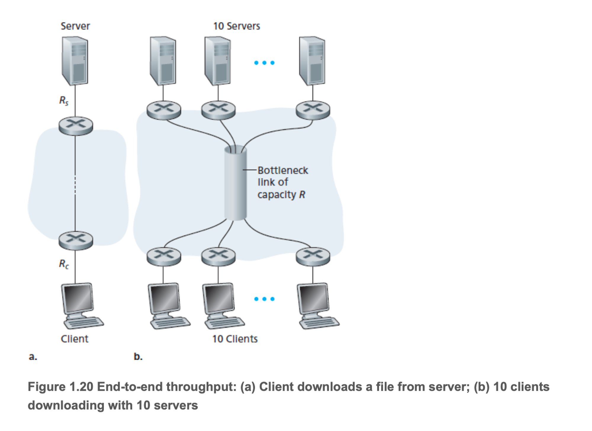

# 1.4 패킷 교환 네트워에서의 지연, 손실과 처리율

컴퓨터네트워크는 반드시 두 종단 시스템 간에 처리율(전달될 수 있는 초당 데이터의 양)을 제한하여 종단 시스템 간에 지연을 야기하며 실제로 패킷을 잃어버리기도한다. 그렇기에 지연과 손실이 야기됨

## 패킷 교환 네트워크에서의 지연 개요

- 패킷이 경로를 따라 한 노드에서 다음 노드로 전달되므로 경로상의 각 노드에서 지연을 겪게 됨
- 지연 종류
    - 노드 처리 지연
    - 큐잉 지연
    - 전송 지연
    - 전파 지연
- 이것들이 쌓여서 전체 노드 지연을 일으킴
- 라우터 사이에서 하나의 출력 링크가 존재
- 이 링크 앞에 큐가 있으며 패킷 헤더를 조사하여 해당 링크로 보내게 됨
- 만약 해당 링크를 누군가 사용하지 않는다면 바로 전송이 될 것이고 그렇지 않다면 큐에 쌓이게 된다.

### 처리 지연

- 패킷 헤더를 조사하고 그 패킷을 어디로 보낼지를 결정하는 시간
- 업스트림 노드에서 라우터 A로 패킷의 비트를 전송하면서 발생하는 패킷의 비트 레벨 오류를 조사하는데 필요한 시간 포함
- 고속 라우터에서는 수 마이크로초
- 처리 후에는 큐에 보내게된다.

### 큐잉 지연

- 큐에서 링크로 전송되기를 기다리는 시간
- 큐잉 지연 길이는 큐에 저장되어 링크로 전송되기를 기다리는 다른 패킷의 수에 의해 결정
- 만약 비어있다면 0
- 수 마이크로초에서 수 밀리초

### 전송 지연

- 패킷의 길이를 L비트, 링크의 전송률을 Rbps라고 하자
- 전송 지연 = L/R (패킷의 모든 비트를 링크로 밀어내는데 걸리는 시간)
- 수 마이크로초에서 수 밀리초

### 전파 지연

- 링크의 처음부터 라우터 B까지의 전파에 필요한 시간
- 비트는 링크의 전파 속도로 전파
- 전파 속도는 링크의 물리매체에 따라 다름 (2*10^8m/s ~ 3*10^8m/s)
- 두 라우터 사이의 거리를 전파 속도로 나눈 것 (d/s, 거리, 전파 속도)
- 마지막 비트까지 B노드에 전달되면 라우터 B에 저장

### 전송 지연 vs 전파 지연

- 전송 지연은 패킷을 내보내는 데 필요한 시간
- 전파 지연은 비트가 한 라우터에서 다음 라우터로 전파되는데 걸리는 시간
    

    
- 예시를 보면 요금소가 서비스하는데 걸리는 시간이 분당 5대라고한다면 모든 차량(10대)이 서비스되는데는 2분이 걸린다.(전송 지연)
- 그리고 한 계산소에서 다음 계산소로 이동하는데 100km/h의 속도로 간다면 1시간이 걸린다.(전파 지연)
- 그럼 만약 서비스 시간이 더 걸린다면?
- 충분히 그럴수 있다. 그렇기에 다음과 같이 전체 지연 시간을 나타낸다
- 전체 지연 시간 = 처리 지연 + 큐잉 지연 + 전송 지연 + 전파 지연
- 각각의 지연 시간은 여러 요소(거리와 같은)로 무시될 수도 있고 주요 요소가 될 수 있다.

---

## 큐잉 지연과 패킷 손실

- 다른 지연들과 달리 큐잉 지연은 패킷마다 다를 수 있다.
- 예를 들어 10개의 패킷이 동시에 비어 있는 큐에 도착한다면, 전송된 첫 패킷은 큐잉 지연을 겪지 않지만 마지막으로 전송되는 패킷은 상당히 많은 큐잉 지연 시간을 겪는다.
- 따라서 큐잉 지연 묘사에서는 평균 큐잉, 큐잉 지연의 분산, 큐잉 지연이 어느 특정 값을 넘을 확률 등을 이용
- 언제 큐잉 지연이 크고 미미한가? → 큐에 도착하는 비율, 링크의 전송률, 도착하는 트래픽의 특성

예를 들어보자(큐는 무한하다 가정)

- a는 패킷이 큐에 도착하는 평균율, R은 큐에서 밀려나는 비율(전송률), 모든 패킷은 L비트
- 그럼 비트가 큐에 도착하는 평균율은 Lab/s, 그럼 여기서 트래픽 강도는 La/R인데 La/R > 1이면 평균율이 전송률 보다 높다는 의미. 그렇기에 시스템 설계에서 1보다 크지 않게 설계가 기본 원칙
- ≤1인 경우는 트래픽의 특성에 따라 달라짐
- 만약 비어있다면 지연 시간이 없겠지만 버스트 상황이라면 상당한 평균 큐잉 지연 시간을 겪게된다.

### 패킷 손실

- 앞에서는 큐가 무한대라고 가정했는데 현실은 그렇지 않음.
- 큐 용량이 유한하므로 트래픽 강도가 1에 접근함에 따라 패킷 지연이 실제로 무한대가 되지 않음.
- 대신 큐에 못 넣으면 그 패킷을 버려버림.
- 즉 잃어버린다고 표현
- 손실 패킷의 비율은 트래픽 강도가 클수록 증가
- 그러므로 노드에서의 성능은 흔히 지연뿐만 아니라 패킷 손실 확률로도 측정

---

## 종단 간 지연

- 호스트 사이에 N-1개의 라우터 있다고 가정
- 네트워크 혼잡하지 않음(큐잉 지연 무시), 전송률은 R, L은 패킷 길이, 전송 지연 = L/R
- 종단간 지연 = N(호스트의 처리 지연 + 전송 지연 + 전파 지연)

### Traceroute

- 네트워크 지연을 느끼기 위한 프로그램
- 어떤 인터넷 호스트에서든 수행 가능
- 사용자가 목적지 호스트 이름을 제시하면 출발지 호스트에 있는 프로그램은 목적지를 향해 여러 개의 특별한 패킷을 보냄
- N-1 라우터가 있다고 가정. 호스트는 N개의 특별 패킷을 보냄
- i번째 라우터가 i번째 패킷을 받으면 목적지가 아닌 출발지에 역으로 메시지를 보냄
- 목적지가 N번째 패킷을 받으면 그 패킷을 파기하고 출발지로 메시지 보냄
- 출발지는 이러한 응답 메시지를 받을 때까지 경과 시간을 기록
- 실제로는 이 과정을 3번 반복

### 종단 시스템. 애플리케이션 그리고 그 밖의 지연

- 처리, 전송, 전파 외의 지연
- 공유 매체(와이파이 혹은 케이블 모뎀)로 패킷을 전송하고자 하는 종단 시스템은 다른 종단 시스템과 매체를 공유하기 위해 프로토콜의 일부로 전송을 의도적으로 지연 시킬 수 있음
- 이에 대한 내용은 6장에 나옴
- 다른 예시는 VoIP 어플리케이션에 있는 미디어 패킷화 지연
- VoIP에서 송신 측은 먼저 패킷을 인터넷으로 보내기 전에 패킷을 인코딩된 디지털 음성으로 채움
- 이 채우는 시간이 미디어 패킷화 지연

---

## 컴퓨터 네트워크에서의 처리율

- 지연과 패킷 손실 이외의 또 다른 주요 성능 수단은 종단 간 처리율

호스트 A에서 호스트 B로 커다란 파일을 전송하는 것을 고려

- p2p 방식으로 커다란 파일을 보낸다 했을 때 어느 한 순간에서의 순간적인 처리율은 호스트 B가 파일을 수신하는 비율
- 만약 파일이 F비트로 구성되고 호스트 B가 모든 F비트를 수신하는 데 T초가 걸린다고 한다면, 이때 파일 전송의 평균 처리율은 (F/T) b/s

1.19(a) 상황

- Rs < Rc 라면 정상적으로 서버에서 클라이언트로 흘러감
- 반면엔 Rs > Rc인 상황이면 라우터에서 바로 바로 내보내지 못하고 쌓이게 된다.
- 위처럼 처리율은 min(Rc,Rs), 즉 병목 링크의 전송률이 처리율이 된다.
- F비트의 커다란 파일을 서버에서 클라이언트로 전송하는데 걸리는 시간 = F/min(Rs,Rc)
- 예
    - F=3200 bit, Rs = 2Mbps, Rc = 1Mbps의 접속 링크
    - 이 파일을 전송하는데 걸리는 시간은 32초

1.19(b) 상황

- 서버와 클라이언트 사이에 N개의 링크를 가진 상황
- 각각의 전송률은 R1,R2, … , Rn
- 앞에서 본거와 같이 처리율은 min(R1, R2, .. , Rn) → 병목 링크의 전송률

1.20(a) 상황

- 서버는 Rs의 접속 링크 속도로 네트워크에 연결, 클라이언트는 Rc의 접속 링크 속도로 네트워크에 연결
- 네트워크 코어에 있는 모든 링크가 Rs와 Rc 보다 매우 높은 전송률을 갖는다고 가정
- 전체 네트워크에서 보내진 비트들은 서버에서 클라이언트로 가는 비트가 유일하다고 가정
- 처리율 = min(Rs,Rc)
- 따라서 오늘날의 인터넷에서의 처리율에 대한 제한 요소는 전형적으로 접속 네트워크

1.20(b) 상황

- 10개의 서버와 10개의 클라이언트로 구성
- 10개의 동시적인 다운로드 가정(이 트래픽이 유일한 트래픽이라 가정)
- 코어에 하나의 링크가 존재
- 이 링크 R의 전송률을 R이라고 하자
- 모든 서버 접속 링크가 Rs의 속도를 가지며, 모든 클라이언트 접속 링크는 같은 Rc의 속도를 갖고 코어에서의 모든 링크의 전송률은 Rs,Rc,R보다 크다고 가정
- 각 다운로드에 대한 처리율 = min(Rs,Rc)
- 예
    - Rs = 2Mbps, Rc = 1Mbps, R = 5Mbps라면 병목은 더 이상 접속 네트워크가 아니라 공유 링크에서 병목이 발생
    - 그렇기에 10개의 다운로드이기에 종단 간 처리율은 500kbps가 된다.