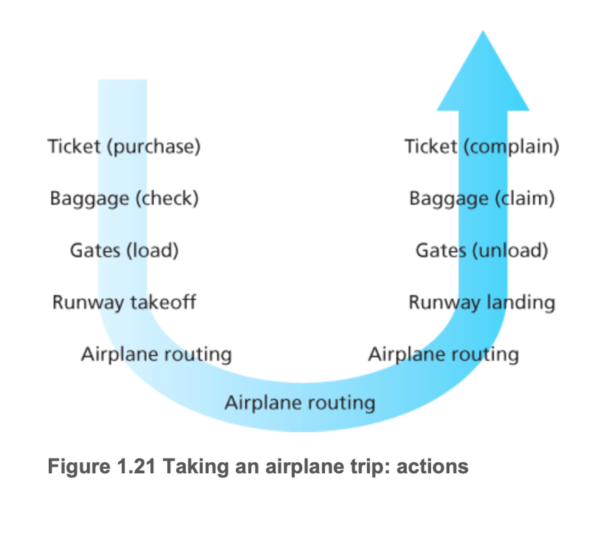
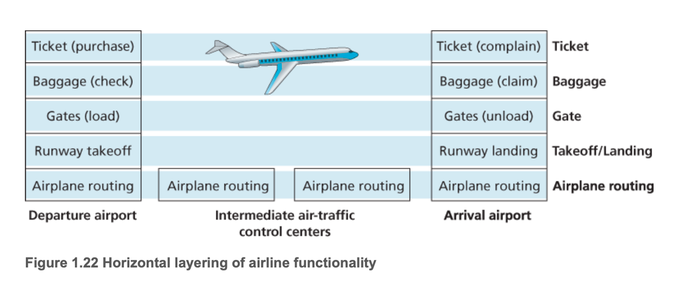
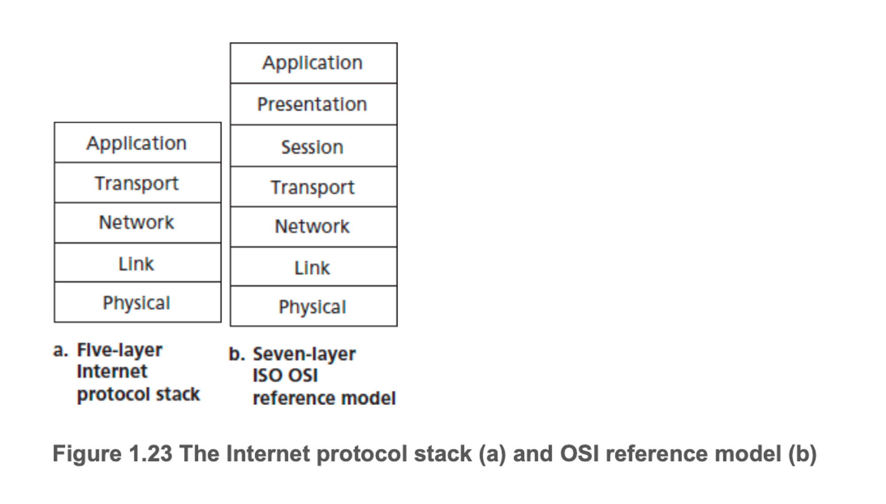
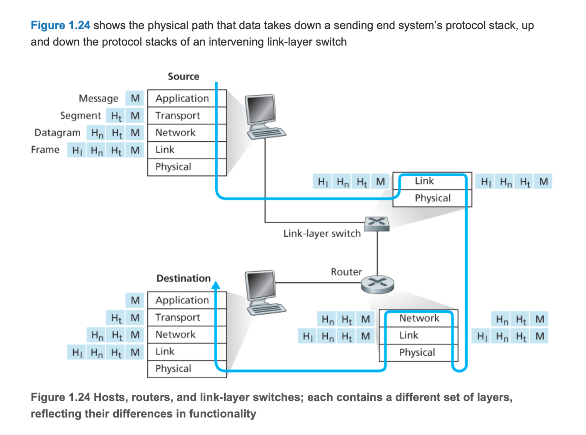

# 1.5 프로토콜 계층과 서비스 모델

어떻게 네트워크 구조를 조작하는가?

## 계층 구조

- 시스템은 계층구조를 가질 때, 그 계층이 제공하는 서비스의 구현을 변경하는 것도 쉽다.
- 한 계층이 상위 계층에 같은 서비스를 제공하고 하위 계층의 서비스를 이용하는 한, 어떤 한 계층의 구현이 변하더라도 시스템의 나머지 부분은 변하지 않는다.

그럼 만약 항공시스템을 설명해달라하면 어떻게 설명할 것인가?

- 비행기를 탈 때 취하는 일련의 행동을 설명할 것이다.

  
  

이것은 네트워킹과 매우 유사하다

- 인터넷에서 패킷은 출발지 호스트에서 목적지 호스트로 수송된다.
- 하나의 계층 구조의 형태로 네트워크 구조가 이루어져있다.

### 프로토콜 계층화

- 네트워크 프로토콜의 설계 구조를 제공하기 위해 계층으로 조직한다.
- 각 프로토콜은 한 계층에 속하고 다시 한 계층이 상위 계층에 제공하는 서비스에 관심을 갖고, 이것을 계층의 서비스 모델이라고 한다.
- 프로토콜 계층은 소프트웨어, 하드웨어 또는 둘의 통합으로 구현
- HTTP와 SMTP 같은 애플리케이션 계층 프로토콜은 대부분 종단 시스템의 소프트웨어로 구현되며 트랜스포트 프로토콜도 마찬가지
- 물리계층과 링크 계층은 특정 링크상에 통신을 다루는 책임이 있으므로 그들은 전형적으로 부여된 링크와 관련된 네트워크 인터페이스 카드로 구현(이더넷이나 와이파이 인터페이스 카드)
- 네트워크 계층은 종종 하드웨어와 소프트웨어로 혼합 구현
- 아래는 프로토콜 스택이라고 한다.

- 이러한 계층화는 시스템 구성요소의 갱신을 더 쉽게 해준다.
- 반대측 의견
    - 한 계층의 기능이 하위 계층과 기능적으로 중복된다. 예를 들어, 많은 프로토콜 스택이 링크와 종단 시스템 두 곳 모두에서 오류 복구 기능을 제공
    - 어느 한 계층에서의 기능이 다른 계층에만 존재하는 정보를 필요로 할 수 있다.

### 애플리케이션 계층

- HTTP, SMTP, FTP 같은 많은 프로토콜을 포함.
- 어플리케이션 계층에서 도메인 네임 서버가 도메인이 32비트 네트워크 주소로 변환하는 기능을 돕는다.
- 이 계층 프로토콜은 여러 종단 시스템에 분산되어 있어서 한 종단 시스템에 있는 애플리케이션이 다른 종단 시스템에 있는 애플리케이션과 정보 패킷을 교환하는 데이 프로토콜 사용
- 여기서 정보 패킷을 메시지라고 부름

### 트랜스포트 계층

- 클라이언트와 서버 간에 애플리케이션 계층 메시지를 전송하는 서비스를 제공
- 대표적인 프로토콜은 TCP, UDP
- TCP
    - 연결 지향형 서비스를 제공
    - 목적지로의 애플리케이션 계층 메시지 전달 보장과 흐름 제어를 포함
    - 긴 메시지를 짧은 메시지로 나누고 혼잡 제어 기능을 제공하여 네트워크가 혼잡할 때 출발지의 전송률을 줄이게 한다.
- UDP
    - 비연결형 서비스를 제공
    - 신뢰성, 흐름제어, 혼잡 제어를 제공하지 않는 간단한 서비스
- 이 계층에서의 패킷은 세그먼트라고 한다.

### 네트워크 계층

- 한 호스트에서 다른 호스트로 데이터그램을 라우팅하는 책임을 가짐
- 트랜스포트 계층에서 세그먼트와 목적지 주소를 네트워크 계층으로 전달한다.
- 그런 다음 네트워크 계층은 목적지 호스트의 트랜스포트 계층으로 세그먼트를 운반하는 서비스를 제공
- 중요 두 가지 요소
    - IP 데이터그램의 필드를 정의하며 종단 시스템과 라우터가 이 필드에 어떻게 동작하는지를 정의하는 프로토콜을 갖는다. (IP 프로토콜)
    - 출발지와 목적지 사이에서 데이터그램이 이동하는 경로를 결정하는 라우팅 프로토콜을 포함

### 링크 계층

- 네트워크 계층에서는 출발지와 목적지 간 일련의 패킷 스위치를 통해 데이터그램을 라우트한다.
- 이 네트워크 계층은 링크 계층 서비스에 의존적이다.
- 링크 계층에서 데이터그램을 경로상의 다음 노드에 전달한다. 다음 노드에서 링크 계층은 그 데이터그램을 상위 네트워크계층으로 보낸다.
- 대표적인 프로토콜은 이더넷, 와이파이 그리고 케이블 접속 네트워크의 DOCSIS 프로토콜을 들 수 있다.
- 이 계층 패킷은 프레임이라고 한다.
- 여기서 스위치는 iP 주소를 인식하지 못함

### 물리 계층

- 링크 계층의 기능이 전체 프레임을 한 네트워크에서 이웃 네트워크로의 이동이라면 물리 계층의 기능은 프레임 내부의 각 비트를 한 노드에서 다음 노드로 이동하는 것
- 이 계층의 프로토콜들은 링크에 의존하고 더 나아가 링크의 실제 전송 매체(꼬임쌍선, 단일 모드 광케이블)에 의존

예) 네이버 로그인을 하는 상황이면?

1. 애플리케이션 계층에서 로그인 요청에 대해 HTTP 프로토콜로 요청을 보낸다
2. 해당 요청을 트랜스포트 계층에 TCP 프로토콜을 통해서 전달(패킷이 분할되서 목적지로 안정적인 전송)
3. 네트워크 계층에서 IP프로토콜로 내 IP와 네이버 IP를 세팅하고 최적의 경로로 라우팅 설정
4. 여기서 컴퓨터로 접속중이면 mac 주소를 보고 다음 노드로 이동(스위치를 통해)
5. 여기서 해당 전송을 꼬임쌍선과 같은 것을 이용하여 이동된다.(UTP 같은 것이 일반적이겠네)

---

### 캡슐화

위 그림처럼 위 계층의 정보는 그대로 드러나는 것이 아닌 페이로드에 해당 정보를 넣고  해당 계층 정보를 넣는 방식으로 캡슐화를 진행한다.