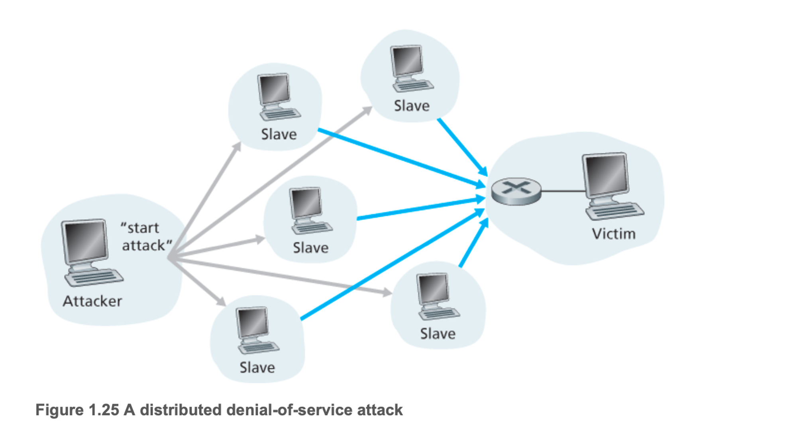

# 1.6 공격받는 네트워크

홈 장치를 포함해 많은 사물들이 인터넷에 연결된 상태. 네트워크에서는 여러 문제들이 발생할 수 있고 취약점들이 존재한다.(ex) DDOS)

### 나쁜 친구들은 인터넷을 통해 호스트에 멀웨어(악성코드)를 침투시킬 수 있다.

- 우리가 인터넷에서 다운로드를 받는 행위를 할 때 멀웨어도 같이 받을 수 있다.
- 해당 멀웨어는 파일 삭제, 비밀번호, 주민번호, 키스트로크 등의 사적인 정보를 모으는 스파이웨어를 설치하여 이러한 정보를 모아 공격자에게 다시 보낸다.
- 멀웨어는 기본적으로 자기복제를 함.
- 한 호스트에 영향을 미치면, 그 호스트에서 인터넷을 통해 다른 호스트로의 엔트리를 찾는다.
- 그러고 나서 새롭게 영향을 받은 호스트로부터 또 다른 많은 호스트로의 엔트리를 찾음

### 나쁜 친구들은 서버와 네트워크 인프라스트럭처를 공격할 수 있다.

- 대표적으로 DoS 공격
- 해당 스트럭처에 정크 파일을 보내 해당 인프라스트럭처가 정상적인 행동을 할 수 없게 만든다.
- Dos 공격의 범주
    - 취약성 공격: 공격 받기 쉬운 애플리케이션 혹은 운영체제에 교묘하게 메시지를 보냄. (이거 아마 패킷 번호나 시퀀스 넘버를 교묘하게 바꿔서 오버플로우 발생시키는 그런걸 의미하나?)
    - 대역폭 플러딩: 목표 호스트로 수많은 패킷을 보냄. 그럼 정당한 패킷들이 서버에 도달하지 않음
    - 연결 플러딩:  목표 호스트에 반열림 혹은 전열림된 TCP 연결을 설정

### 나쁜 친구들은 패킷을 탐지할 수 있다.

- 스니핑 방식으로 해당 패킷을 얻을 수 있다. 이러한 수신자를 패킷 스니퍼라고 한다.
- LAN상에서의 모든 패킷의 사본을 얻을 수 있음
- 더 나아가서, 인터넷에 연결되는 기관의 접속 라우터 혹은 접속 링크에 대한 접속 권한을 얻은 공격자가 그 조직으로 들어가고 나오는 모든 패킷을 복사하는 스니퍼를 설치할 수 있음

### 나쁜 친구들은 여러분이 신뢰하는 사람인 것처럼 위장할 수 있다.

- IP를 속여서 자신이 해당 IP의 사용자인냥 사용 → IP 스푸핑
    - 해당 IP 사용자는 DoS공격으로 마비 시키고 공격자가 해당 IP로 변경하여 접속 시도
- 이 문제를 해결하기 위해선느 종단 인증, 즉 메시지가 실제로 와야 할 곳으로부터 온 것인지 확신할 수 있는 방법이 필요