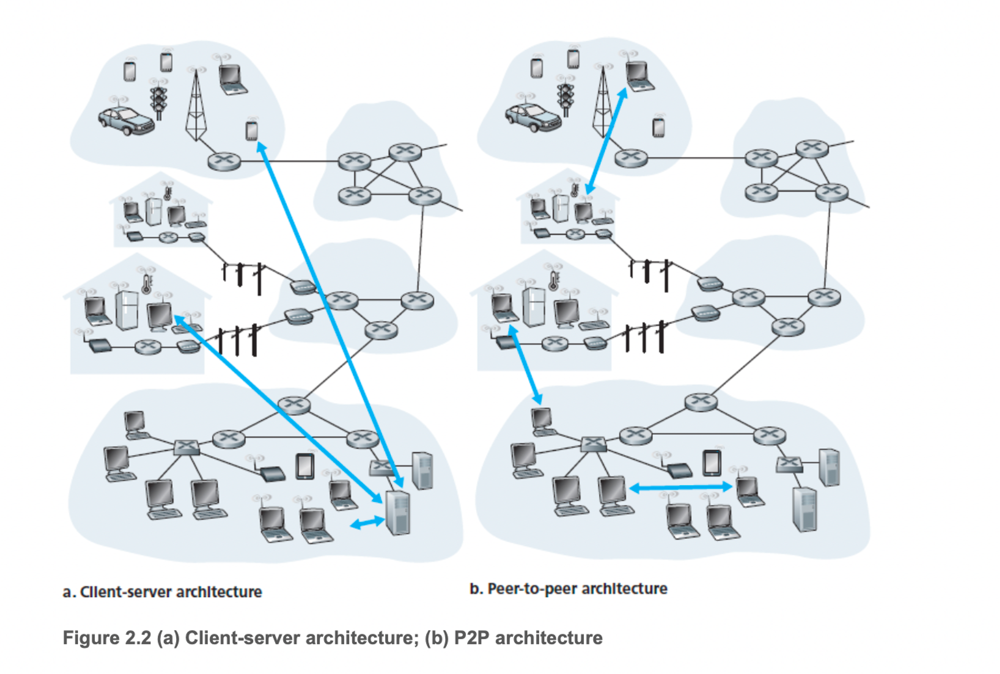
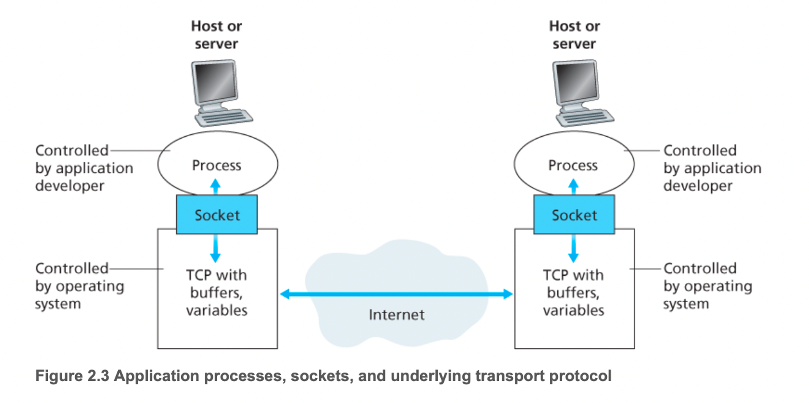
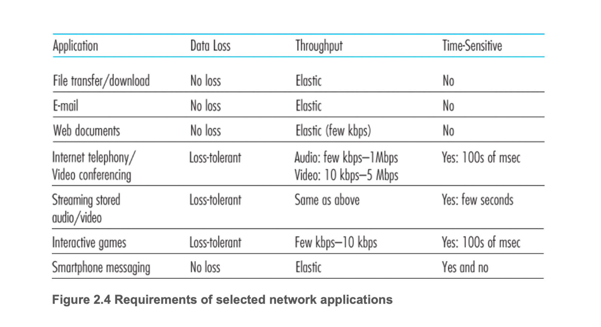
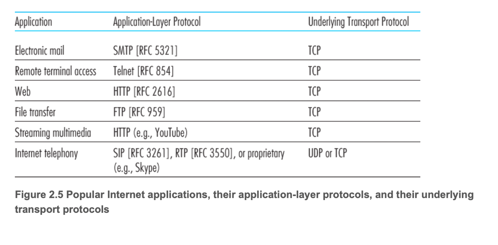

# 2.1 네트워크 애플리케이션의 원리

네트워크 애플리케이션

- 다른 위치의 종단 시스템에서 동작하고 네트워크를 통해 서로 통신하는 프로그램을 작성하는 것
- ex) 웹 애플리케이션에는 서로 통신하는 서버와 클라이언트로 구별, 사용자의 호스트에서 실행되는 브라우저 프로그램과 웹 서버 호스트에서 실행되는 웹 서버 프로그램
- ex) 넷플릭스 같은 온디맨드 비디오 어플리케이션에는 사용자의 스마트폰, 태블릿, 컴퓨터상에서 실행되는 넷플릭스 제공 프로그램과 넷플릭스 서버 호스트에서 실행되는 넷플릭스 서버
- 결국 애플리케이션 개발이란 여러 종단 시스템에서 실행되는 소프트웨어 작성
- 여기서 핵심은 라우터나 링크 계층 스위치처럼 네트워크 코어 장비를 위한 애플리케이션 작성이 아님

## 네트워크 애플리케이션 구조

애플리케이션 구조는 네트워크 구조와 다름

- 애플리케이션 개발자 관점에서 네트워크 구조는 고정되어 있고 해당 애플리케이션에 특정 서비스 집합을 제공
- 애플리케이션 구조는애플리케이션 개발자가 설계하며, 또한 애플리케이션이 다양한 종단 시스템에서 어떻게 조직되어야 하는지 알려줌

네트워크 애플리케이션 구조

- 클라이언트-서버 구조
    - 서버: 항상 동작하고 있는 호스트
    - 클라이언트: 다른 호스트들로부터 서비스 요청을 받는 호스트
    - 핵심
        - 클라이언트-서버 구조에서 핵심은 클라이언트는 서로 직접적으로 통신하지 않는다.
            - ex) 웹 어플리케이션에서 2개의 브라우저가 서로 직접적으로 통신하지 않음.
        - 서버가 고정 IP 주소라는 잘 알려진 주소를 갖는다.
            - 서버는 항상 동작하고 있으므로 클라이언트는 서버 주소로 패킷을 보내서 언제든지 서버에 연결.
    - 만약 클라이언트 수가 많아 요청이 많아지면?
        - 데이터 센터로 가상의 서버를 생성하여 처리(구글, 아마존, 이베이, 페이스북 등등)
- P2P 구조
    - 항상 켜져 있는 인프라스트럭처 서버에 최소로 의존(혹은 전혀 의존 x)
    - 대신 애플리케이션은 피어라는 간헐적으로 연결된 호스트 쌍이 직접 통신하게 한다.
    - 여기서 말하는 피어는 일반적인 데스크톱, 랩톱 즉 일반적인 사용자를 의미.
    - 특정 서버를 통하지 않고 피어가 통신하므로 이 구조를 peer-to-peer라고 함.
    - 대표적인게 BitTorrent
    - 특징
        - 확장성!
            - 각 피어들에게 파일을 부배함으로써 그 시스템에 서비스 능력을 추가
        - 비용 효율성
            - 일반적으로 상당한 서버 인프라스트럭처와 서버 대역폭을 요구x

## 프로세스간 통신

프로세스

- 종단 시스템에서 실행되는 프로그램
- 2개의 종단 시스템에서 프로세스는 컴퓨터 네트워크를 통한 메시지 교환으로 서로 통신
- 송신 프로세스는 메시지를 만들어서 네트워크로 보냄, 수신 프로세스는 해당 메시지를 네트워크에서 받아 처리

### 클라이언트와 서버 프로세스

네트워크 애플리케이션은 네트워크에서 서로 메시지를 보내는 두 프로세스로 구성

- 클라이언트-서버 → 브라우저 프로세스가 웹 서버 프로세스와 메시지 교환
    - 여기서 브라우저를 클라이언트 프로세스고, 웹 서버는 서버 프로세스
- p2p → 한 피어의 프로세스에서 다른 피어의 프로세스로 파일을 전송
    - p2p는 클라이언트, 서버 둘 다 가능. 내려 받는 피어는 클라이언트 프로세스, 보내는 피어는 서버 클라이언트

결국에는 아래와 같이 프로세스를 정의할 수 있다.

**두 프로세스 간의 통신 세션에서 통신을 초기화(다른 프로세스와 세션을 시작하려고 접속을 초기화)하는 프로세스를 클라이언트라 하고, 세션을 시작하기 위해 접속을 기다리는 프로세스를 서버라고한다.**

### 프로세스와 컴퓨터 네트워크 사이의 인터페이스

대부분의 애플리케이션은 두 프로세스가 메시지를 서로에게 보내는 통신 프로세스쌍으로 구성된다. 그럼 해당 프로세스는 메시지를 어떻게 네트워크로 보내는가? 

프로세스는 소켓을 통해 네트워크로 메시지를 보내고 받는다. 비유를 하자면 프로세스는 집이고 소켓은 출입구가 된다. 프로세스가 만약 다른 프로세스에게 메시지를 보내고 싶다면 출입구 바깥 네트워크로 메시지를 밀어내는 방식으로 이루어진다. 해당 프로세스가 상요하는 하위 전송 프로토콜 중 대표적인 것이 TCP 프로토콜이다.

이 말을 들으면 대충 짐작이 갈 것이다. **소켓은 바로 애플리케이션 계층과 트랜스포트 계층 간의 인터페이스**이다. 또한 소켓은 네트워크 애플리케이션이 인터넷에 만든 프로그래밍 인터페이스이므로, **애플리케이션과 네트워크 사이의 API**라고도 불림.

그럼 애플리케이션의 개발자는 소켓의 통제권을 모두 가질 수 있는 것인가? 그렇지는 않다. 일반적으로 애플리케이션 개발자는 트랜스포트 계층에 대한 소켓의 통제권은 거의 같지 못한다.그나마 가지는 통제권은 트랜스포트 프로토콜의 선택, 최대 버퍼와 최대 세그먼트 크기 같은 약간의 매개변수 설정뿐이다.

### 프로세스 주소 배정

한 프로세스가 다른 프로세스에게 메시지를 보내기 위해서는 해당 프로세스의 주소가 필요하다. 크게 두 가지 정보가 명시되어야 하는데

1. 호스트의 주소
2. 그 목적지 호스트 내의 수신 프로세스를 명시하는 식별자

여기서 말하는 호스트의 주소 경우 일반적으로 인터넷에서 IP 주소로 식별된다. 이 IP 주소로 호스트를 유일하게 식별할 수 있게한다. 하지만 해당 호스트에는 여러 네트워크 애플리케이션이 실행되고 있을 수 있다. 해당 프로세를 식별하는 것이 포트 번호이다. 예를 들어, 웹 서버는 80번으로 식별된다.

## 애플리케이션이 이용 가능한 트랜스포트 서비스

많은 네트워크에서는 하나 이상의 트랜스포트 프로토콜을 제공한다. 애플리케이션을 개발할 때는 사용 가능한 트랜스포트 프로토콜 중에서 하나를 선택한다. 그럼 어떻게 선택할 것인가? 아마 해당 애플리케이션과 적합한 서비스를 제공하는 프로토콜을 선택할 것이다. 트랜스포트 계층 프로토콜은 이러한 제공할 수 있는 서비스들을 넓은 범위에서 신뢰적 데이터 전송, 처리율, 시간, 보안이라는 네 가지 차원으로 분류를 하였다.

### 신뢰적 데이터 전송

1장에서 본거처럼 라우터 오버플로우와 같은 문제로 패킷의 손실이 발생할 수 있다. 하지만 전자메일, 웹 문서 전송, 재무 애플리케이션 같은 경우 데이터 손실을 치명적인 문제이다. 트랜스포트 계층에서 제공하는 한 가지 중요한 서비스가 바로 **신뢰적 데이터 전송**이다. **프로토콜이 보장된 데이터 전송 서비스를 제공**한다면 신뢰적 데이터 전송이라하는데 해당 서비스를 제공할 때는 송수신에서 데이터 오류 없이 프로세스에게 데이터를 준다는 확신을 준다.

반대로 꼭 신뢰적 데이터 전송이 필요없는 경우도 있다. 예를 들어 실시간 오디오의 경우 약간의 데이터 손실이 발생해도 상관이 없다. (책 뒤에 UDP라는 이름으로 소개)

### 처리율

처리율 - 네트워크 경로를 따라 두 프로세스 간의 통신 세션에서 송신 프로세스가 수신 프로세스로 비트를 전달할 수 있는 비율

어떠한 애플리케이션이 32kbps로 음성을 인코딩한다고 하자. 그러면 이 애플리케이션은 이 속도로 데이터를 네트워크로 보내야하고 수신 애플리케이션이 데이터를 수신 받아야한다. 근데 트랜스포트가 해당 처리율을 제공하지 못한다면 애플리케이션은 인코딩 속도를 낮추거나 포기해야한다. 이것처럼 처리율 요구 사항을 갖는 애플리케이션을 대역폭 민감 애플리케이션이라고 한다. 그 반대는 탄력적 애플리케이션이라 한다. 트랜스포트는 이것에 맞게 프로토콜 서비스를 제공하고 애플리케이션은 선택하게 된다.

### 시간

트랜스포트 계층 프로토콜은 시간 보장도 제공. 예를들어 인터넷 전화나 게임과 같이 실시간 상호작용 애플리케이션의 경우 시간안에 메시지를 송수신하는 것을 필요. 시간 보장 프로토콜에서 해당 요구를 제공한다.

### 보안

트랜스포트 프로토콜은 애플리케이션에 하나 이상의 보안 서비스를 제공할 수 있다. 예를들어 송신 호스트에서 프로토콜로 송신 프로세스가 모든 데이터를 암호화할 수 있고 수신 호스트는 프로토콜을 통해 복호화할 수 있다. 이처럼 트랜스포트 플토콜은 기밀성, 무결성, 인증과 같은 서비스를 제공한다.

## 인터넷 전송 프로토콜이 제공하는 서비스

인터넷(TCP/IP 네트워크)은 애플리케이션에게 2개의 전송 프로토콜, 즉 TCP와 UDP 서비스를 제공한다. 애플리케이션 유형에 맞게 어떤 프로토콜을 상요할지 결정하게 된다. 아래와 같은 애플리케이션의 요구사항이 있을 경우 어떤 것을 선택해야할까? TCP와 UDP를 공부해보고 결정해보자

### TCP 서비스

TCP 서비스 모델은 연결지향형 서비스와 신뢰적인 데이터 전송 서비스를 포함한다. 

- 연결지향형 서비스: 메시지를 전송하기 전에 TCP는 클라이언트와 서버가 서로 전송 제어 정보를 교환. 이 때 핸드셰이킹 과정으로 교환하며 서버 패킷이 곧 도달할테니 준비하라는 역할. 해당 단계를 지나면 두 프로세스의 소켓 사이에서 메시지를 보낼 수 있다.(전이중(full-duplex) 연결이라고함)
- 신뢰적인 데이터 전송 서비스: 통신 프로세스는 모든 데이터를 오류 없이 올바른 순서로 전달하기 위해 TCP에 의존. 한쪽이 바이트 스트림을 소켓으로 전달하면 그 바이트 스트림이 손실되거나 중복되지 않게 수신 소켓으로 전달

### UDP 서비스

- 최소의 서비스 모델을 가진 전송 프로토콜.
- 비연결형이므로 두 프로세스가 핸드셰이킹을 하지 않는다.
- 비신뢰적 데이터 전송 서비스
- 메시지를 보내면 그 메시지가 수신 소켓에 도착하는 것을 보장X. 순서 보장X
- 혼잡 제어 방식을 포함하지 않기에 송신 측은 데이터를 원하는 속도로 하위 계층으로 보낼 수 있음

### 인터넷 전송 프로토콜이 제공하지 않는 서비스

- 오늘날의 인터넷은 시간 혹은 대역폭 보장을 제공할 수 없다.

## 애플리케이션 계층 프로토콜

애플리케이션 계층 프로토콜은 다른 종단 시스템에서 실행되는 애플리케이션의 프로세스가 서로 메시지를 보내는 방법을 정의

- 교황 메시지 타입
- 여러 메시지 타입의 문법
- 필드의 의미, 즉 필드에 있는 정보의 의미
- 언제, 어떻게 프로세스가 메시지를 전송하고 메시지에 응답하는지 결정하는 규칙

여러 애플리케이션 계층 프로토콜은 RFC에 명시되어 있다. 대표적으로 HTTP프로토콜의 경우 개방적 프로토콜이기에 RFC에 기재되어 있다. 하지만 스카이프 같은 경우는 기재되어 있지 않은 비개방 애플리케이션 계층 프로토콜을 사용한다.

**네트워크 애플리케이션과 애플리케이션 계층 프로토콜의 차이는?** 

예를 들면 쉽게 알 수 있다. 웹은 사용자가 필요에 따라 웹 서버로부터 문서를 얻게 해주는 네트워크 애플리케이션이다. **웹 애플리케이션**은 **브라우저, HTML, 웹서버, 프로토콜 등을 요소로 가진다**. 하지만 **애플리케이션 프로토콜**은 단순히 브라우저와 웹 서버 사이에서 교환되는 메시지의 포맷과 순서를 정의한다. 단지 ***웹 애플리케이션의 한 요소***인 것이다.