1990년대 초 월드와이드웹이 등장하였고 일반적으로 웹이라고 부르는 것은 온디맨드 방식으로 사람들에게 빠르게 퍼졌다. 자신이 원하는 시점에 원하는 것을 수신하고 매우 낮은 비용으로 자신이 원하는 정보를 받을 수 있기에 각광 받음. 

## HTTP 개요

웹페이지

- 객체들로 구성
    - 여기서 말하는 객체는 단순히 단일 URL로 지정할 수 있는 파일(HTML 파일, JPEG이미지, 자바스크립트 등)
- 대부분은 기본 HTML 파일과 여러 참조 객체로 구성
- 기본 HTML 파일은 페이지 내부의 다른 객체를 그 객체의 URL로 참조
- ex)
    - http://www.someSchool.edu/someDepartment/picture.gif
    - www.someSchool.edu는 호스트 이름
    - /someDepartment/picture.gif는 경로 이름

웹브라우저

- HTTP의 클라이언트 측을 구현
- 요구한 웹 페이지를 보여주고 여러 가지 인터넷 항해와 구성 특성을 제공

웹 서버

- HTTP의 서버 측을 구현하는 웹 서버
- URL로 각각을 지정할 수 있는 웹 객체를 갖고 있다.
- 대표적인게 아파치, 인포메이션 서버

HTTP 프로토콜

- 애플리케이션 프로토콜
- 클라이언트 프로그램과 서버 프로그램으로 구현
- 메시지의 구조 및 클라이언트와 서버가 메시지를 어떻게 교환하는지에 대해 정의
- 웹 클라이언트가 웹 서버에게 웹 페이지를 어떻게 요청하는지와 서버가 클라이언트로 어떻게 웹 페이지를 전송하는지를 정의

HTTP는 TCP를 전송 프로토콜로 사용한다. 클라이언트는 먼저 메시지를 보내기 전에 TCP 연결을 시도한다. 연결이 이루어지면 브라우저와 서버가 소켓 인터페이스를 통해 메시지를 주고 받게 된다. 여기서 중요한 점은 애플리케이션 계층 즉 HTTP에서는 데이터가 순서대로 제대로 갔는지 신결 쓸 필요가 없다. 그것은 전송계층에서 신경 쓸 일이니까.
또한 HTTP의 특징은 서버의 경우 클라이언트에 관한 어떠한 상태정보도 저장하지 않는 다는 것이다. 만약 클라이언트가 특정 객체를 두 번 요청한다면 잠시 전에 이미 그 객체를 보냇지만 그 전 작업을 기억하지 않기에 그 객체를 또 보내게 된다. 그 이유는 HTTP는 비상태 프로토콜(stateless protocol)이기 때문이다.

## 비지속 연결과 지속 연결
### 비지속 연결
- TCP 상에서 각 요구/응답 쌍이 분리된 연결을 통해 보내지는 연결

이것에 대해 알기 위해 예시를 들어보자. 예를 들어 HTTP 클라이언트가 서버로부터 특정 경로의 파일을 요구한다고 하자. 그 메시지는 소켓 인터페이스를 통해 서버로 갈 것이다. 그럼 서버는 해당 메시지를 받고 그에 맞는 객체를 보내게 될 것이다. 그럼 클라이언트가 그 메시지를 받게 되면 TCP 연결은 끊기게 되고 그 객체 즉 HTML에 추가적인 객체가 필요하다면 그 객체 수만큼 위의 과정을 반복하게 된다. 

HTTP/1.0은 이러한 비지속 연결을 지원한다. 각 TCP 연결은 하나의 요청 메시지와 하나의 응답 메시지만 전송하게 되는 것이다.

RTT
- 작은 패킷이 클라이언트로부터 서버까지 가고, 다시 클라이언트로 되돌아오는 시간
- RTT는 패킷 전파 지연, 중간 라우터와 스위치에서의 패킷 큐일 지연, 패킷 처리 지연 등을 포함한다.

우리는 이제 이것을 통해 브라우저에서 하이퍼링크를 클릭하면 이루어지는 과정을 설명할 수 있다. 기본적으로 TCP 프로토콜은 3-way-handshake과정으로 이루어진다. 먼저 클라이언트가 TCP 연결을 위해 서버에게 요청하고 서버는 그것에 대한 응답을 준다. 그럼 클라이언트는 마지막 응답을 주며 HTTP 요청 메시지를 같이 보내게 되는 것이다. 그럼 서버는 그것에 대한 응답을 주며 TCP 요청이 끝나게 되는 것이다.

단점
- 각 요청 객체에 대한 새로운 연결이 설정되고 유지되어야 한다.
- 각 객체는 2RTT를 필요로 한다.

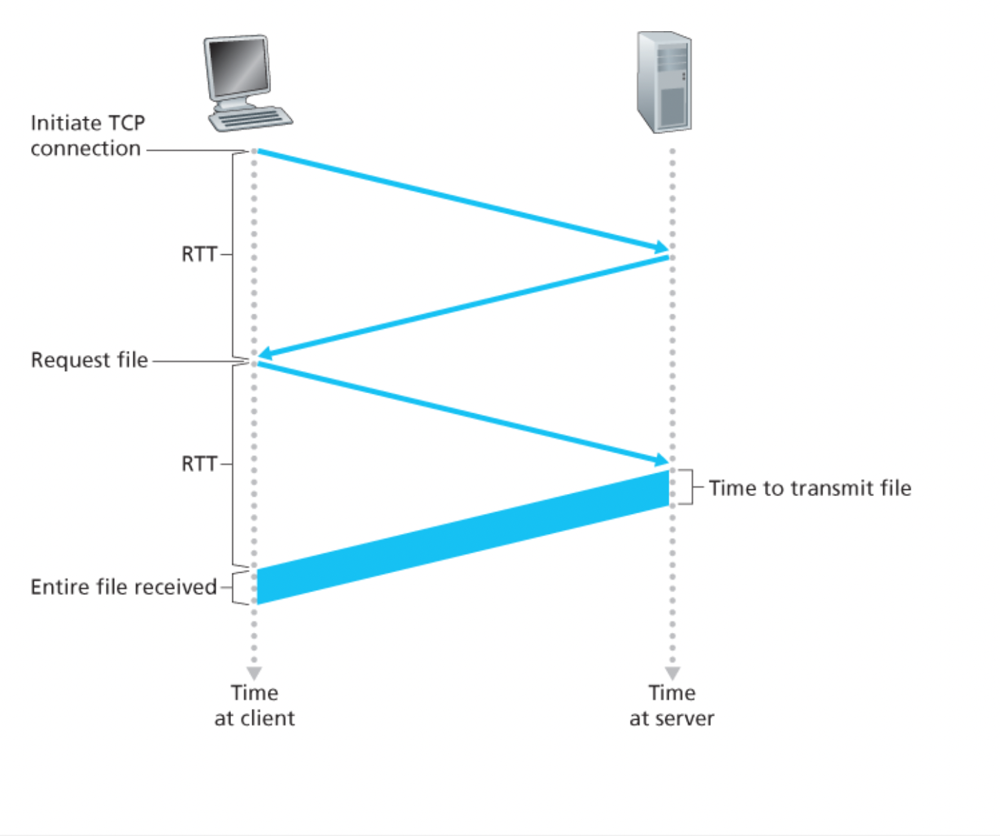

### 지속 연결
HTTP/1.1 지속 연결에서 서버는 응답을 보낸 후에 TCP 연결을 그대로 유지한다. 같은 클라이언트와 서버 간의 이후 요청과 응답은 같은 연결을 통해 보내진다. 일반적으로 HTTP 서버는 일정 기단(타임아웃 기간) 사용되지 않으면 연결을 닫는다. 서버가 연속된 요구를 수신할 때, 서버는 객체를 연속해서 보낸다.

## HTTP 메시지 포맷
### HTTP 요청 메시지

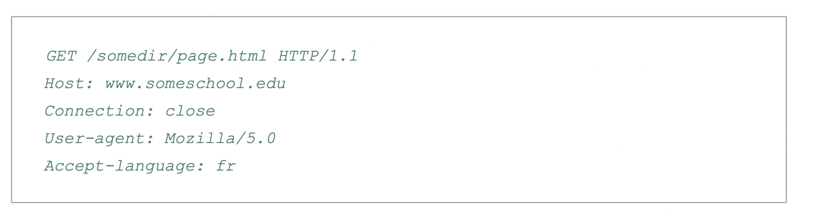

일반적으로 위와 같은 메시지를 가진다. 일반적으로 메시지는 ASCII 텍스트로 쓰여 있고 다섯 줄로 되어 있고 각 줄은 CR(Carriage return)과 LF(line feed)로 이루어져 있다. 이 줄의 경우 이것보다 더 짧거나 길 수도 있다. HTTP 요청 메시지의 첫 줄은 요청 라인(Request Line)이라고 부르고, 이후의 줄들은 헤더 라인(Header line)이라고 부른다.

요청 라인
- method(GET, POST, HEAD, PUT, DELETE)
- URL
- HTTP 버전 

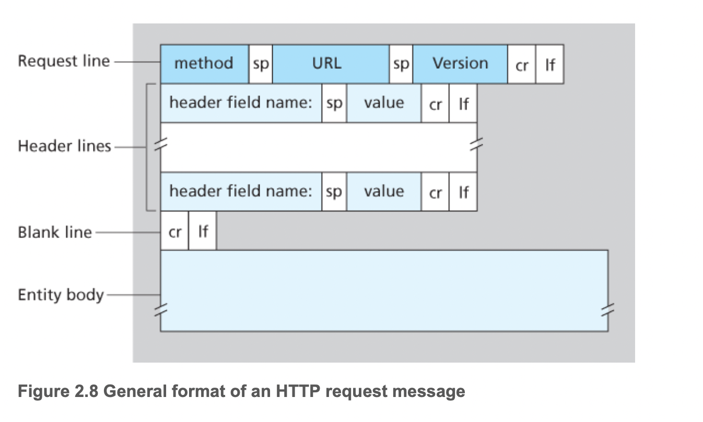

헤더 라인
- HOST: 객체가 존재하는 호스트
- Connection: 브라우저는 서버에게 지속 연결을 할지 말지 결정
- User-agent: 사용자 에이전트, 즉 서버에게 요청을 하는 브라우저 타입을 명시
- Accept-language: HTTP에서 사용 가능한 많은 콘텐츠 협상 헤더 중 하나

엔티티 바디
- GET 방식에는 비어 있고, POST 방식에서 사용
- 클라이언트가 폼에 특정 값들을 넣어 서버에게 전달할 수 있다.
- 그렇다고 무조건적으로 POST 방식으로 엔티티 바디에 값을 넣어서 전달할 필요는 없다. GET을 이용하여 URL에 넣어 전달해도 된다.

### HTTP 응답 메시지

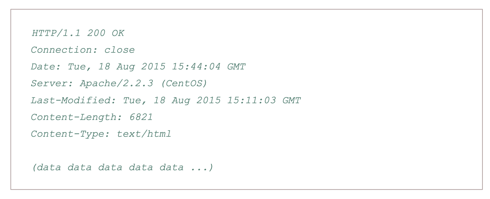

응답 메시지는 상태 라인, 헤더 라인, 개체 몸체로 이루어져 있다.

헤더라인
- Connection: 클라이언트에게 메시지를 보낸 후 TCP 연결을 닫는데 사용
- Date: HTTP 응답이 서버에 의해 생성되고 보낸 날짜와 시간을 나타낸다. 이 시간은 객체를 생성하거나 마지막으로 수정한 시간이 아닌 파일 시스템으로부터 객체를 추출하고 응답 메시지에 그 객체를 삽입하여 응답 메시지를 보낸 시간
- Server: 메시지가 어떤 타입의 서버에 의해 만들어졌는지
- Last-Modified: 객체가 생성되거나 마지막으로 수정된 시간과 날짜. 이 헤더는 객체를 로컬 클라이언트와 네트워크 캐시 서버 캐싱에 중요
- Content-Length: 송신되는 객체의 바이트 수
- Content-Type: 개체 몸체 내부의 객체가 어떤 타입인지 명시

상태 코드와 문장
- 200 OK: 요청이 성공했고, 정보가 응답으로 보내졌다.
- 301 Moved Permanently: 요청 객체가 영원히 이동. 새로운 URL은 응답 메시지의 Location: 헤더에
- 400 Bad Request: 서버가 요청을 이해할 수 없다는 일반 오류 코드
- 404 Not Found: 요청 문서가 서버에 존재하지 않는다.
- 505 HTTP Version Not Supported: 요청 HTTP 프로토콜 버전을 서버가 지원하지 않는다.

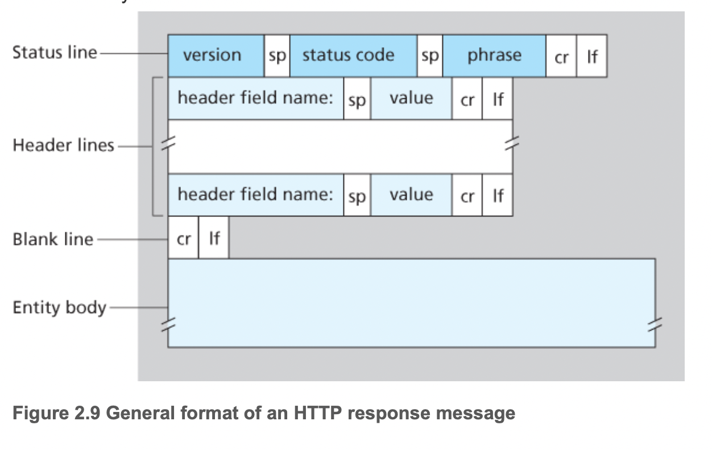

## 사용자와 서버 간의 상호작용: 쿠키
서버가 사용자 접속을 제한하거나 사용자에 따라 콘텐츠를 제공하기 원한다. 그럼 어떻게 그것을 구별해야할까? 가장 간단한 방법은 바로 쿠키라는 기술이다.

쿠키 기술은 다음 네 가지 요소를 갖는다.
- HTTP 응답 메시지 쿠키 헤더 라인
- HTTP 요청 메시지 쿠키 헤더 라인
- 사용자의 브라우저에 사용자 종단 시스템과 관리를 지속시키는 쿠키 파일
- 웹 사이트의 백엔드 데이터베이스

일반적으로 HTTP 응답에 Set-Cookie: 라는 헤더 라인을 통해 전달.

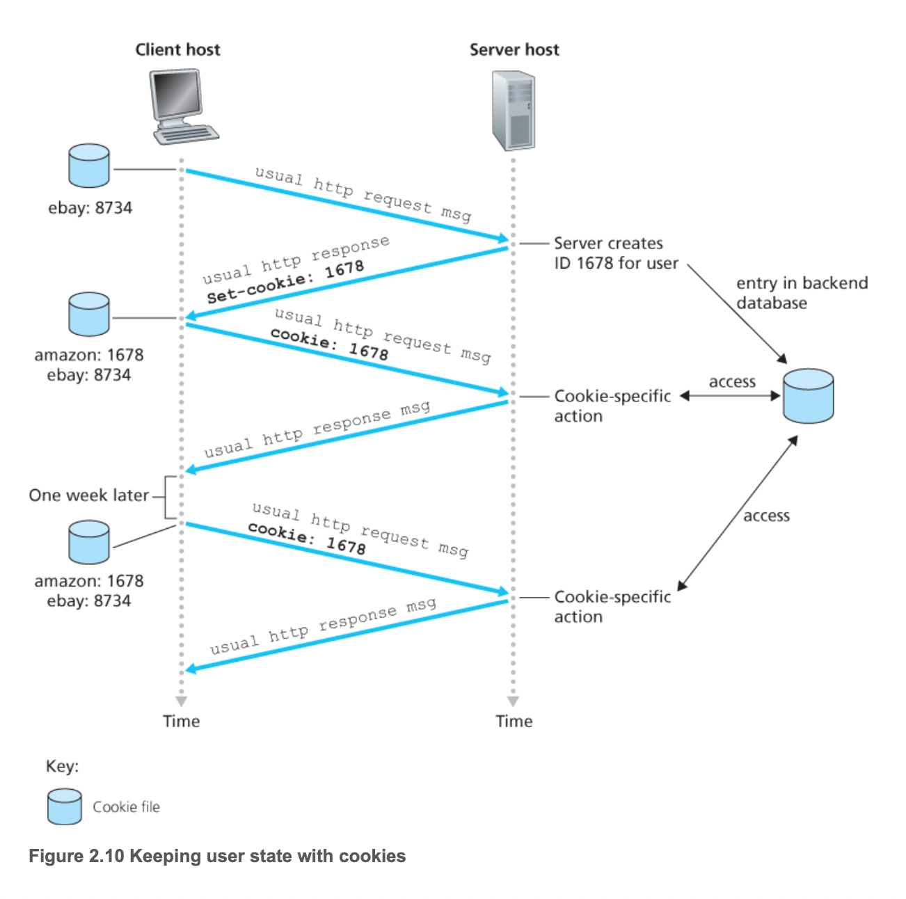

이러한 방식으로 사용자가 언제 해당 페이지에 방문 했는지 몇번 방문 했는지 등을 알 수 있다. 그리고 이것은 세션이 끝날 때까지 지속된다. 죽 세션 동안에, 브라우저는 서버에 쿠키 헤더를 전달하여 서버에게 사용자를 확인한다. 따라서 쿠키는 비상태 HTTP 위에서 사용자 세션 계층을 생성하는 데 이용될 수 있다.

## 웹 캐싱
웹 캐시(= 프록시 서버)
- 기점 웹 서버(Origin Web Server)를 대신하여 HTTP 요구를 충족시키는 네트워크 객체
- 자체의 저장 디스크를 갖고 있어 최근 호출된 객체의 사본을 저장 및 보존

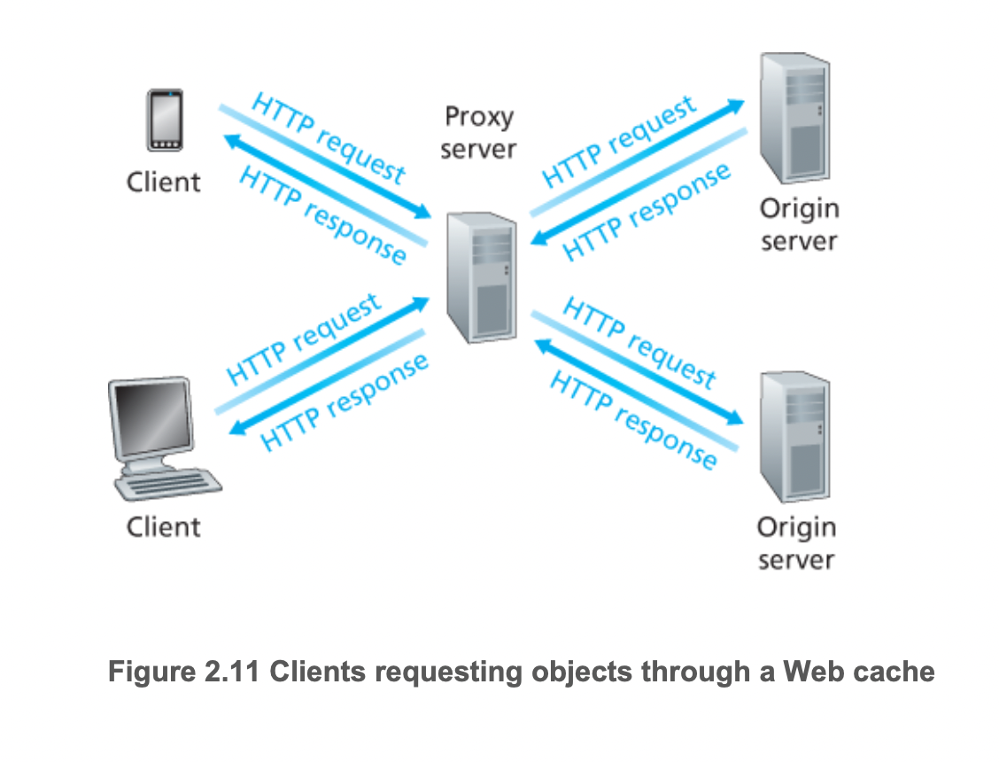

- 위의 그림처럼 브라우저는 HTTP 요구가 웹 캐시에 가장 먼저 보내지도록 구성 가능
- 요청은 웹 캐시에 먼저 보내지기에 웹 캐시와 TCP 연결을 하고 웹 캐시에 해당 객체의 사본이 저장되어 있다면 그것을 보내고 만약 없다면 Origin server와 TCP 연결을 하여 해당 객체를 받고 그것을 복사한 후 브라우저에게 보내준다.
- 캐시는 서버이면서 클라이언트이다.
- 일반적으로 ISP가 구입하고 설치한다.

웹 캐시의 장점
- 클라이언트의 요구에 대한 응답 시간을 줄일 수 있다.
    - 특히 클라이언트와 기점 서버 사이의 병목 대역폭이 클라이언트와 캐시 사이의 병목 대역폭에 비해 매우 작을 때 효과적
- 한 기관에서 인터넷으로의 접속하는 링크상의 웹 트래픽을 대폭으로 줄일 수 있따.

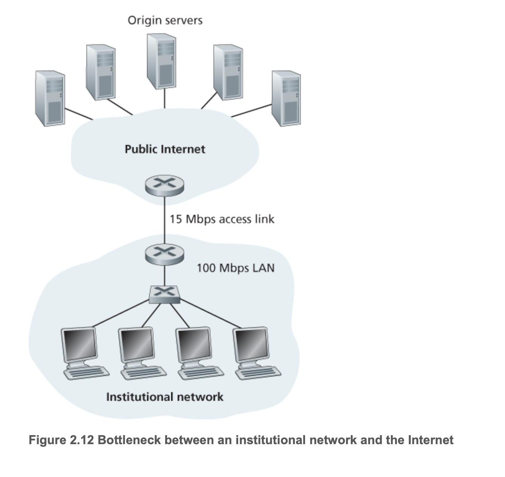

위와 같은 상황을 보면 캐시의 장점을 확실히 알 수 있다. 대역폭을 보더라도 기관의 라우터에서 인터넷 라우터로 가는 것이 훨씬 빠른 상황이다. 실제로 응답 시간은 LAN 지연과 접속 지연, 인터넷 지연의 합이다. 초당 15개의 요청이 주어진다면 값은 아래와 같다.

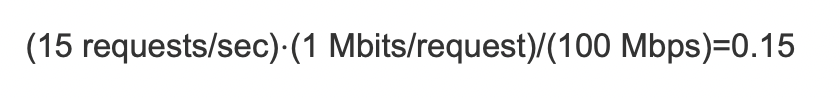

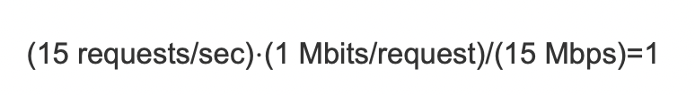

실제로 0,15라는 값은 매우 작은 트래픽 강도이다. 하지만 1이라는 트래픽 강도는 앞 챕터에서도 봤듯이 회선의 지연이 매우 커지고 한 없이 증가한다. 이것을 해결하기 위해 어떻게 해야할까? 방법 중 하나는 접속률을 늘리는 것이다. 15 -> 100으로 개선시키는 것이다. 하지만 이것은 매우 큰 비용이 들어간다. 다른 방법은 네트워크에 웹 캐시를 사용하는 것이다. 결국 한 기관에서 나오는 네트워크이기에 캐시에 저장을 하여 주는 것이다!

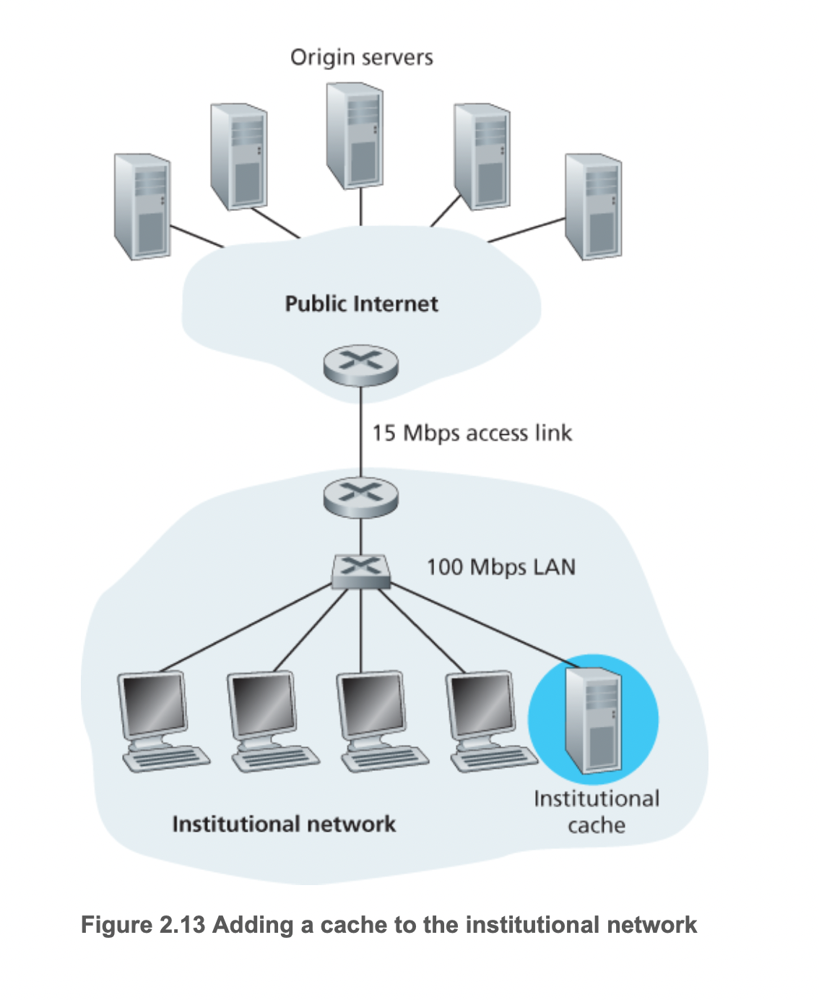

콘텐츠 전송 네트워크(CDN)
- 인터넷 전역을 통해 많은 지역적으로 분산된 캐시를 설치하고 있음
- 트래픽을 지역화하고 있다.

## 조건부 GET
웹 캐싱에서 가지고 있는 복사본이 새것이 아닐 수 있다. 복사본이 클라이언트에 캐싱된 이후에 웹 서버에 있는 객체가 갱신되었을 수도 있다. 그나마 다행인점은 HTTP는 클라이언트가 브라우저로 전달되는 모든 객체가 최신의 것임을 확인하면서 캐싱을 해주는 방식을 가지고 있다. 이러한 방식이 바로 조건부 GET
- GET 방식을 사용한다.
- Modified-Since: 헤더 라인을 포함하고 있다.

## HTTP/2
HTTP 주요 목표
- 하나의 TCP 연결상에서 멀티플렉싱 요청/응답 지연 시간을 줄이는데 있으며, 요청 우선순위화, 서버 푸시, HTTP 헤더 필드의 효율적인 압축 기능 등을 제공

HTTP2는 상태코드, URL, 헤더 필드 등 HTTP 메소드 자체는 변경하지 않고 클라이언트와 서버 간의 데이터 포캣 방법과 전송 방법을 변경했다.

HTTP2를 보기 전에 한 가지 예시를 보자. 만약 일반적인 HTTP/1.1에서 해당 페이지에 영상이 여러개의 객체를 가지는 페이지를 불러온다고 하자. 그리고 서버와 클라이언트 사이에 병목 현상이 발생하는 링크가 있다고 하자. 그럼 큰 영상 객체로 인해 작은 객체들 또한 막히게 될 것이다. 이것을 HOL(Head of Line) 블로킹 문제라고 한다. HTTP/1.1은 이러한 문제를 해결하기 위해 소켓을 여러개를 열고 소켓마다 대역폭을 나눠가지며 이러한 문제를 해결할려고 했다. HTTP/1.1은 이러한 TCP 연결을 열 수 있게 6개까지 지원한다. 하지만 HTTP/2는 그렇지 않다. 주요 목표는 이러한 병렬 TCP 연결을 줄이거나 없애는데 있다. 하지마 그러기 위해서 HOL 블로킹을 피하기 위한 다른 메커니즘이 필요하다.

### HTTP/2 프레이밍
- 각 메시지를 작은 프레임으로 나누고, 같은 TCP 연결에서의 요청과 응답 메시지를 인터리빙
- 프레이밍은 HTTP/2 프로토콜의 프레임으로 구현된 다른 프레이밍 서브 계층에 의해 이루어진다.
- 서버가 HTTP 응답을 보내고자 할 때, 응답은 프레이밍 서브 계층에 의해 처리되며 프레임들로 나눠진다. 
- 응답의 헤더 필드는 하나의 프레임이 되며 메시지 본문은 하나의 프레임으로 쪼개진다.
- 응답 프레임들은 서버의 프레이밍 서브 계층에 의해 인터리빙된 후 하나의 지속적인 TCP 연결상에서 전송된다.
- 프레임들이 클라이언트에 도착하면 프레이밍 서브 계층에서 처음 응답 메시지로 재조립되며 브라우저에 의해 처리
- 클라이언트의 HTTP 요청도 프레임으로 쪼개지고 인터리빙

### 메시지 우선순위화 및 서버 푸싱
클라이언트가 하나의 특정 서버로 동시에 여러 개의 요청을 할 때, 각 메시지에 1에서 256 사이의 가중치를 부여함으로써 요청에 우선순위를 매길 수 있다. 높은 수치일수록 높은 우선순위를 의미. 가중치를 통해서 높은 요청을 먼저 보내게 되는 것이다.

HTTP는 이것 말고도 다른 특징이 있는데 서버로 하여금 특정 클라이언트 요청에 대해 여러 개의 응답을 보낼 수 있게 해주는데 있다. 처음 요청에 대한 응답 외에도, 서버는 클라이언트이 요청 없이도 추가적인 객체를 클라이언트에게 푸시하여 보낼 수 있다.

### HTTP/3
- 트랜스포트 프로토콜인 QUIC은 UDP 프로토콜 위에 위치하는 애플리케이션 계층에 구현되어 있다.
- QUIC은 메시지 멀티플렉싱(인터리빙), 스트림별 흐름 제어, 저지연 연결 확립과 같은 HTTP에 의미 있는 여러 특징을 가짐.
- HTTP/3는 QUIC 위에서 작동하도록 설계된 새로운 HTTP 프로토콜