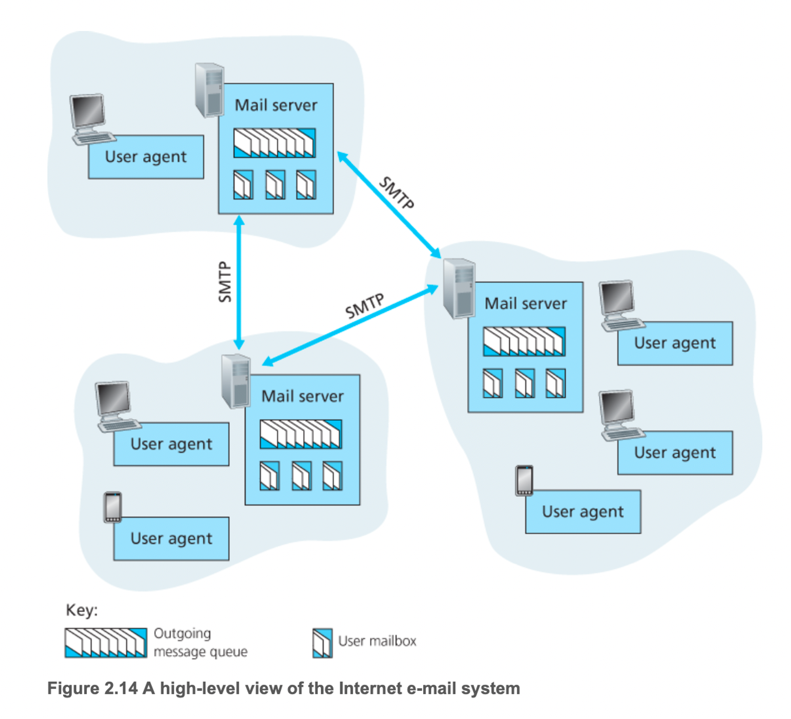
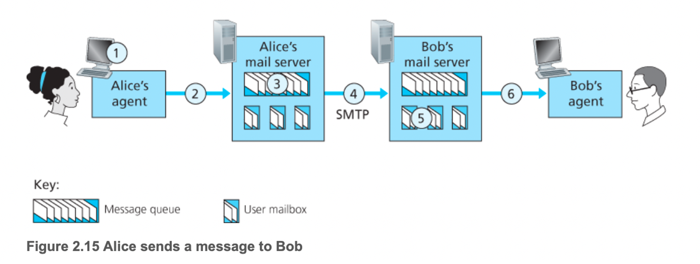
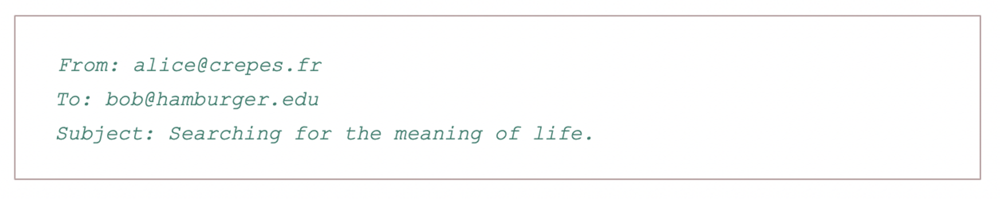
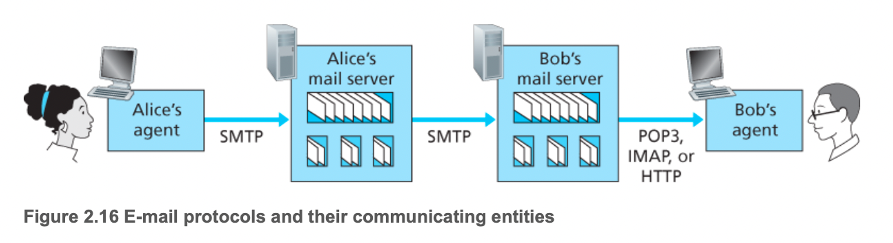

# 2.3 인터넷 전자메일

전자메일

- 비동기적 통신 매체(상대방이 당장 받든 안받든 자신이 편할 때 보내고 읽는다.)
- 분배가 쉽고, 빠르고, 저렴
- 첨부된 메시지, 하이퍼 링크, HTML 포맷 텍스트, 내장된 사진 등 많은 특성을 가짐

위는 인터넷 메일 시스템의 상위 레벨 개념이다. 위에 다이어그램에는 사용자 에이전트, 메일 서버, SMTP 3요소가 존재한다.

사용자 에이전트

- 사용자가 메시지를 읽고, 응답하고, 전달하고, 저장하고, 구성하게 해준다.
- 대표적으로 마이크로소프트 아웃룩, 애플 메일, 웹 기반 지메일 등
- 메시지를 서버로 보내고, 거기서 메시지는 메일 서버의 출력 메시지의 큐로 들어간다.
- 읽고 싶을 때는 메일 서버에 있는 메일 박스에서 메시지를 가져온다.

메일 서버

- 전자메일 인프라스트럭처의 중심
- 메일 서버 안에는 메일 박스가 존재(메시지 보관,유지 관리)
- 메일 서버는 사용자 계정과 비밀번호를 이용하여 인증, 그 후 메일 박스에 있는 값을 전달함
- 만약 상대방에 메일 서버가 문제라면 메시지 큐에 보관하고 나중에 전달할려고 시도한다.
- 재시도는 약 30분마다 일어나고 계속 실패하면 송신자에게 전자메일로 통보

SMTP

- 인터넷 전자메일을 위한 주요 어플리케이션 계층 프로토콜
- 송신자의 메일 서버로부터 수신자의 메일 서버로 전송하는데 TCP 의 신뢰적인 데이터 전송 서비스를 이용한다.
- 송신자 메일 서버에서 수행하는 클라이언트와 수신자 메일 서버에서 수행되는 서버를 갖고 있다.
- 메일 서버가 상대 메일 서버로 메일을 보낼 때는 SMTP의 클라이언트로 동작하는 반면, 메일 서버가 상대 메일 서버로부터 메일을 받을 때는 SMTP 서버로 동작

## SMTP

- 송신자의 메일 서버로부터 수신자의 메일 서버로 메시지를 전송
- 모든 메일 메시지의 몸체(헤더뿐 아니라)는 단순한 7비트 ASCII여야 한다는 단점 존재
- HTTP는 전송 전에 멀티미디어 데이터를 ASCII로 변환하는 것은 오규하지 않지만 SMTP는 전송 전에 ASCII로 변환하고 후에 다시 ASCII를 원래 메시지로 변환해야 한다.

 

### SMTP 과정

위와 같은 상황을 보자. 

1. 앨리스는 자신이 보내고 싶은 메시지를 에이전트에게 보내라고 명령한다.
2. 에이전트는 메시지를 메일 서버에게 보내고 그곳에서 메시지는 메시지 큐에 놓인다.
3. 메일 서버에서 동작하는 SMTP의  클라이언트 측은 메시지 큐에 있는 메시지를 보고 수신자 메일 서버에서 수행되고 있는 SMTP 서버에게 TCP 연결을 설정한다.
4. 초기 SMTP 핸드셰이킹 이후에 SMTP 클라이언트는 송신자의 메시지를 TCP 연결로 보낸다.
5. 수신자 메일 서버 호스트에서 SMTP의 서버 측은 메시지를 수신하고 그 메시지를 메일 박스에 넣어 둔다.
6. 수신자는 편한 시간에 그 메시지를 읽기 위해 사용자 에이전트를 시동한다.

위에서 본 것처럼 SMTP는 메일을 보낼 때 멀리 떨어져 있더라도 중간 메일 서버를 사용하지 않음을 이해하자. 특히, 수신자가 죽어있더라도 그 메시지를 중간에서 저장하는 것이 아닌 송신자 메일 서버에 남아 저장을 해둔다.

## 메일 메시지 포맷

- 주변 정보가 포함된 헤더가 메시지 몸체 앞에 오게 된다.
- 이 주변 정보는 일련의 헤더 라인에 포함
- 헤더 라인과 메시지 몸체는 빈 줄(CRLF)로 분리된다.
- HTTP에서처럼 각 헤더 라인은 키워드, 콜론, 값의 순서로 구성되고 읽을 수 있는 텍스트를 포함한다.
- 키워드 중 반드시 필요한 것도 있고 선택사항도 있다.
- 모든 헤더 라인은 From: 헤더라인과 To: 헤더라인을 반드시 가져야한다. Subject: 헤더라인은 옵션

- 위의 헤더라인이 끝나면 바로 빈 줄이 이어지고 메시지 몸체(ASCII 문자)가 나온다.

## 메일 접속 프로토콜

메일 서버가 메일 박스를 관리하고 SMTP의 클라이언트와 서버 측 모두를 수행한다는 것을 기억하자. 그럼 메일 서버가 로컬 호스트에 있다면, 언제든 전자 메일이 도착할 수 있게 로컬 호스트는 계속 인터넷에 연결되고 있어야할 것이다. 실제로는 일반 사용자는 로컬 호스트에서 사용자 에이전트를 수행하고 늘 켜져 있는 공유 메일 서버에 저장된 메일박스에 접근한다. 메일 서버는 보통 사용자들과 공유한다.

위의 예시를 보자. 앨리스의 사용자 에이전트는 밥의 메일 서버로 전자메일 메시지를 SMTP 또는 HTTP를 이용하여 보낸다. 그리고 앨리스의 메일 서버는 SMTP를 사용하여 밥의 메일 서버로 전자메일 메시지를 중계한다. 여기서 왜 두 단계의 절차인가? 주요 이유는 앨리스의 메일 서버를 통해 중계하지 않으며 앨리스의 사용자 에이전트는 목적지 메일 서버에 도달할 수 없기 때문이다. 앨리스는 전자메일을 자신의 메일 서버에 먼저 저장하고 연결 될 때까지 반복해서 보내려한다. 그럼 밥은 어떻게 메일을 받는가? 일단 SMTP는 불가능한 것이 push 프로토콜이기 때문이다. 수신은 pull 동작으로 이루어지고 그렇기에 해당 메일을 확인하기 위해 HTTP나 IMAP을 이용하여 확인한다. 그 말은 앨리스 메일 서버와 통신하기 위해 SMTP 인터페이스는 물론이고 HTTP 인터페이스를 갖고 있어야한다.