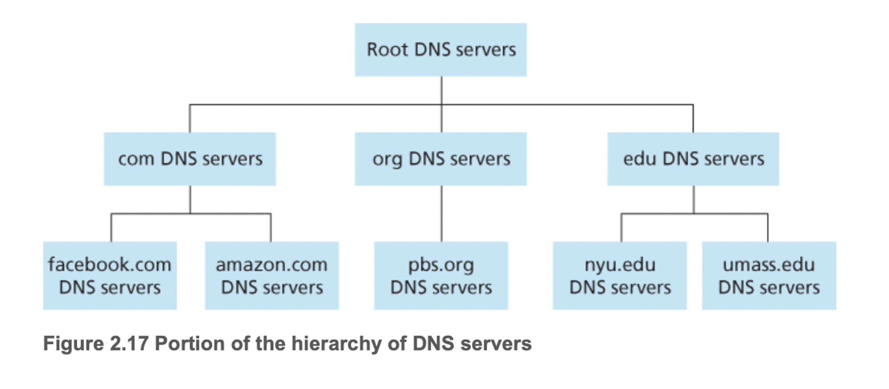
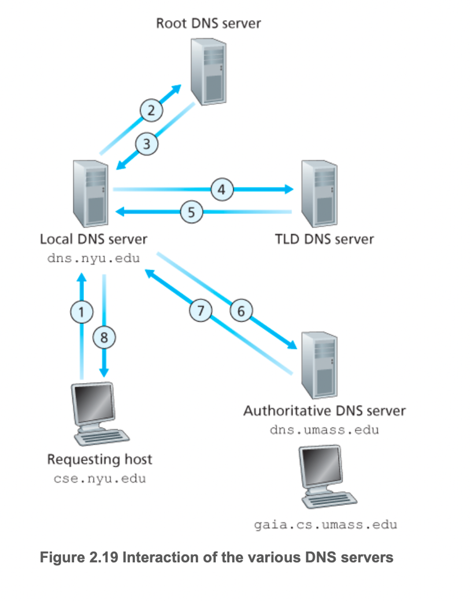

# 2.4 DNS: 인터넷의 디렉터리 서비스

호스트 이름(hostname)

- 호스트의 식별자 중 하나
- ex) www.naver.com
- 하지만 이러한 이름은 가변 길이의 알파뉴메릭 문자로 구성되므로 라우터가 처리하는데 어려움
    
    → IP 주소로도 식별이 된다.
    

## DNS가 제공하는 서비스

DNS

- 호스트 이름을 IP 주소로 변환해주는 디렉터리 서비스
- DNS 서버들의 계층 구조로 구현된 분산 데이터베이스
- 호스트가 분산 데이터베이스로 질의하도록 허락하는 애플리케이션 계층 프로토콜
- DNS 서버는 주로 BIND(Berkeley Internet Name Domain) 소프트웨어를 수행하는 유닉스 컴퓨터
- UDP 상에서 수행되고 포트 번호는 53을 사용
- 다른 애플리케이션 프로토콜들이 HTTP, SMTP, FTP 등 사용자가 제공한 호스트 이름을 IP 주소로 변환하기 위해 주로 이용

브라우저에서 url www.naver.com에 페이지를 요청한다고 했을 때 아래와 같이 수행하게 된다.

1. 같은 사용자 컴퓨터는 DNS 애플리케이션의 클라이언트 측을 수행
2. 브라우저는 URL로부터 호스트 이름 www.naver.com을 추출하고 그 호스트 이름을 DNS 애플리케이션의 클라이언트 측에 넘긴다.
3. DNS 클라이언트는 DNS 서버로 호스트 이름을 포함하는 질의를 보낸다.
4. DNS 클라이언트는 결국 호스트 이름에 대한 IP 주소를 가진 응답을 받는다.
5. 브라우저가 DNS로부터 IP 주소를 받으면, 브라우저는 해당 IP 주소와 그 주소의 80번 포트에 위치하는 HTTP 서버 프로세스로 TCP 연결을 초기화한다.

이렇게 하면 추가지연 되는거 아니야? → 추가 지연은 발생하지만 ‘가까운’ DNS 서버에 IP 주소가 캐싱되어 지연 시간을 줄이고 있다.

DNS가 주는 추가 서비스

- 호스트 에일리어싱(host aliasing)
    - 복잡한 호스트 이름을 가진 호스트는 하나 이상의 별명을 가질 수 있음(기존의 이름이 정식 호스트 이름)
    - [relay1.west-coast.enterprise.com](http://relay1.west-coast.enterprise.com) → enterprise.com & www.enterprise.com
- 메일 서버 에일리어싱
- 부하 분산
    - 중복 웹 서버 같은 여러 중복 서버 사이에 부하를 분산하기위해서도 사용
    - 인기 있는 사이트의 경우 종단 시스템에서 여러 서버, 다른 IP를 사용하고 있다.
    - 호스트 이름에 대한 DNS 질의를 하면, 서버는 IP 주소 집합 전체를 가지고 응답한다.

## DNS 동작 원리 개요

DNS의 간단한 설계 방법으로는 모든 매핑을 포함하는 하나의 인터넷 네임 서버를 생각할 수 있다. 하지만 오늘날의 인터넷에는 적합하지 않다. 그 이유는 아래와 같다.

- 서버의 고장: 만약 이 네임 서버가 고장 나면, 전체 인터넷이 작동하지 않는다.
- 트래픽양: 단일 DNS 서버가 모든 DNS 질의를 처리해야 한다.
- 먼 거리의 중앙 집중 데이터베이스: 단일 DNS 서버가 모든 질의 클라이언트로부터 ‘가까울’ 수만은 없다. 그렇기에 먼 거리의 사용자라면 심각한 지연을 일으킨다.
- 유지관리: 단일 네임 서버는 모든 인터넷 호스트에 대한 레코드를 유지해야한다.

정리하면 단일 서버의 경우 확장성이 전혀 없다. 그렇기에 실제로 DNS는 분산되도록 설계되었다.

### 분산 계층 데이터베이스

확장성 문제를 위해 DNS는 여러 서버를 두고 계층 형태로 구성하여 전 세계에 분산시켰다. 크게 세 유형의 DNS 서버가 있다. 루트, 최상위 도메인(top-level), 책임(authoritative) 서버다.

- 루트 DNS 서버: 1000개 이상의 루트 서버가 전 세계에 흩어져 있다. 루트 서버들은 13개의 다른 루트 서버 복사체이고, 12개의 다른 기관에서 관리된다. 루트 네임 서버는 TLD 서버의 IP 주소들을 제공한다.
- 최상위 레벨 도메인 서버: com, org, net, edu, gov 같은 상위 레벨 도멘과 kr, uk, fr, ca, jp 같은 모든 국가의 상위 레벨 도메인에 대한 TLD 서버가 있다. TLD 서버는 책임 DNS 서버에 대한 IP 주소를 제공한다.
- 책임 DNS 서버: 인터넷에서 접근하기 쉬운 호스트를 가진 모든 기관은 호스트 이름을 IP 주소로 매핑하는 공개적인 DNS 레코드를 제공해야한다. 기관의 책임 DNS 서버는 이 DNS 레코드를 갖고 있다. 또한 기관은 이 레코드를 갖도록 자신의 책임 DNS 서버의 구현을 선택할 수 있고, 일부 서비스 제공자의 책임 DNS 서버에 이 레코드를 저장하도록 비용을 지불한다. 대부분의 큰 기업들은 자신의 기본 책임 DNS 서버와 보조 책임 DNS 서버를 유지하고 구현한다.

여기서 등장하지 않았지만 추가적인 DNS 서버가 바로 로컬 DNS 서버이다.

- 로컬 DNS 서버
    - 엄격하게 계층에 속하지는 않지만 DNS 구조의 중심에 있다.
    - ISP들은 로컬 DNS 서버를 갖는다.
    - 호스트가 ISP에 연결 될 때, 그 ISP는 로컬 DNS 서버로부터 IP주소를 호스트에게 제공한다.
    - 호스트의 로컬 DNS 서버는 대체로 호스트에 ‘가까이’ 있다.
        
        

        
    - 호스트가 DNS 질의를 보내면, 이 질의는 먼저 프록시로 동작하는 로컬 DNS 서버에 전달되고, 그 로컬 DNS 서버는 이 질의를 DNS 서버 계층으로전달한다.

실제로 동작은 다음과 같다.

1. 요청 호스트가 로컬 DNS에 질의를 보낸다.
2. 로컬 DNS가 루트 DNS에 질의를 보낸다.
3. 그 응답을 가지고 해당하는 TLD DNS에 질의를 보낸다.
4. 그 응답을 가지고 책임 DNS에 보낸다.
5. 그 응답을 가지고 최종적으로 목적지 호스트의 ip를 알아낸다.

위의 과정은 네 번의 질의와 네 번의 응답 메시지 총 8번의 메시지가 보내졌다. 매우 전송이 복잡하고 딜레이 되는데 실제로는 DNS 캐싱을 통해 이런 문제를 해결한다.

### DNS 캐싱

- 질의 사슬에서 DNS 서버가 DNS 응답을 받았을 때 그것은 로컬 메모리에 응답에 대한 정보를 저장할 수 있다.
- 만약 호스트 이름과 IP 주소쌍이 DNS 서버에 저장되고 다른 호스트 이름으로부터 같은 질의가 DNS 서버로 도착한다면, DNS 서버는 호스트 이름에 대한 책임이 없을 때조차 원하는 IP 주소를 제공할 수 있다.
- 영구적인 것은 아니고 설정된 기간이 지나면 삭제한다.
- 즉 로컬 DNS에 네이버라는 도메인의 ip주소를 요청하고 캐싱해서 가지고 있다면 추가적인 질의 없이 바로 줄 수 있는 것

## DNS 레코드와 메시지

DNS 서버들은 호스트 이름을 IP 주소로 매핑하기 위한 자원 레코드를 저장한다. 

자원레코드

- 4개의 튜플 → (Name, Value, Type, TTL)
- Type=A이면 Name은 호스트 이름이고 Value는 호스트 이름에 대한 IP 주소다. (relay1.bar.foo.com, 145.37.93.126, A)
- Type=NS이면, Name은 도메인이고 Value는 도메인 내부의 호스트에 대한 IP 주소를 얻을 수 있는 방법을 아는 책임 DNS 서버의 호스트 이름이다. (foo.com, dns.foo.com, NS)
- Type=CNAME이면, Value는 별칭 호스트 이름 Name에 대한 정식 호스트 이름이다. 이 레코드는 질의 호스트에게 호스트 이름에 대한 정식 이름을 제공. (foo.com, relay1.bar.foo.com, CNAME)
- Type=MX이면, Value는 별칭 호스트 이름 Name을 갖는 메일 서버의 정식 이름이다. (foo.com, mail.bar.foo.com, MX). MX 레코드는 메일 서버의 호스트 이름이 간단한 별칭을 갖는 것을 허용.

위의 말을 정리하면 DNS 서버가 특별한 호스트 이름에 대한 책임 서버라면 Type A 레코드를 가질 것이다. 아니라면 Type NS 레코드를 포함 할 것이다.

### DNS 메시지

메시지 포맷

- 헤더 영역
    - 처음 12바이트, 여러 영역을 가짐
    - 첫 필드는 질의를 식별하는 16비트 숫자
        - 질의 응답 메시지에 복사되어, 클라이언트가 보낸 질의와 수신된 응답 간의 일치를 식별
        - 플래그 필드에는 여러개의 플래그 존재. 질의인지 응답인지 확인
- 질문 영역
    - 현재 질의에 대한 정보를 포함.
    - 질의 되는 이름을 포함하는 이름 필드와 이름에 대해 문의되는 질문 타입을 나타내는 타입 필드를 포함
- 답변 영역
    - 질의된 이름에 대한 자원 레코드를 포함
- 책임 영역
    - 다른 책임 서버의 레코드를 포함
- 추가 영역
    - 다른 도움이 되는 레코드를 포함

### DNS 데이터베이스에 레코드 삽입

- 만약 벤처 기업을 설립했다고 가정하자. 그럼 도메인 네임을 등록기관에 등록할 것이다.
- 등록기관은 도메인 네임의 유일성을 확인하고, 그 도메인 이름을 DNS 데이터베이스에 넣고, 그 서비스에 대한 약간의 요금을 여러분으로부터 받는 상업 기관이다.
- 그럼 도메인 네임을 어떤 등록기관에 등록할 때 등록기관에 주책임 서버와 부책임 서버의 이름과 IP 주소를 등록기관에 제공해야 한다. 이 두 책임 DNS 서버 가각에 대해 등록기관은 Type NS와 Type A레코드가 TLD 서버에 등록되도록 확인한다. 그리고 Type A 자원 레코드와 메일 서버에 대한 Type MX 자원 레코드가 책임 DNS 서버에 등록되는 것을 확인해야한다.
- 이 단계들이 끝나면 사람들은 해당 웹 사이트를 방문할 수 있을 것이다.