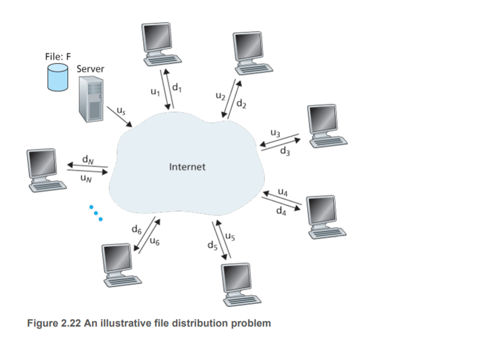
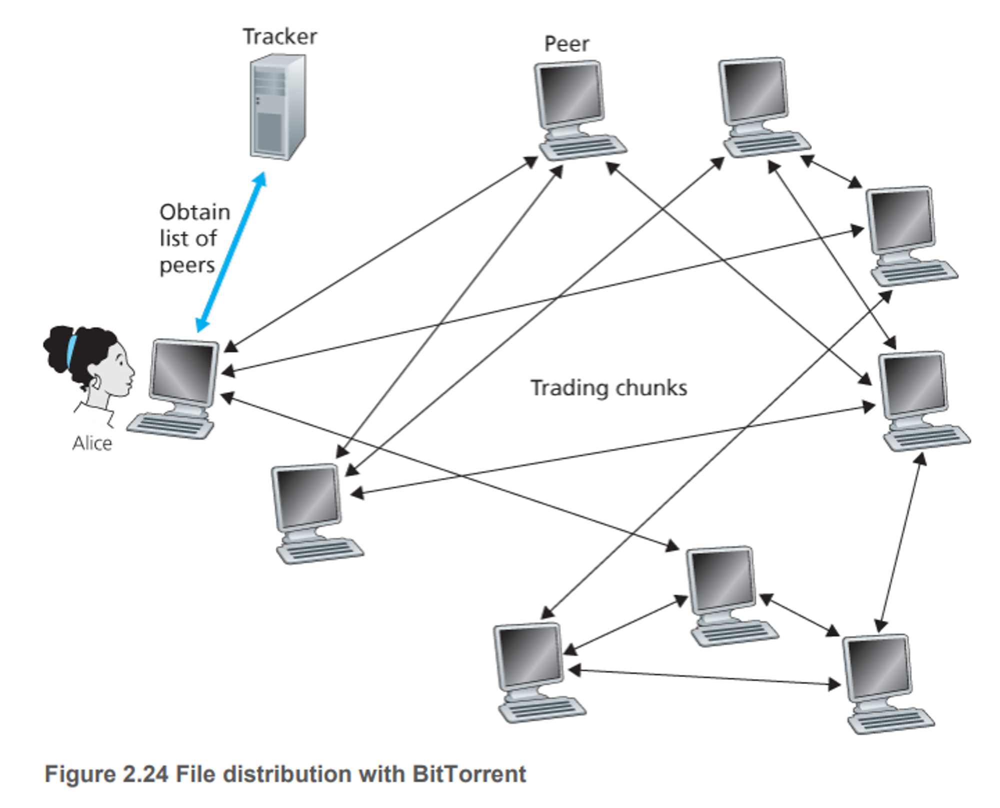

# 2.5 P2P 파일 분배

P2P 구조는 서버-클라이언트 구조가 아니기에 서버가 항상 켜져 있을 필요가 없다. 대신 호스트 쌍들(피어라고 부름)이 서로 직접 통신한다. 피어는 서비스 제공자가 소유하는 것이 아니라 사용자가 제어한다(스마트폰, 데스크탑).

### P2P 구조의 확장성

- 아래의 그림처럼 서버와 피어들은 접속 링크로 인터넷에 연결
- Us: 서버의 접속 접속 링크 업로드 속도
- Ui: i번째 피어의 접속 링크 업로드 속도
- Di: i번째 피어의 접속 링크 다운로드
- F: 분배되는 파일의 크기(단위는 비트)
- N: 파일의 복사본을 얻고자 하는 피어들의 수
- 분배 시간: 모든 N개의 피어들이 파일의 복사본을 얻는데 걸리는 시간
- 여기서 인터넷 코어가 풍부한 대역폭을 가지고, 서버-클라이언트는 다른 네트워크 애플리케이션에 참여하지 않아서 다운로드 접속 대역폭은 이 파일 분배에 모두 사용된다고 가정

위의 조건들을 가지고 클라이언트-서버 구조와 P2P 구조 분배 시간을 비교해보자

### 클라이언트-서버 구조

- 서버는 파일 복사본을 N개의 피어 각각에 전송해야 한다. 따라서 NF비트를 전송해야한다. 그럼 분배 시간은 NF/u
- d(min)이 가장 낮은 다운 속도를 가진 피어의 속도라고 하자. 따라서 최소 분배 시간은 F/d(min)
- 이것을 통해 수식을 만들면
- Dcs≥max{NFus,Fdmin}
- 이는 클라이언트-서버 구조에 대한 최소 분배 시간의 하한값이다.
- Dcs=max{NFus,Fdmin}
- 충분히 큰 N에 대해 클라이언트-서버 분배 시간은  NF/u로 주어진다. 그렇다는 것은 N에 따라 선형적으로 증가한다는 사실을 알 수 있다. 피어가 많아질 수록 분배 시간 또한 엄청 증가한다는 것이다.

### P2P

- 각 피어들이 서버가 파일을 분배하는 데 도움을 줄 수 있다.
- 특히 한 피어가 파일 데이터 일부를 수신할 때, 피어는 그 데이터를 다른 피어들에게 재분배하는 데 자신의 업로드 용량을 이용할 수 있다.
- 분배 시간은 각 피어가 다른 피어들에게 파일의 일부를 어떻게 분배하느냐에 달렸기에 복잡하다. 하지만 수식을 도출해보자
- 분배가 시작되면 서버만이 파일을 가지고 있다.
- 서버는 적어도 한번 접속 링크로 보내야한다. 따라서 최소 분배 시간은 적어도  F/u .
- 클라이언트-서버 구조처럼 다운로드가 가장 낮은 피어는 F/d(min)이다.
- 마지막으로, 시스템의 전체 업로드 용량은 전체적으로 서버의 업로드 속도와 각 피어들의 업로드 속도를 더한 것이다. utotal=us+u1+⋯+uN
- 시스템은 N개 피어들 각각에게 F비트를 전달(업로드)해야 한다. 이는 utotal보다 빠를 순 없음
- 최소 분배 시간은 적어도 NF/(us+u1+⋯+uN)
- DP2P≥max{Fus,Fdmin,NFus+∑i=1Nui}
- DP2P=max{Fus,Fdmin,NFus+∑i=1Nui}

결론적으로 두 시스템을 비교하면 P2P 방식으로 분배를 하였을 경우 N의 증가함에 따라 훨씬 빠른 것을 확인할 수 있다. 그렇다고 항상 작다는 것은 아니다.

### 비트 토렌트

- 파일 분배를 위한 인기 있는 P2P 프로토콜
- 비트 토렌트 용어로 특정 파일의 분배에 참여하는 모든 피어의 모임을 토렌트라 부른다.
- 토렌트에 참여하는 피어들은 서로에게서 같은 크기의 청크를 다운로드한다.(일반적으로 256킬로바이트)
- 피어가 청크를 다운로드할 때 피어는 또한 청크를 다른 피어들에게 업로드한다.
- 한 피어가 전체 파일을 얻으면, 토렌트를 떠날 수 있거나 혹은 토렌트에 남아서 다른 피어들로 청크를 계속 업로드할 수 있다. 또한 어떤 피어는 일부 청크만을 가진 채로 토렌트를 떠날 수 있으며, 나중에 토렌트에 재가입할 수 있다.

동작방식

- 각 토렌트는 트래커라고 부르는 인프라스트럭처 노드를 갖고 있다.
- 한 피어가 토렌트에 가입할 때 트래커에 자신을 등록하고 주기적으로 자신이 아직 토렌트에 있음을 알린다.
- 이러한 방식으로 트래커는 토렌트에 참여하는 피어들을 추적
- 예를 들어 위처럼 앨리스가 토렌트에 가입할 때 트래커는 참여하고 있는 피어 집합에서 임의로 피어들의 부분집합을 선택해서 IP 주소를 앨리스에게 보낸다.
- 이 목록을 얻고, 앨리스는 이 목록에 있는 모든 피어와 동시에 TCP 연결을 설정
- 성공적으로 연결을 설정한 모든 피어를 ‘이웃 피어’라고 부름
- 시간이 지남에 따라 이웃 피어들 중 일부는 나가고 다시 들어오고 할거임
- 각 피어들은 파일 청크의 일부분 중 다른 부분들을 가지고 있을 것이다.
- 그럼 주기적으로 앨리스는 이웃 피어들 각각에게 그들이 갖고 있는 청크 목록을 요구하고 얻을 것이다.
- 어느 피어들에게 청크를 요구하고 어느 청크를 요구할지에 대해서는 교역 알고리즘을 사용한다.