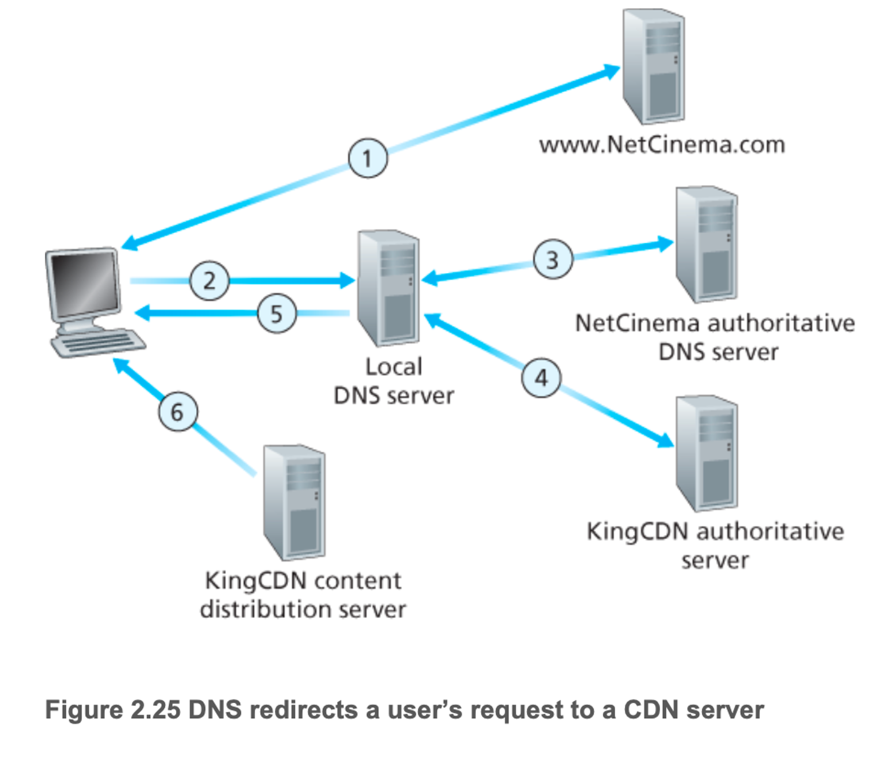
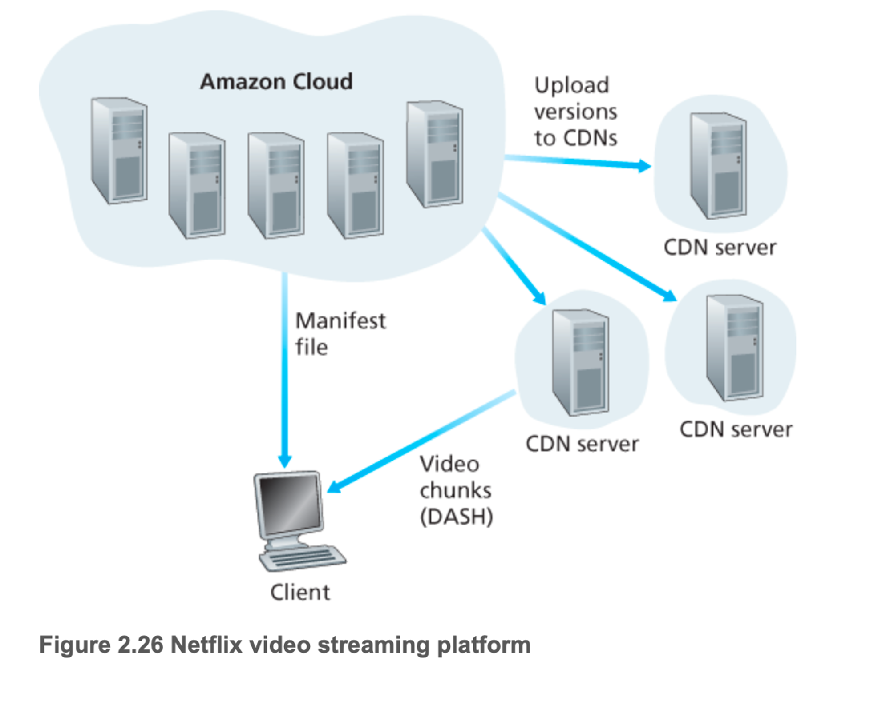

# 2.6 비디오 스트리밍과 콘텐츠 분배 네트워크

비디오 스트리밍 서비스가 어떻게 구현되는가? → 캐시와 같은 기능을 하는 애플리케이션 레벨 프로토콜과 서버를 사용하여 구현

## 인터넷 비디오

- 녹화된 비디오는 서버에 저장되어 사용자가 비디오 시청을 서버에게 온디맨드로 요청한다.(넷플릭스, 유튜브, 아마존, 틱톡)
- 여기서 고려할 점은 비디오는 이미지의 연속으로서 초당 24개 또는 30개의 이미지로 일정한 속도로 표시된다.
- 압축되지 않은 디지털 인코딩된 이미지는 픽셀 단위로 구성되고, 각 픽셀은 휘도, 색상을 나타내는 여러 비트로 인코딩
- 비디오의 특징은 압축될 수 있다는 것 → 사실 전송률이 곧 품질임
- 네트워크 측면에서 비디오의 가장 두드러지는 특징은 높은 비트 전송률
- 인터넷 비디오는 일반적으로 고화질 동영상을 스트리밍하기 위해 100kbps에서 4mbps 이상으로 구성
- 4K 스트리밍은 10Mbps 이상의 전송률
- 이 말들을 다시 정리하면 동영상은 엄청난 트래픽과 용량이 필요하다는 것
- 그렇기에 압축의 버전을 여러 개 나누어(300kbps, 1Mbps, 3Mbps) 사용자가 원하는 비디오를 선택(자신의 인터넷 연결 상태를 고려하여)

## HTTP 스트리밍 및 DASH

- HTTP에서의 비디오는 HTTP 서버 내의 특정 url을 갖는 일반적인 파일
- 만약 시청자가 비디오를 보고 싶다하면 TCP 연결을 하고 URL에 HTTP GET 요청을 보내어 트래픽 조건이 허용하는 대로 HTTP 응답 메시지 내에서 비디오 파일을 전송한다.
- 그럼 시청자 쪽 애플리케이션 버퍼에 전송된 바이트가 저장된다.
- 그리고 미리 정해진 특정 임계값을 초과하면 재생한다.
- 스트리밍 비디오에서는 이렇게 버퍼에서 주기적으로 비디오 프레임을 가져와서 프레임을 압축 해제하고 화면에 보이게 하는 것이다.

DASH

- 위의 상황에서 문제점이 존재하는데 그것은 바로 클라이언트 사이에 가용 대역폭의 차이에도 불구하고 똑같이 인코딩된 비디오를 전송받는 점(시간에 따른 차이도 발생)
- 그래서 만들어진 것이 바로 HTTP 기반 스트리밍인 DASH(Dynamic Adaptive Streaming over HTTP)
- DASH에서는 비디오는 여러 가진 버전으로 인코딩되며, 각 버전은 비트율과 품질 수준이 서로 다르다.
- 클라이언트는 동적으로 서로 다른 버전의 비디오를 몇 초 분량의 길이를 갖는 비디오 chunk 단위로 요청
- 그렇기에 가용 대역폭이 충분할 때는 높은 비트율 버전, 낮을 때는 낮은 비트율 버전(HTTP GET 요청 때마다 선택)
- 그래서 클라이언트가 자신의 인터넷 환경에 맞는 품질의 비디오를 받을 수 있는 것이다.
- 특히나 DASH는 세션 유지 중에 시간에 따라 변화하는 종단 간 가용 대역폭에 적응할 수 있도록 허용하는데 이 말은 사용자가 무선 환경에서 이동하더라도 그에 맞추어 그에 맞는 품질의 비디오를 보내주겠다는 것이다.
- DASH를 사용할 때 그에 맞는 버전으로 URL을 저장한다.(매니페스트 파일)
- 최초에 사용자가 원하는 URL과 byte-range를 보내면 처음에 그걸 주고 다운 받는 동안 수신자의 대역폭을 확인하여 다음 버전을 결정한다.

## 콘텐츠 분배 시스템

- 많은 스트리밍 회사들은 정말 많은 고객들에게 Mbps의 비디오 스트림을 분배하는데 어떻게 안정적으로 보낼까?
- 일단 스트리밍의 가장 간단한 방법은 단일 거대 데이터 센터를 구축하고 모든 비디오를 데이터 센터에 저장하고 클라이언트들은 이 데이터 센터에서 보내주게 되는 것이다.
- 이렇게하면 문제가 크게 몇 가지 존재
    - 첫째, 클라이언트가 데이터 센터로부터 먼 경우
    - 두 번째, 인기 있는 비디오는 같은 통신 링크를 통해 여러 번 반복적으로 전송될 것이라는 점
    - 세 번째, 단일한 데이터 센터를 구축하면 한 번의 장애로 인해 전체 서비스가 중단될 수 있는 위험이 있다는 것
- 이 문제를 해결하기 위해 대부분의 스트리밍 회사들은 콘텐츠 분배 네트워크(Content Distribution Network)를 이용한다.
- 다수의 지점에 분산 서버를 두고 각 서버들에 데이터의 복사본들을 저장한다.
- CDN은 사설일 수도 있고 아니면 제 3자가 운영하는 CDN일 수 있다. 물론 구글은 사설 CDN(private CDN)을 사용한다.
- 그렇다고 해서 모든 복사본을 모든 지점에 저장해둘 필요는 없다.
- 일반적으로는 인기있는 비디오들 위주로 저장을 하고 없는 비디오를 요청하면 다른 지점이나 중앙에 요청을 하여 가져오는 방식을 채택한다.
- 그러다 만약 저장 공간이 가득 차면 요청이 적은 비디오 데이터를 삭제한다.

### CDN 동작

- 사용자가 URL을 지정하여 비디오 재생을 요청하면 CDN은 그 요청을 가로채 1. 그 시점에서 클라이언트에게 적절한 CDN 클러스터를 선택, 2. 클라이언트의 요청을 해당 클러스터의 서버로 연결
- 어떻게 가로채고 다른 곳으로 연결하는 가?
    - DNS를 활용
    - 예를 들어 Netflix라는 콘텐츠 제공자가 King이라는 CDN 업체를 이용해 비디오를 고객에게 분배한다고 하자.
    - 사용자가 트랜스포머 영상을 요청하기 위해 해당 URL을 할당받고 요청 한다고 하자

1. 사용자가 Netflix 사이트 접속
2. 사용자가 해당 트랜스포머 링크를 클릭하여 DNS질의를 보냄(http://netflix.com/6Y7B23V)
3. 그럼 로컬 DNS 서버에서는 Netflix 문자열을 보고 Netflix 책임 DNS 서버로 전달. Netflix는 해당 영상을 제공하기 위해 King이라는 업체의 CND 호스트 이름을 알려줌
4. 이 시점부터는 Netflix 에서 벗어나 King이라는 업체의 DNS 구조로 들어감.  King 책임 서버에 요청을 보내면 콘텐츠 서버의 IP주소를 반환해주게 된다.
5. 그럼 로컬 DNS 서버는 콘텐츠 서버의 IP주소를 받게 된다.
6. 클라이언트는 해당 IP주소로 해당 서버에 TCP 연결을 하고 HTTP GET 요청을 한다.

### 클러스터 선택 정책

- 클라이언트를 동적으로 어떤 서버 클러스터 또는 CDN 데이터 센터로 연결하는 방식
- 앞에서 본 것처럼 CDN은 클라이언트가 DNS 처리를 하는 과정에서 클라이언트의 LDNS 서버의 IP 주솔르 알아낸다. 이걸로 결정하는데 여기서 선택 기법이 몇개 존재한다.
- 지리적으로 가장 가까운 클러스터를 할당
    - 대부분 잘 작동하는데 일부에서는 아닌 경우 존재
    - 예를 들어 지리적으로는 가까우나 네트워크 경로의 길이 홉의 수에 따라 가장 가까운 클러스터가 아닐 수 있다.
- 위와 같은 문제로 인해 실시간 측정(클러스터와 클라이언트 간의 지연 및 손실 성능)을 수행하여 처리

## 사례연구: 넷플릭스, 유튜브

넷플릭스와 유튜브는 성공적인 스트리밍 플랫폼이다.

### 넷플릭스

- 아마존 클라우드와 자체 CDN 인프라가 존재

- 자체 CDN이면 충분할텐데 왜 아마존 클라우드가 있는가? → 웹사이트(백엔드) 등
    - 콘텐츠 수집: 넷플릭스는 고객들에게 비디오를 분배하기 전에 먼저 영화를 수집하고 처리한다. 영화의 스튜디오 마스터 버전을 받아서 아마존 클라우드 시스템의 호스트에 업로드
    - 콘텐츠 처리: 기기 사양에 적합하도록 여러 가지 형식의 비디오를 생성. 또한 DASH를 이용한 HTTP 적응적 스트리밍 서비스를 위해 각 형식별로 다양한 비트율의 여러가지 버전을 생성
    - CDN으로의 버전 업로드: 이렇게 다양한 버전들을 생성하면 CDN으로 업로드
- 즉 영화를 필요로 하면 그 영화 사본이 저장되어 있는 최적의 CDN 서버를 결정한다.
- 클라이언트가 해당 ISP에 설치된 CDN 서버 랙에 있는 로컬 ISP를 사용하고 있고, 이 랙에 요청된 사본이 있는 경우 일반적으로 이 랙 서버가 선택된다. 그렇지 않으면 근처에 IXP서버가 선택
    - 이게 되는 이유는 넷플릭스가 자체 CDN을 구축하기 위해 IXP 및 거주용 ISP 자체에서 서버 랙을 설치
- 그 뒤 요청에 대한 응답으로 조각 단위(4초 단위 데이터)를 주고 수신 처리율을 측정하고 전송률 결정 알고리즘을 이용해 다음에 요청할 비디오 조각 단위 데이터의 품질을 결정

### 유튜브

- 넷플릭스와 유사한 방식
- 수백 가지의 IXP 및 ISP 위치에 서버 클러스터를 설치
- 이러한 위치에서 거대한 데이터 센터에서 직접 동영상을 배포
- 구글의 클러스터 선택 정책은 클라이언트와 클러스터 간의 RTT가 가장 적은 곳을 연결
- HTTP 스트리밍을 채용하고 있다. 여기서 추가적으로 클라이언트 → 서버 즉 업로드에도 HTTP 스트리밍을 사용
- 업로드 된 영상을 자신들의 형식으로 변환하고 여러 개의 버전으로 생성