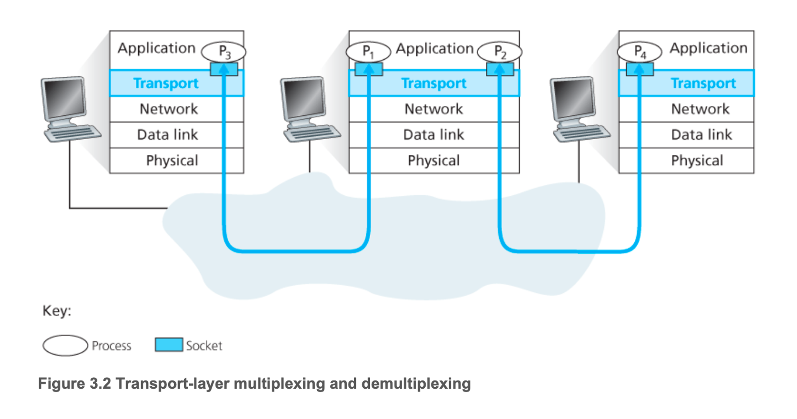
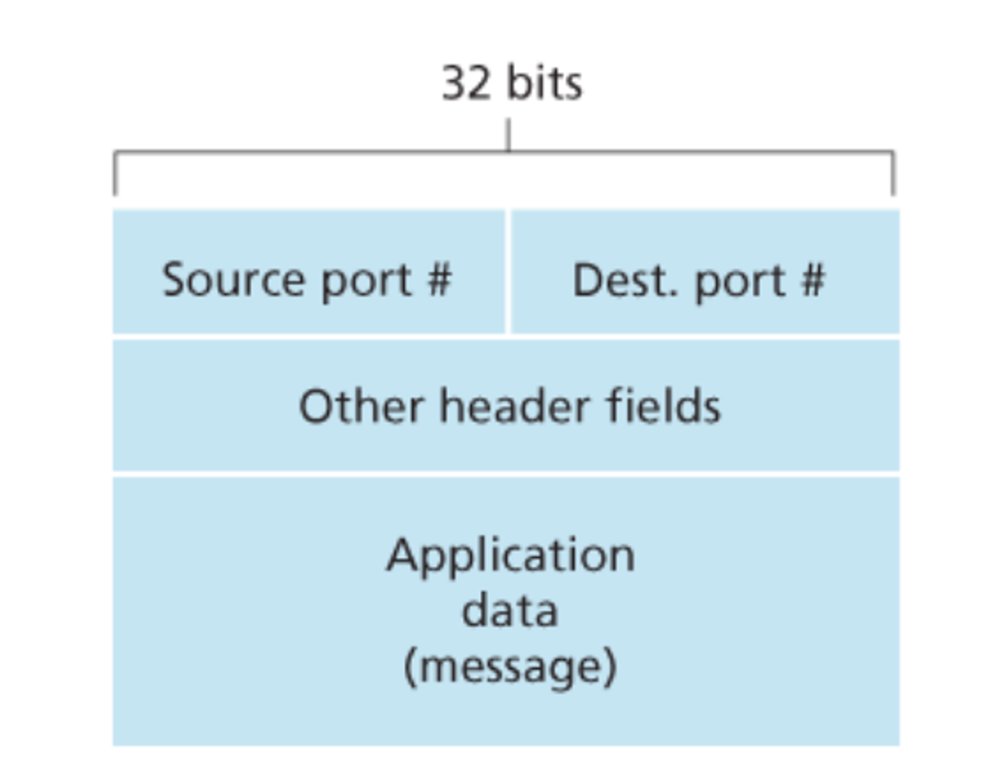
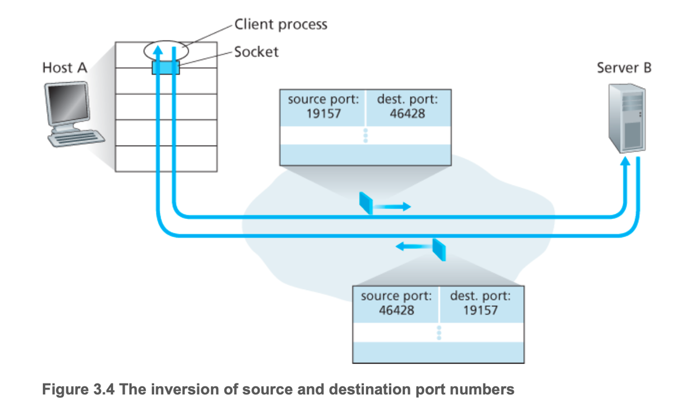
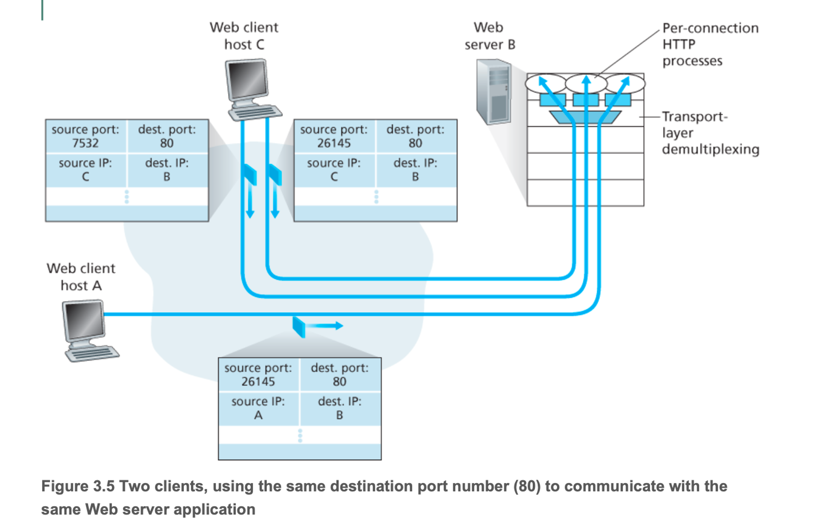

# 다중화와 역다중화

<p align="center">

만약 해당 호스트에 여러 어플리케이션 즉 여러 프로세스가 존재한다고 하자. 그럼 트랜스포트 계층에서는 어느 프로세스에게 데이터를 전달할지 정하고 보내야하게된다. 트랜스포트 계층은 실제로는 프로세스에게 직접 데이터를 전달하는 것이 아닌 소켓에게 전달하게 된다.즉 호스트에 하나 이상의 소켓이 있을 수 있고, 각각의 소켓은 하나의 유일한 식별자를 갖는데 이 식별자의 포맷은 소켓이 UDP 소켓인지 TCP 소켓인지에 따라 달라진다. 수신 측의 트랜스포트는 수신 소켓을 식별하기 위해 세그먼트에 필드를 확인하고 올바른 소켓에게 전달하는데 이 작업을 역다중화라고 한다. 반대로 출발지 호스트에서 소켓으로부터 데이터를 모으고, 이에 대한 세그먼트를 생성하기 위해 캡슐화하고, 그 세그먼트들을 네트워크 계층으로 전달하는 작업을 중화라고 한다.

하지만 이러한 다중화에는 두 가지 요구사항이 필요하다.

1. 소켓은 유일한 식별자를 갖는다.
2. 각 세그먼트는 세그먼트가 전달된 적절한 소켓을 가리키는 특별한 필드를 갖는다.

이 특별한 필드라는 것은 출발지 포트 번호 필드와 목적지 포트 번호 필드다.

<p align="center">

각각의 필드 번혼느 0 ~ 65535까지의 16비트 정수다. 그 중 0 ~ 1023까지의 포트 번호를 잘 알려진 포트 번호(well-known port number)라고 하여 엄격하게 제한한다.

호스트의 각 소켓은 포트 번호를 할당받고 세그먼트가 호스트에 도착하면, 트랜스포트 계층은 세그먼트 안의 목적지 포트 번호를 검사하고 상응하는 소켓으로 세그먼트를 보내게 된다.

### 비연결형 다중화와 역다중화

```python
clientSocket = socket(AF_INET, SOCK_DGRAM)
```

위와 같은 방법으로 UDP 소켓이 생성될 때, 트랜스포트 계층은 포트 번호를 소켓에게 자동으로 할당한다. 겹치면 안되기에 UDP 포트로 사용되지 않는 1024 ~ 65535 사이의 포트번호를 할당한다.

```python
clientSocket.bind((’’, 19157))
```

그렇게 하여 특정 번호를 UDP에 할당을 하게 된다. 일반적으로 애플리케이션의 서버 측이 틀정 포트 번호를 할당하는 것에 반하여, 애플리케이션의 클라이언트 측은 트랜스포트 계층이 포트 번호를 자동으로 할당한다.

UDP 다중화/역다중화

- UDP 소켓 19157을 가진 호스트 A의 프로세스가 호스트 B의 UDP 소켓 46428을 가진 프로세스에게 애플리케이션 데이터 전송을 원한다고 가정
- 호스트 A의 트랜스포트 계층은 애플리케이션 데이터, 출발지 포트 번호, 목적지 포트 번호, 긜고 2개의 다른 값을 포함하는 트랜스포트 계층 세그먼트를 생성한다.
- 해당 세그먼트를 네트워크 계층으로 전달하여 IP 데이터그램으로 캡슐화하고 최선형 전달 서비스로 세그먼트를 수신 호스트로 전달
- 그럼 수신 호스트에 도착하면 목적지 포트 번호를 검사하고 그 세그먼트를 포트 46428로 식별되는 소켓에 전달한다.

UDP는 목적지 IP주소와 목적지 포트 번호로 구성된다. 그렇기에 만약 출발지 IP 주소가 다르거나 출발지 포트 번호가 다르다 할지라도 목적지 IP 주소와 포트 번호가 같다면 같은 목적지 소켓으로 향할 것이다.

<p align="center">


그럼 출발지 포트 번호는 왜 필요한 것인가? 해당 포트 번호의 경우 ‘회신 주소’의 한 부분으로 사용된다. 

### 연결지향형 다중화와 역다중화

TCP 소켓과 UDP 소켓의 다른 점은 TCP 소켓은 4개 요소의 집합, 즉 (출발지 IP 주소, 출발지 포트 번호, 목적지 IP 주소, 목적지 포트 번호)에 의해 식별된다. 그렇기에 호스트에 세그먼트가 전달되면 4개의 필드를 통해 소켓에 전달되게 되는 것이다. 그렇기에 UDP와 다르게 출발지 주소와 포트 번호를 가지고 다른 소켓으로 향하게 된다. 

서버 호스트는 동시 존재하는 많은 TCP 소켓을 지원할 수 있다. 이 각각의 소켓은 프로세스에 접속되어 있으며, 소켓은 4개 요소의 집합으로 식별된다. 그렇기에 해당 필드로 역다중화가 되는 것이다.

<p align="center">

위의 그림처럼 서버B에 여러 요청들 즉 여러 프로세스들에게 오는 요청이 오더라도 4개의 필드를 가지고 역다중화하여 적절한 포트의 소켓에게 전달하게 된다.

### 웹 서버와 TCP

아파치 웹 서버 같은 웹 서버가 포트 번호 80상에서 동작하는 호스트를 고려해보자. 클라이언트가 서버로 세그먼트를 보내면, 모든 세그먼트는 목적지 포트 번호 80을 갖고 있을 것이다. 특히, 초기 연결 설정 세그먼트들과 HTTP 요청 메시지를 전달하는 모든 세그먼트는 목적지 포트 번호 80을 가질 것이다. 근데 이 상황에서 연결 소켓과 프로세스 사이에 항상 일대일 대응이 이루어지지 않는다. 새로운 클라이언트 연결을 위해 새로운 연결 소켓과 함께 새로운 스레드를 생성한다. 이런 웹 서버에서는 하나의 같은 프로세스에 붙어 있는 많은 연결 소켓들이 동시에 존재한다.