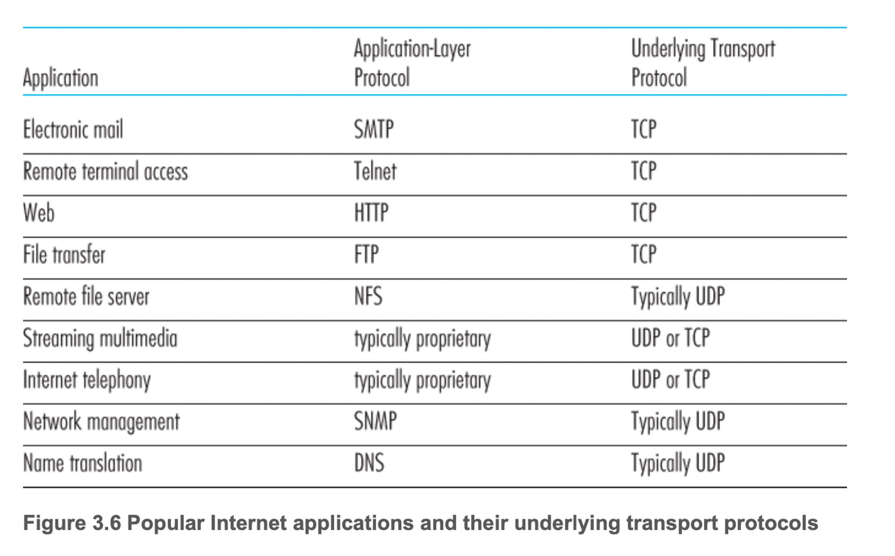

# 3.3 비연결형 트랜스포트: UDP

- [RFC 768]에서 정의된 UDP는 트랜스포트 계층 프로토콜이 할 수 있는 최소 기능으로 동작한다. UDP는 다중화/역다중화 기능과 간단한 오류 검사 기능을 제외하면 IP에 아무것도 추가하지 않는다. 그렇기에 UDP를 사용한다는 것은 거의 IP와 직접 통신하는 셈이다.
- UDP는 애플리케이션 프로세스로부터 메시지를 가져와서 다중화/역다중화 서비스에 대한 출발지 포트 번호 필드와 목적지 포트 번호 필드를 첨부하고 다른 두 필드를 추가한 후에 최종 세그먼트를 네트워크 계층으로 넘겨준다.
- 네트워크 계층은 트랜스포트 계층 세그먼트를 IP 데이터그램으로 캡슐화하고, 세그먼트를 수신 호스트에게 전달
- 그렇게 전달된 세그먼트의 데이터를 포트 번호를 가지고 목적지에 전달하게 된다.
- UDP는 세그먼트를 송신하기 전에 송신 트랜스포트 계층 개체들과 수신 트랜스포트 계층 개체들 사이에 핸드셰이크를 사용하지 않는다.

그럼 어떤 곳에서 UDP를 사용하는가? → DNS

- 호스트의 DNS 애플리케이션이 질의를 생성할 때, DNS 질의 메시지를 작성하고 UDP에게 메시지를 넘겨준다.
- 목적지 종단 시스템상에서 동작하는 UDP 개체와 호스트 측 UDP는 어떠한 핸드셰이크도 수행하지 않고 메시지에 헤더 필드를 추가한 후에 최종 세그먼트를 네트워크 계층에 넘겨준다.
- 네트워크 계층은 UDP 세그먼트를 데이터그램으로 캡슐화하고 네임 서버에 데이터그램을 송신
- 이때 질의 호스트에서의 DNS 애플리케이션은 질의에 대한 응답을 기다리고 수신 받지 못하면 질의를 다른 네임 서버로 송신하거나 애플리케이션에게 응답을 수신할 수 없음을 통보

UDP가 적합한 경우

- 무슨 데이터를 언제 보낼지에 대해 애플리케이션 레벨에서 더 정교한 제어: UDP하에서 애플리케이션 프로세스가 데이터를 UDP에게 전달하자마자 UDP는 데이터를 UDP 세그먼트로 만들고 그 세그먼트를 즉시 네트워크 계층으로 전달. 이에 반해 TCP는 혼잡 제어 매커니즘으로 인해 목적지 호스트들과 출발지 호스트들 사이에서 하나 이상의 링크가 과도하게 혼잡해지면, 트랜스포트 계층 TCP 송신자를 제한한다. TCP는 신뢰적인 전달이 얼마나 오래 걸리는지에 관계없이 목적지가 세그먼트의 수신 여부를 확인응답할 때까지 데이터의 세그먼트 재전송을 계속한다. 이렇게하면 실시간 처리에서는 지연으로 인한 문제가 발생한다.
- 연결 설정이 없음: TCP는 데이터 전송을 시작하기 전에 세 방향 핸드셰이크를 사용한다. 반면에 UDP는 공식적인 사전 준비 없이 전송한다. 그렇기에 UDP는 연결을 위한 추가 지연이 없다. 이러한 특징으로 인해 DNS에서는 UDP 위에서 동작한다. 그에 반해 HTTP 문서로 된 웹 페이지는 신뢰성이 중요해 TCP를 사용한다.
- 연결 상태가 없음: TCP는 종단 시스템에서 연결 상태를 유지한다. 이 연결 상태는 수신 버퍼와 송신 버퍼, 혼잡 제어 파라미터, 순서 번호와 확인응답 번호 파라미터를 포함한다. TCP는 혼잡제어를 위해 이런 것들을 구현하고 제공해야한다. 이에 반하여, UDP는 연결 상태를 유지하지 않으며 이 파라미터 중 어느 것도 기록하지 않는다. 그렇기에 TCP보다는 좀 더 많은 액티브 클라이언트를 수용할 수 있다.
- 작은 패킷 헤더 오버헤드: TCP는 세그먼트마다 20바이트의 헤더 오버헤드를 갖지만, UDP는 단지 8바이트의 오버헤드를 갖는다.

위의 목록들처럼 신뢰적 데이터 전송을 필요한 데이터 서비스들(전자메일, 원격 터미널 접속, 웹, TCP 상의 파일 전송 등)은 TCP 프로토콜들을 사용한다. 그에 반해 대부분의 애플리케이션들은 UDP를 사용한다. 인터넷 전화, 실시간 비디오 회의, 저장된 오디오와 비디오의 스트리밍 같은 멀티미디어 애플리케이션에 종종 사용된다. 이러한 서비스들은 적은 양의 패킷 손실은 허용할 수 있기에 UDP가 효과적이다.

그럼 UDP는 신뢰적인 데이터 전송이 아예 불가능한가? 그렇지 않다. 신뢰성을 애플리케이션 자체에서 제공한다면 신뢰적인 데이터 전송을 할 수 있다. 대표적인 것인 QUIC 프로토콜이다. 근데 이러한 작업은 결국 개발자가 디버깅을 계속해서 작업해야하는 것이다. 그럼에도 지연 없이 신뢰적 통신을 할 수 있다는 것에 큰 이점이 있다.

### UDP 세그먼트 구조

- UDP 세그먼트 구조를 RFC 768에 정의 되어 있다.
- 애플리케이션 데이터는 UDP 데이터그램의 데이터 필드에 위치한다.
    - 예를 들면, DNS에 대한 데이터 필드에는 질의 메시지나 응답 메시지를 포함
- UDP 헤더는 2바이트씩 구성된 단 4개의 필드만을 갖는다.
- 포트 번호는 목적지 호스트가 목적지 종단 시스템에서 동작하는(역다중화 기능을 수행하는) 정확한 프로세스에게 애플리케이션 데이터를 넘기게 해준다.
- 체크섬은 UDP 세그먼트 이외에 IP 헤더의 일부 필드도 계산한다.
- 길이 필드는 헤더를 호함하는 UDP 세그먼트의 길이를(바이트 단위) 나타낸다.

### UDP 체크섬

- 오류 검출을 위한 것
- 세그먼트가 출발지로부터 목적지로 이동했을 때, UDP 세그먼트 안의 비트에 대한 변경사항이 있는지 검사하는 것
- 송신자 측에서 UDP는 세그먼트 안에 있는 모든 16 비트 워드의 합산에 대해 다시 1의 보수를 수행하며, 합산 과정에서 발생하는 오버플로는 윤회식 자리올림(wrap around)을 한다.
- 이 결과값이 UDP 세그먼트의 체크섬 필드에 삽입

### 체크섬을 제공하는 이유

- 출발지와 목적지 사이의 모든 링크가 오류 검사를 제공한다는 보장이 없기 때문
- 즉, 링크 중에서 하나가 오류 검사를 제공하지 않는 프로토콜을 사용할 수도 있기 때문이다.
- 세그먼트가 정확하게 링크를 통해 전송되었을지라도, 세그먼트가 라우터의 메모리에 저장될 때 비트 오류가 발생할 수 있다.
- 주어진 링크 간의 신뢰성과 메모리의 오류 검사가 보장되지도 않고, 종단 간의 데이터 전송 서비스가 오류 검사를 제공해야 한다면, UDP는 종단 기반으로 트랜스포트 계층에서 오류 검사를 제공해야한다.
- 이것이 종단과 종단의 원칙(end-end principle)의 한 예
- 그렇다고 UDP가 오류를 회복는 일은 하지 않는다. 단순히 오류 검사를 제공한다. 물론 일부 UDP 구현에서는 손상된 세그먼트를 그냥 버리기도 하고, 다른 구현에서는 경고와 함께 손상된 세그먼트를 애플리케이션에게 넘겨주기도 한다.