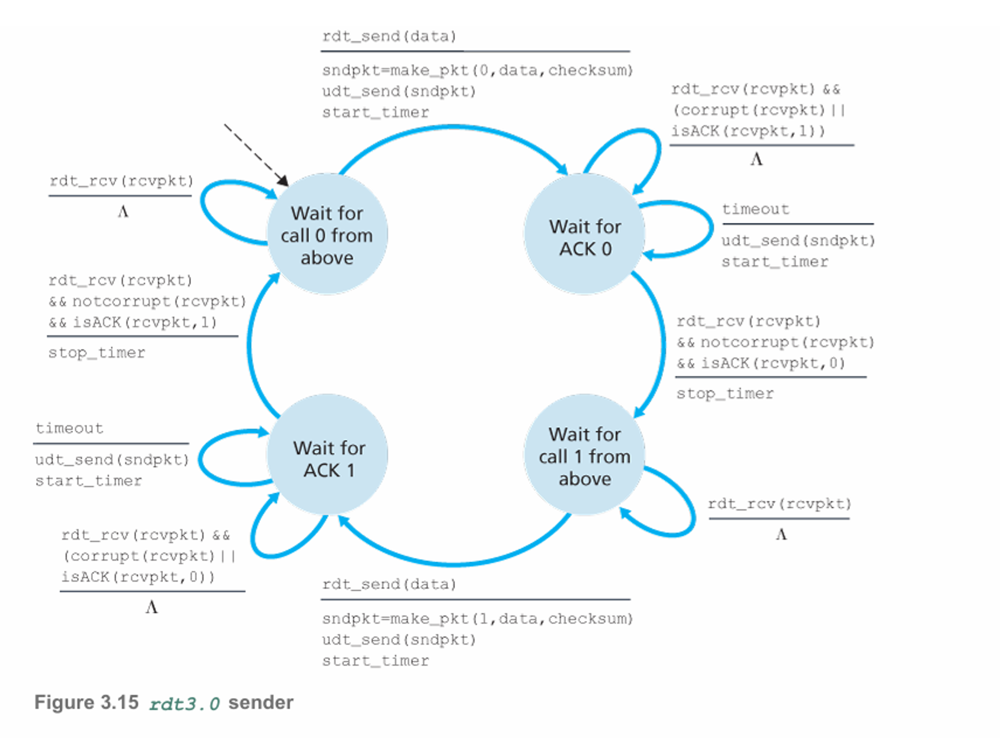

# 3.4 신뢰적인 데이터 전송의 원리

신뢰적인 데이터 전송을 구현하는 문제는 트랜스포트 계층뿐만 아니라 링크 계층과  애플리케이션 계층에서도 발생 할 수 있는 문제이다.

아래의 그림은 신뢰적 데이터 전송 연구의 프레임워크를 보여준다.

 

        
        

상위 계층 객체에게 제공되는 서비스 추상화는 데이터가 전송될 수 있는 신뢰적인 채널의 서비스 추상화다.

- 신뢰적인 채널에서는 전송된 데이터가 손상되거나 손실되지 않는다.
- 모든 데이터는 전송된 순서 그대로 전달된다.

⇒ TCP가 인터넷 애플리케이션에게 제공하는 서비스 모델

서비스 추상화를 구현하는 것이 신뢰적인 데이터 전송 프로토콜의 의무다.

---

> 이 절에서는 점점 복잡해지는 하위 채널 모델을 고려하여 신뢰적인 데이터 전송 프로토콜의 송신자 측면과 수신자 측면을 점진적으로 개발
> 

하위 채널에서 비트가 손상되거나 전체 패킷을 손실하는 경우 어떠한 프로토콜 메커니즘이 필요할지를 고려한다. 

- 보내진 패킷은 일분 손실될 수도 있겠지만 보내진 순서대로 전달될 것이라고 가정

위의 그림 중 오른쪽 그림은 데이터 전송 프로토콜의 인터페이스를 나타낸다.

- 송신 측은 rdt_send() 호출로 위쪽으로부터 호출될 것이다.
- 수신 측에서는 상위 계층으로 전달될 데이터를 넘길 것이다.
    - 여기서 rdt는 신뢰적인 데이터 전송 프로토콜
    - _send는 rdt의 송신 측이 호출되고 있음을 나타냄
- 수신 측에서 rdt_rcv()는 패킷이 채널이 수신 측으로부터 도착했을 때 호출된다.
- rdt 프로토콜이 상위 계층에 데이터를 전달하려고 할 때 deliver_data()를 호출 한다.

---

> 이 절에서는 단방향 데이터 전송의 경우인 송신측으로부터 수신 측까지의 데이터 전송만을 고려
> 
- 신뢰적인 양방향(전이중) 데이터 전송의 개념은 복잡함
- 단방향 전송만 생각하더라도 위의 그림처럼 프로토콜의 송신 측과 수신 측이 양방향으로 패킷을 전달할 필요가 있음을 유의
- rdt의 송신 측과 수신 측은 전송 데이터를 포함하는 패킷을 교환하는 것 외에 제어 패킷을 양쪽으로 전송해야한다는 것을 볼 것임
- rdt의 송신 측과 수신 측 모두 udt_send()를 호출함으로써 다른 쪽에 패킷을 전송한다.

## 신뢰적인 데이터 전송 프로토콜의 구축

### 완벽하게 신뢰적인 채널상에서 신뢰적인 데이터 전송: rdt1.0

- 하위 채널이 완전히 신뢰적인 가장 간단한 경우를 고려. 프로토콜은 rdt1.0이라 부름

- 위는 rdt1.0 송신자와 수신자에 대한 유한상태 머신(finite-state machine,FSM)이다.
- (a)의 FSM은 송신자의 동작은 정의, (b)의 FSM은 수신자의 동작을 정의
- 즉 송신자와 수신자의 FSM이 분리되어 있다는 것을 유의

rdt1.0에서 각각의 FSM은 하나의 상태만을 가지므로, 전이는 필연적으로 그 상태로부터 자신으로 되돌아온다.

송신자

- rdt_send(data) 이벤트에 의해 상위 계층으로부터 데이터를 받아들이고 데이터를 포함한 패킷을 생성한다.(make_pkt(data)에 의해)
- 그러고 난 후 패킷을 채널로 송신
- rdt_send(data) 이벤트는 상위 계층 애플리케이션의 프로시저 호출(예: rdt_send())에 의해 발생

수신자

- rdt_rcv(packet) 이벤트에 의해 하위의 채널로부터 패킷을 수신하고, 패킷으로부터(extract(packet,data)에 의해) 데이터를 추출한 후 데이터를 상위 계층으로 전달한다.(deliver_data(data)).
- rdt_rcv(packet) 이벤트는 하위 계층 프로토콜로부터의 프로시저 호출(예 rdt_rcv())에 의해 발생

---

- 이러한 간단한 프로토콜에서는 데이터 단위와 패킷의 차이점이 없음
- 모든 패킷 흐름은 송신자로부터 수신자까지다.

> 즉, 완전히 신뢰적인 채널에서는 오류가 생길 수 없으므로 수신 측이 송신 측에게 어떤 피드백도 제공할 필요가 없다.
> 

따라서 수신자가 송신자에게 천천히 보내라는 것을 요청할 필요가 없다.

### 비트 오류가 있는 채널상에서의 신뢰적 데이터 전송: rdt2.0

- 하위 채널의 더 실질 모델은 패킷 안의 비트들이 하위 채널에서 손상되는 모델
- 비트 오류는 패킷이 전송 또는 전파되거나 버퍼링될 때 네트워크의 물리적 구성요소에서 일반적으로 발생

> 전송된 모든 패킷이 송신된 순서대로 수신된다고 가정
> 

비트 오류를 처리하기 위해서는 재전송을 기반으로하는 신뢰적인 데이터 전송을 하는 프로토콜이 필요하다. 그것이 바로 자동 재전송 요구(Authomatic Repeat reQuest, ARQ) 프로토콜. 비트 오류를 처리하기 위해 기본적으로 ARQ 프로토콜에 세 가지 부가 프로토콜이 필요하다.

- 오류 검출
    - 비트 오류가 발생했을 때 수신자가 검출할 수 있는 기능이 필요
    - UDP에서는 이러한 목적을 위해 인터넷 체크섬 필드를 사용했음
    - 이러한 기술을 통해 수신자가 패킷 비트 오류를 검출하고 복구할 수 있게 해준다.
- 수신자 피드백
    - 송신자가 수신자의 상태(패킷이 정확하게 수신되었는지 아닌지와 같은 경우)를 알기 위한 유일한 방법은 수신자가 송신자에게 피드백을 제공하는 것
    - 긍정 확인응답(ACK)과 부정 확인응답(NAK)이 예시(순신자 → 송신자)
    - 원칙적으로 이러한 패킷은 단지 한 비트 길이면 된다.(예 → 0 값은 NAK, 1은 ACK)
- 재전송
    - 수신자에서 오류를 가지고 수신된 패킷은 송신자에 의해 재전송

위는 오류 검출, 긍정 확인응답 그리고 부정 확인응답들을 채택하는 데이터 전송 프로토콜 rdt2.0의 FSM

송신자

- 2개의 상태를 가짐
- 왼쪽 상태
    - 송신 측 프로토콜은 상위 계층으로부터 데이터가 전달되기를 기다린다.
    - rdt_send(data) 이벤트가 발생하면, 송신자는 패킷 체크섬과 함께 전송될 데이터를 포함하는 패킷(sndpkt)을 생성하고, 그 패킷을 udt_send(sndpkt) 동작을 통해 전송
- 오른쪽 상태
    - 송신자 프로토콜은 수신자로부터 ACK 또는 NAK 패킷을 기다린다.
    - ACK 패킷이 수신된다면 송신자는 가장 최근에 전송된 패킷이 정확하게 수신되었음을 알게된다.
    - 프로토콜은 상위 계층으로부터 데이터를 기다리는 상태로 돌아간다.
    - NAK 패킷이 수신된다면 프로토콜은 마지막 패킷을 재전송하고 재전송된 데이터 패킷에 대한 응답으로 수신자에 의해 응답하는 ACK 또는 NAK를 기다린다.
    - 이 상태일 때는 상위 계층으로부터 더 이상의 데이터를 전달받을 수 없다. 즉 rdt_send() 이벤트는 발생할 수 없음
- 위와같이 송신자는 수신자가 현재의 패킷을 정확하게 수신했음을 확신하기 전까지 새로운 데이터를 전송하지 않기에 rdt2.0은 전송 후 대기(stop-and-wait) 프로토콜로 알려져있다.

수신자

- 단일 상태를 갖는다.
- 패킷이 도착했을 때, 수신자는 수신된 패킷이 손상되었는지 아닌지에 따라 ACK 또는 NAK로 응답
- rdt_rcv(rcvpkt) && corrupt(rcvpkt)는 패킷이 수신되고 오류가 검출되는 이벤트에 대응

하지만 이러한 rdt2.0 또한 치명적인 결함이 존재. 여기서는 ACK 또는 NAK 패킷이 손상될 수 있다는 가능성을 고려하지 않았다. 이러한 오류를 검출하기 위해 해당 패킷에 체크섬 비트를 추가할 필요가 있다. 좀 더 어려운 문제는 어떻게 프로토콜이 ACK 또는 NAK 패킷 오류로부터 복구되는가이다. 만약 ACK 또는 NAK가 손상된다면, 송신자는 수신자가 전송된 데이터의 마지막 부분을 올바르게 수신했는지를 알 방법이 없다.

해결방법은 무엇일까?

1. 송신자가 검출뿐만 아니라 비트 오류로부터 회복할 수 있도록 충분한 체크섬 비트들을 추가하는 것
    - 패킷이 손상될 순 있으나 손실되는지는 않는 채널의 경우에는 즉각적으로 문제를 해결할 수 있다.
2. 송신자가 왜곡된 ACK 또는 NAK 패킷을 수신할 때 현재 데이터 패킷을 단순히 다시 송신하는 것
    - 이 방식은 송신자에서 수신자 간의 채널로 중복 패킷을 전송한다.
    - 송신자 입장에서는 마지막으로 전송된 ACK 또는 NAK가 송신자에게 정확하게 수신됐는지를 알 수 없다.
    - 수신자 입장에서는 도착하는 패킷이 새로운 데이터를 포함하고 있는 것인지 아니면 재전송인지를 사전에 알 수 없다.
    

그럼 다른 해결법은?

- 데이터 패킷에 새로운 필드를 추가하고 이 필드 안에 순서번호를 삽입하는 방식으로 데이터 패킷에 송신자가 번호를 붙이는 것
- 수신자는 수신된 패킷이 재전송인지를 결정할 때는 이 순서 번호만 확인하면 된다.
- 일반적으로 패킷을 손실하지 않는 채널을 가정하고 있으므로, ACK와 NAK 패킷 자체는 확인 중인 패킷의 순서 번호를 나타낼 필요는 없다.

### rdt2.0 문제 해결을 위한 rdt2.1

 

        
        

- rdt2.1 송신자와 수신자 FSM은 전보다 두 배 많은 상태를 가지고 있다.
- 이는 프로토콜 상태가 현재 (송신자에 의해) 전송되고 있거나, 아니면 (수신자가) 기다리고 있는 패킷이 순서 번호 0 또는 1을 가져야 하는지를 반영해야 하기 때문이다.
- 2.1은 수신자로부터 송신자까지의 긍정 확인응답과 부정 확인응답을 모두 포함
- 순서가 바귄 패킷이 수신되면, 수신자는 이미 전에 수신한 패킷에 대한 긍정 확인 응답을 전송
- 손상된 패킷이 전송되면, 수신자는 부정 확인응답을 전송

NAK를 송신하는 것 대신에, 가장 최근에 정확하게 수신된 패킷에 대해 ACK를 송신함으로써 NAK를 송신하는 것과 같은 효과를 얻는다.

즉, 같은 패킷에 대해 2개의 ACK를 수신한 송신자는 수신자가 두 번 ACK 한 패킷이 다음 패킷을 정확하게 수신하지 못했다는 것을 안다.

### 비트 오류를 갖는 채널을 위한 NAK 없는 신뢰적인 데이터 전송 프로토콜: rdt2.2

 

        
        

- rdt2.1과 rdt2.2의 미묘한 차이는 수신자가 반드시 ACK 메시지에 의해 응답되는 패킷의 순서 번호를 포함해야 한다는 점이다.(수신자 FSM의 make_pkt()에 ACK, 0 또는 ACK, 1인 인수를 넣어서 수행)
- 송신자는 수신된 ACK 메시지에 의해 확인응답된 패킷의 순서 번호를 반드시 검사해야한다.(송신자 FSM의 isACK()에 0 또는 1인 인수를 넣어서 수행)

### 비트 오류와 손실이 있는 채널상에서의 신뢰적인 데이터 전송: rdt3.0

> 비트가 손상되는 것 외에도 인터넷을 포함하는 오늘날의 컴퓨터 네트워크처럼 하위 채널이 패킷을 손실하는 경우를 생각
> 
- 어떻게 패킷 손실을 검출할 것인가?
- 패킷 손실이 발생했을 때 어떤 행동을 할 것인가?

두 번째의 문제는 체크섬, 순서 번호, ACK 패킷, 재전송의 사용(rdt2.2 기술)로 해결이 가능하다. 하지만 첫 번째 문제를 위해서는 새로운 프로토콜 메커니즘이 필요. 여기서는 송신자에게 손실된 패킷의 검출과 회복 책임을 부여할 것이다. 송신자가 데이터 패킷을 전송하고 패킷 또는 수신자의 패킷에 대한 ACK를 손실했다고 가정

- 송신자가 패킷을 잃어버렸다고 확신할 정도로 충분히 기다릴 수 있다면 상관 없지만 얼마나 오랫동안 기다려야 할까? 적어도 송신자와 수신자 사이의 왕복 시간 지연에 수신 측에서 패킷을 처리하는 데 필요한 시간을 더한 만큼 기다린다.
- 하지만 이러한 지연 시간을 예측하는 것은 어려움
- 만일 패킷이 유별나게 큰 지연을 갖는다면, 송신자는 비록 데이터 패킷이나 그 패킷에 대한 ACK가 손실되지는 않았다 하더라도 패킷을 재전송할 수 있다.
- 이건 중복 데이터 패킷의 가능성을 포함한다.
- 하지만 이 문제는 rdt2.2에서 이미 순서 번호라는 기능이 있어 해결이 가능하다.

송신자의 관점에서는 결국 데이터 패킷이 손실되었는지, ACK가 손실되었는지, 패킷 또는 ACK가 단순히 지나치게 지연된 것인지를 알지 못한다. 시간 기반의 재전송 메커니즘을 구현을 위해, 주어진 시간이 지난 후에 송신자를 인터럽트할 수 있는 카운트다운 타이머가 필요. 동작은 다음과 같다.

1. 매 패킷(첫 번째 또는 재전송 패킷)이 송신된 시간에 타이머를 시작함
2. 타이머 인터럽트에 반응함(적당한 행동을 취함)
3. 타이머를 멈춤

- 위 그림은 rdt3.0에 대한 송신자 FSM을 보여준다.
- 패킷 손실 또는 지연 없이 어떻게 동작하는지와 손실된 데이터 패킷을 어떻게 처리하는지를 보여준다.
- 패킷에 대한 수신 시간은 전송 지연과 전파 지연 때문에 패킷 전송 시간보다 더 늦다.

 

        
        

 

        
        

- 그림 b ~ d에서 송신 측 꺾쇠는 타이머가 설정된 후에 타임아웃된 시간을 의미한다.
- 패킷의 순서 번호가 0과 1이 번갈아 일어나므로, 프로토콜 rdt3.0은 때때로 얼터네이팅 비트 프로토콜이라고 부른다.

## 파이프라이닝된 신뢰적인 데이터 전송 프로토콜

- rdt3.0은 기능적으로는 정확한 프로토콜이나 전송 후 대기(stop-and-wait) 프로토콜이기에 성능적으로는 문제가 있다.

 

        
        

> - 하나의 호스트는 미국 서부에 위치하고 다른 하나는 동부에 있는 두 종단 호스트의 경우 갖
- 두 종단 시스템 사이의 광속 왕복 전파 지연(RTT)은 대략 30ms
- 두 호스트가 1Gbps 전송률(R)을 가진 채널로 연결되어 있다고 가정
> 

헤더 필드와 데이터를 모두 포함하여 패킷당 1000바이트(8000비트)의 패킷 크기(L)를 가지고 1Gbps 링크로 패킷을 실제로 전송하는 데 필요한 시간

→ dtrans=LR=8000 bits/packet109 bits/sec=8 microseconds

그럼 (a)의 경우

- 송신자가 t = 0에서 데이터를 전송하기 시작한다면 t = L/R = 8 microseconds에서 마지막 비트가 송신 측의 채널로 들어간다.
- 이제 패킷은 15ms동안 대륙을 횡단하고, t = RTT/2 + L/R = 15.008ms에 수신측으로 마지막 비트가 도착한다.
- 송신자 측에 ACK 패킷은 t = RTT + L/R = 30.008ms 후에 다시 받을 수 있다.
- 그러므로 30.008ms 동안 송신자는 단지 0.008ms 도안만 데이터를 전송한 셈
- 그럼 결국 이용률은 Usender=(L/R)/(RTT+L/R) =.008/30.008=0.00027
- 즉 송신자는 단지 0.027%만큼만 바빴다.
- 만약 중간 라우터에서 발생하는 처리 지연과 큐잉 지연은 물론 하위 계층 프로토콜 처리 시간까지 포함하면 성능은 더욱 나빠진다.

(b)의 경우

- 확인 응답을 기다리지 않고 여러 패킷을 전송하도록 허용
- 만약 확인 응답들을 기다리기 전에 송신자가 3개의 패킷을 전송하도록 허용한다면 송신자의 이용률은 3배가 된다.
- 만흥ㄴ 전송 중인 송신자-수신자 패킷을 파이프라인에 채워 넣음으로써 나타낼 수 있다.
- 이 기술이 파이프라이닝

 

        
        

파이프라이닝 방식이 신뢰적인 데이터 전송 프로토콜에서 가지는 중요성

- 순서 번호의 범위가 커져야 한다. 왜냐하면 각각의 정송 중인 패킷은 유일한 순서 번호를 가져야 하고 전송 중인 확인응답(ACK)이 안 된 패킷이 여럿 있을 수도 있다.
- 프로토콜의 송신 측과 수신 측은 패킷 하나 이상을 버퍼링해야 한다. 최소한 송신자는 전송되었으나 확인 응답되지 않은 패킷을 버퍼링해야 한다.
- 필요한 순서 번호의 범위와 버퍼링 조건은 데이터 전송 프로토콜이 손실 패킷과 손상 패킷 그리고 상당히 지연된 패킷들에 대해 응답하는 방식에 달려 있다. 파이프라인 오류 회복의 두 가지 기본적인 접근 방법으로 GBN(Go-Back-N,N부터 반복)과 SR(Selective Repeat,선택적 반복) 등이 있음

## GBN

- 송신자는 확인응답을 기다리지 않고 여러 패킷을 전송할 수 있다.
- 그러나 파이프라인에서 확인응답이 안 된 패킷의 회대 허용 수 N보다 크지 말아야 한다.

- 위는 송신자 관점의 순서 번호와 범위
- 확인응답이 안 된 가장 오래된 패킷의 순서 번호를 base로 정의하고 사용되지 않은 가장 작은 순서 번호를 nextseqnum(전송될 다음 패킷의 순서 번호)으로 정의한다면, 순서 번호의 범위에서 4개의 간격을 식별할 수 있음

위에서 볼 수 있는 4개의 간격을 식별하면

1. 간격 `[0, base-1]` : 순서 번호는 이미 전송되고 확인응답이 된 패킷
2. 간격 `[base, nextseqnum-1]` : 송신은 되었지만 아직 확인응답되지 않은 패킷
3. 간격 `[nextseqnum, base+N-1]` : 상위 계층으로부터 데이터가 도착하면 바로 전송될 수 있는 패킷
4. `base+N 이상`
    
    → 파이프라인에서 확인응답이 안 된 패킷(특히, 순서 번호 `base`를 가진 패킷)의 확인응답이 도착할 때까지 사용될 수 없다.
    

**슬라이딩 윈도 프로토콜**

- 전송되었지만 아직 확인응답이 안 된 패킷을 위해 허용할 수 있는 순서 번호의 범위는 순서 번호의 범위상에서 크기가 N인 ‘윈도’로 나타낸다.
- 프로토콜이 동작할 때, 이 윈도는 순서 번호 공간에서 오른쪽으로 이동(slide)된다.
- 이러한 이유로 N을 윈도 크기라 부르며, GBN 프로토콜은 스라이딩 윈도 프로토콜이라 부른다.

**패킷의 순서 번호**

- 패킷 헤더 안의 고정된 길이 필드에 포함된다.
- 만약 K가 패킷 순서 번호 필드의 비트 수라면, 순서 번호의 범위는 [0,2^K-1]이 된다.
- 순서 번호의 제한된 범위에서, 순서 번호를 포함하는 모든 계산은 모듈로 2^K 연산을 이용

**ACK 기반의 NAK 없은 GBN 프로토콜의 송신 측과 수신 측의 확장된 FSM**

- 여기서 base와 nextseqnum변수를 추가
- 이러한 변수에서의 동작과 이러한 변수를 포함하는 조건부 동작을 추가

**송신자**

송신자의 세 가지 타입의 이벤트 반응

- 상위로부터의 호출:
    - rdt_send()가 위로부터 호출되면, 송신자는 우선 윈도가 가득 찼는지, 즉 N개의 아직 확인응답되지 않은 패킷이 있는지를 확인.
    - 만약 윈도가 가득 차 있지 않다면 패킷이 생성되고 송신. 변수들 적절히 갱신
    - 윈도가 가득 차 있다면, 송신자는 윈도가 가득 차 있음을 가리키는 함축적인 의미로 단지 데이터를 상위 계층으로 반환. 그럼 나중에 상위 계층이 다시 시도
    - 송신자는 이 데이터를 버퍼링하거나, 오직 윈도가 가득 차 있지 않을 때만 rdt_send()를 호출하는 동기화 메커니즘(세마포어 또는 플래그) 사용
- ACK 수신
    - GBN 프로토콜에서 순서 번호 n을 가진 패킷에 대한 확인응답은 누적 확인응답으로 인식된다.
    - 이 누적 확인 확인응답은 수신 측에서 올바르게 수신된 n을 포함하여, n까지의 순서 번호를 가진 모든 패킷에 대한 확인 응답
- 타임 아웃 이벤트
    - 전송 후 대기 프로토콜에서와 같이, 타이머는 손실된 데이터 또는 손실된 확인응답 패킷으로부터 회복하는데 사용
    - 만약 타임 아웃이 발생한다면, 송신자는 이전에 전송되었지만 아직 확인응답되지 않은 모든 패킷을 다시 송신
    - 만일 ACK가 수신되었지만, 추가로 ‘전송했지만, 아직 확인응답이 안 된 패킷’이 아직 존재한다면, 타이머는 다시 시작. 없으면 멈춘다.

**수신자**

- 만약 순서 번호 n을 가진 패킷이 오류 없이 그리고 순서대로 수신된다면, 수신자는 패킷 n에 대한 ACK를 송신하고 상위 계층에 패킷의 데이터 부분을 전달한다.
- 그 외의 경우에는 수신자는 그 패킷을 버리고 가장 최근에 제대로 수신된 순서의 패킷에 대한 ACK를 재전송한다.
- 패킷이 상위 계층에 한 번에 하나씩 전송되므로, 만일 패킷 k가 수신되고 상위 계층에 전달되었다면, 이때는 이미 k보다 낮은 순서 번호를 가진 모든 패킷 또한 전달되었다는 것에 유념

> GBN 프로토콜에서 수신자는 순서가 잘못된 패킷들을 버린다.
> 
- 정확하게 수신되었지만 순서가 틀린 패킷을 버린다는 것은 낭비인거 같지만 몇가지 이유가 존재
- 수신자가 상위 계층에 데이터를 전달해야한다.
- 지금 패킷 n이 수신되어야 하지만, 그 사람 다음의 패킷 n+1이 먼저 도착했다고 가정
- 데이터가 순서대로 전달되어야 하므로, 수신자는 패킷 n+1을 저장하고 나중에 패킷 n이 수신되고 전달된 후에 상위 계층에 이 패킷을 전달
- 만일 패킷 n이 손실된다면 송신자에서 GBN 재전송 규칙에 따라 패킷 N과 N+1이 모두 재전송
- 수신자는 버퍼링 할 필요 없고 송신자는 윈도 상위와 하위 경계와 이 윈도 안에 있는 nextseqnum 위치를 유지하기만 하면된다.
- 물론 올바르게 수신된 패킷을 버리는 것의 단점은 그 패킷의 재전송이 손실되거나 왜곡될 수 있으므로 많은 재전송 필요

---

- 윈도 크기가 4인 패킷인 경우에 대한 GBN 프로토콜 동작
- 송신자는 패킷 0부터 3까지 송신
- 송신을 계혹하기 전에 하나 이상의 패킷이 긍정 확인응답되는 것을 기다려야함
- ACK0,ACK1이 수신 되었을 때
    - 윈도는 앞으로 이동하고 송신자는 새로운 패킷을 전송
    - 수신 측에서는 패킷 2가 손실되었으므로 패킷 3,4,5는 순서가 잘못된 패킷으로 발견되어 제거

## SR

- GBN 프로토콜은 전 송 후 대기 프로토콜에서의 채널 이용률을 피하도록 패킷으로 파이프라인을 채우는 것을 가능하게 한다.
- 그러나 성능적으로 문제가 있음
- 윈도 크기와 대역폭 지연 곱의 결과가 모두 클 때, 많은 패킷이 파이프라인에 있을 수 있다.
- 그러나 GBN은 패킷 하나의 오류 때문에 ㅁ낳은 패킷을 재전송하므로, 많은 패킷을 불필효하게 재전송.
- SR 프로토콜은 수신자에서 오류가 발생한 패킷을 수신했다고 의심되는 패킷만을 송신자가 다시 전송
- 필요에 따라 각각의 개별적인 재전송은 수신자가 올바르게 수신된 패킷에 대한 **개별적인 확인응답**을 요구할 것이다.

윈도 크기 N은 파이프라인에서 아직 확인응답이 안 된 패킷 수를 제한하는 데 사용

그러나 GBN과는 달리 송신자는 윈도에 있는 몇몇 패킷에 대한 ACK를 이미 수신했을 것이다.

### 순서 번호 공간에 대한 SR 송신자와 수신자 관점

- SR 수신자는 패킷의 순서와는 무관하게 손상 없이 수신된 패킷에 대한 확인응답을 할 것이다.
- 순서가 바뀐 패킷은 빠진 패킷이 수신될 때까지 버퍼에 저장하고, 빠진 패킷이 수신된 시점에서 일련의 패킷을 순서대로 상위 계층에 전달

### SR 송신자 이벤트와 행동

1. 상위로부터 데이터 수신
    - 상위에서 데이터가 수신될 때, SR 송신자는 패킷의 다음 순서 번호를 검사
    - 순서 번호가 송신자 윈도 내에 있으면 데이터는 패킷으로 송신
    - 그렇지 않으면 GBN처럼 버퍼에 나중에 전송하기 위해 되돌려 진다.
2. 타임 아웃
    - 타이머는 손실된 패킷을 보호하기 위해 재사용
    - 그러나 타임아웃 시 오직 한 패킷만이 전송, 각 패킷은 자신의 논리 타이머 필요
3. ACK 수신
    - ACK가 수신되었을 때, SR 송신자는 그 ACK가 윈도 내에 있다면 그 패킷을 수신된 것으로 표기
    - 만약 패킷 순서 번호가 send_base와 같다면,, 윈도 베이스는 가장 작은 순서 번호를 가진 아직 확인응답되지 않은 패킷으로 옮겨 진다.
    - 만약 윈도가 이동하고 윈도 내의 순서 번호를 가진 미전송 패킷이 있다면, 이 패킷들을 전송

### SR 수신자 이벤트와 행동

1. [rcv_base, rcv_base+N-1] 내의 순서 번호를 가진 패킷이 손상 없이 수신된다.
    - 이 경우는 수신된 패킷이 수신자의 윈도에 속하는 것이며, 선택적인 ACK 패킷이 송신자에게 회신
    - 만약 이 패킷이 이전에 수신되지 않았던 것이라면 버퍼에 저장
    - 만약 이 패킷 수신 윈도의 base와 같은 순서 번호를 가졌다면, 이 패킷과 이전에 버퍼에 저장되어 연속적으로 번호를 가진(`rcv_base`로 시작하는) 패킷들은 상위 계층으로 전달된다.
2. [rcv_base-N, rcv_base-1] 내의 순서 번호를 가진 패킷이 수신된다.
    - 이 경우에는 이 패킷이 수신자가 이전에 확인응답한 것이라도 ACK가 생성되어야 한다.
3. 그 외의 경우, 패킷을 무시

### SR의 동작

1. 처음에 `pkt3, 4, 5`를 버퍼에 저장한다.
2. 마지막으로 **pkt2가 수신되었을 때** `pkt2`와 함께 상위 계층에 전달한다.

SR 프로토콜에서 송신자와 수신자의 윈도가 항상 같지 않다.

- 송신자와 수신자의 순서 번호 공간을 줬을 때, 수신자가 송신자에게 보내는 SEND_BASE 패킷에 대한 ACK가 없다면, 수신자가 그 패킷을 이미 수신했음이 분명하더라도 결국 송신자는 send_base 패킷을 재전송
- 만약 수신자가 이 패킷에 대해 확인응답을 하지 않는다면, 송신자의 윈도는 결코 앞으로 이동하지 않을 것이다.

`송신자와 수신자 윈도 사이의 동기화 부족`은 **순서 번호의 한정된 범위에 직면했을 때** 중대한 결과를 가져온다.

예를 들어 

- 한정된 범위의 네 패킷 순서 번호 `0, 1, 2, 3`
- 윈도 크기 : `3`

0부터 2까지의 패킷이 전송되어 올바로 수신되고, 수신자에게서 확인이 되었다고 가정하자.

그 순간에 수신자의 윈도는 각각의 순서 번호가 `3, 0, 1`인 4, 5, 6번째 패킷에 있다.

첫 번째 시나리오

- 처음 3개의 패킷에 대한 ACK가 손실되고 송신자는 이 패킷을 재전송
- 그다음에 수신자는 순서 번호가 0인 패킷을 수신

두 번째 시나리오

- 처음 3개의 패킷에 대한 ACK가 모두 올바르게 전달
- 그러면 송신자는 자신의 윈도를 앞으로 이동시켜 각각의 순서 번호가 3, 0, 1인 4,5,6번째 패킷을 보낸다.
- 순서 번호 3을 가진 패킷이 손실되고, 순서 번호 0을 가진 패킷은 도착

**최소한의 윈도 크기는 얼마인가?**

> 윈도 크기는 SR 프로토콜에 대한 순서 번호 공간 크기의 절반보다 작거나 같아야 한다.
> 

**패킷 순서 바뀜 현상**

맨 앞에서 `패킷들은 송신자와 수신자 사이의 채널 안에서 순서가 바뀔 수 없다는 가정` 하에 신뢰적인 데이터 전송 프로토콜에 대한 설명을 진행하였다.

> 이는 일반적으로 송신자와 수신자가 단일한 물리적 선으로 연결되어 있을 때 적합한 가정이다.
> 
> 
> 하지만 **둘을 연결하는 ‘채널’**이 네트워크일 때는 `패킷 순서 바뀜`이 일어날 수 있다.
> 

패킷 순서 바뀜 현상으로, 송신자와 수신자의 윈도가 `x`를 포함하지 않고 있더라도

순서 번호 또는 확인응답 번호 `x`를 가진 오래된 패킷의 복사본들이 생길 수 있다.

> 패킷 순서가 바뀌는 채널이라는 것은 본질적으로 패킷들을 버퍼에 저장하고, 나중에 어느 때나 이 패킷들을 임의로 내보낸다고 간주할 수 있다.
> 

순서 번호가 재사용될 수 있으므로 그런 중복된 패킷들을 막을 수 있는 조치가 필요하다.

실제 방식은 송신자가 이전에 송신된 순서 번호 x를 가진 패킷들이

**더는 네트워크 상에 없음을 어느 정도 ‘확신’할 때까지 순서 번호가 재사용되지 않음을 확실히 하는 것이다.**

이는 `패킷이 어느 일정 시간 이상으로 네트워크에서 존재할 수 없다는 가정`에 의해 이루어진다.