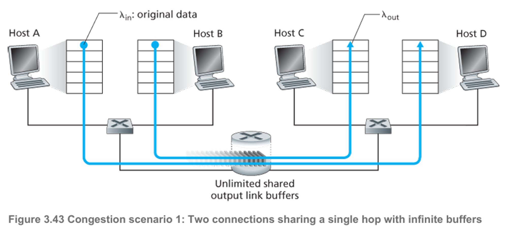
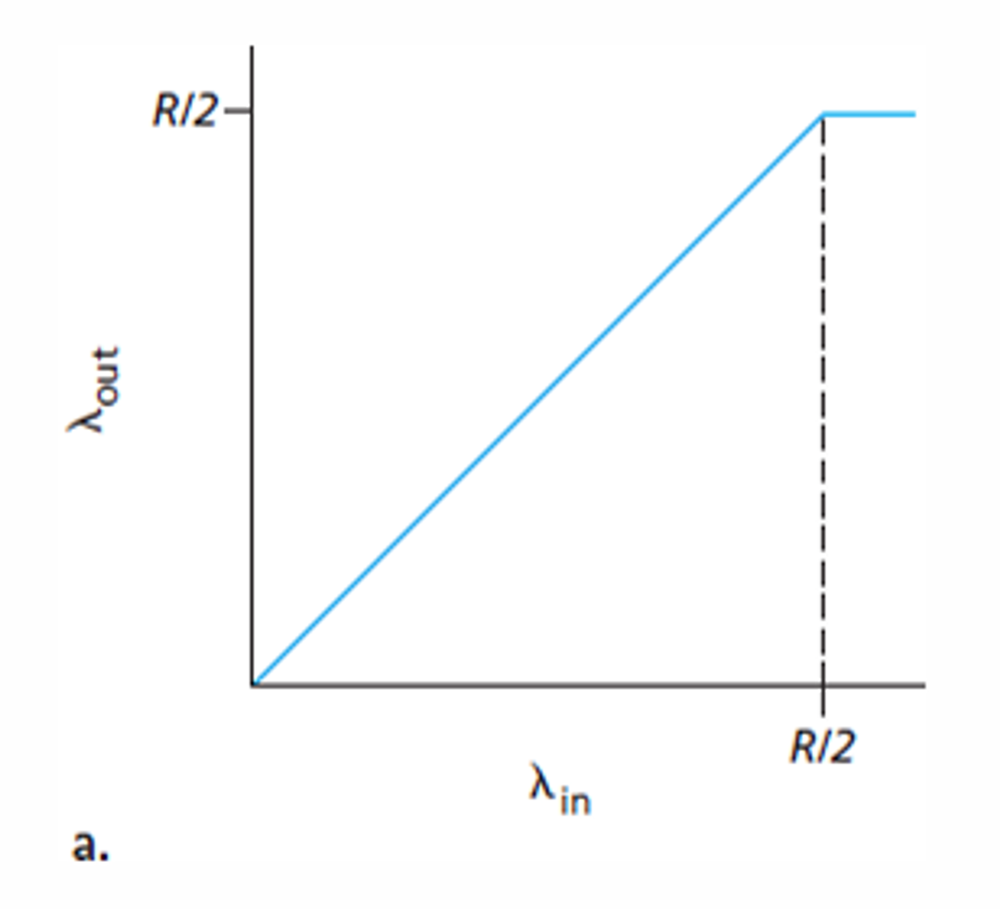
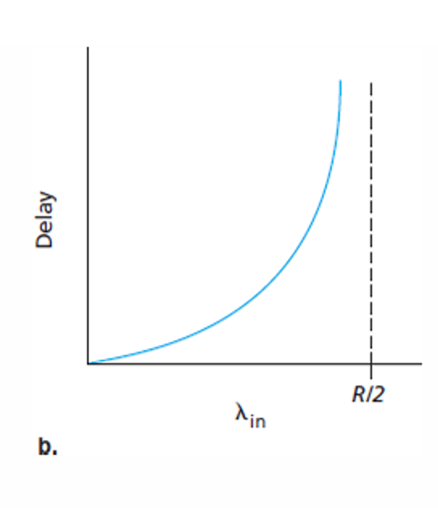
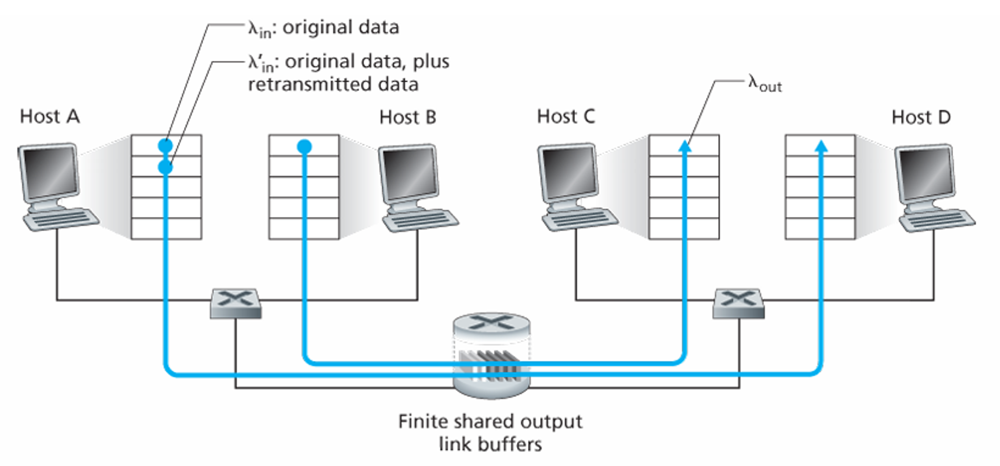
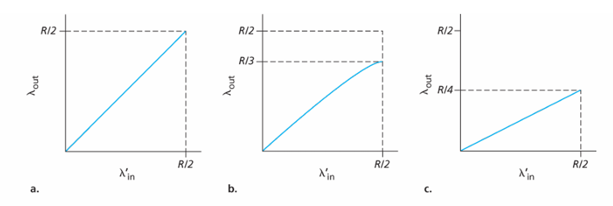
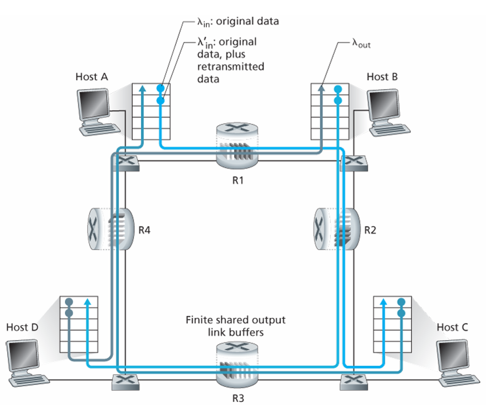
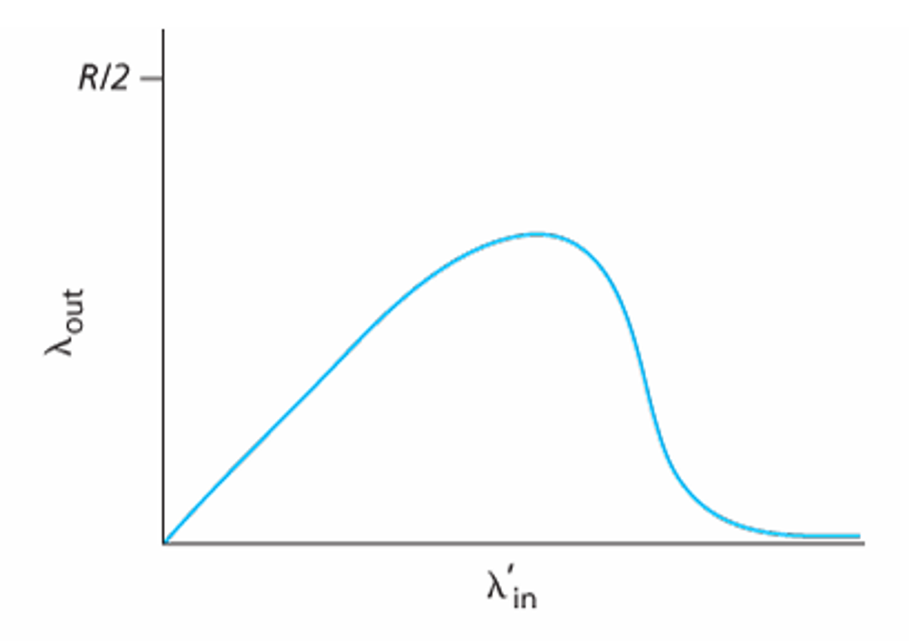
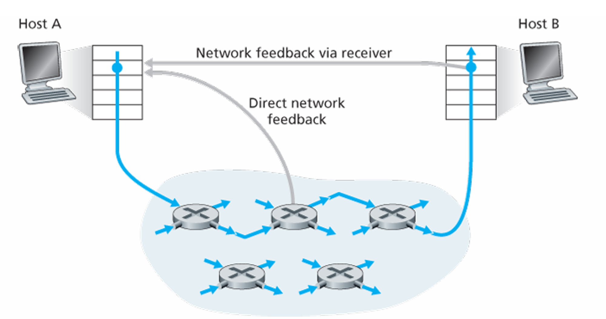

# 3.6 혼잡 제어의 원리

네트워크 혼잡 원인을 처리하기 위해 네트워크 혼잡을 일으키는 송신자들을 억제하는 메커니즘이 필요

## 혼잡의 원인과 비용

### 시나리오 1: 2개의 송신자와 무한 버퍼를 갖는 하나의 라우터

<aside>
💡 두 호스트 A와 B가 그림 3.43처럼 각각 출발지와 목적지 사이에 단일 홉을 공유하는 연결을 갖는다고 생각

</aside>

<aside>
💡 호스트 A의 애플리케이션이 λin 바이트/초의 평균 전송률로 연결상으로 데이터를 보내고 있다고 가정

</aside>

<aside>
💡 라우터는 무제한의 버퍼 공간을 갖는다고 가정

</aside>

- 이러한 데이터는 각 데이터 단위가 소켓으로 한 번만 정송된다는 점에서 원본 데이터다
- 하위의 트랜스포트 계층 프로토콜은 단순하게 데이터를 캡슐화하고 전송한다.
- 트랜스포트 계층과 하위 계층에서 헤더 정보의 추가로 인한 오버헤드를 무시하면, 첫 번째 시나리오에서 호스트 A가 라우터에게 제공하는 속도는 λin 바이트/초

<aside>
💡 호스트 B도 비슷한 방식으로 동작하고 λin 바이트/초라고 가정

</aside>

- 호스트 A와 호스트 B가 전송되는 패킷은 라우터와 용량 R의 공유 출력 링크를 통과

 

        
        

- a는 연결 전송률의 함수로 연결당 처리량을 그린 것
    - 보면 R/2 전까지는 in 값만큼 전송률이 증가하지만 넘어가면 계속해서 R/2이다.
    - 두 호스트가 한 링크로 데이터를 보내기 때문이다.
    - 링크는 안정 상태에서는 R/2를 초과해서 패킷을 수신자에게 전달할 수 없다.
- b는 링크 용량 근처에서 동작의 결과를 보여준다.
    - 전송률이 R/2에 근접했을 때, 평균 지연은 점점 커진다.
    - 전송률이 R/2를 초과할 때, 라우터 안에 큐잉된 패킷의 평균 개수는 제한되지 않고 출발지와 목적지 사이의 평균 지연이 무제한이 된다.

### 시나리오 2: 2개의 송신자. 유한 버퍼를 가진 하나의 라우터

<aside>
💡 라우터 버퍼의 양이 유한하다고 가정

</aside>

<aside>
💡 각 연결은 신뢰적이라고 가정

</aside>

- 트랜스포트 계층 세그먼트를 포함하는 패킷이 라우터에서 버려지면, 결국 송신자에 의해 재전송될 것이다.
- 패킷이 재전송될 수 있으므로, 이제는 송신율이라는 용어 사용에 더 주의
- 애플리케이션이 원래의 데이터를 소켓으로 보내는 송신율을 λin 바이트/초로 표기
- 네트워크 안으로 세그먼트(원래 데이터와 재전송 데이터를 포함)를 송신하는 트랜스포트 계층에서 송신율은 λ’in 바이트/초로 표시하고, λ’in은 때때로 네트워크에 **제공된 부하**라고 부른다.

시나리오 2에서의 성능은 재전송이 어떻게 수행되는지에 따를 것이다.

<aside>
💡 a. 호스트 A가 어떻게 해서든 라우터에 있는 버퍼가 비어 있는지 그렇지 않은지를 알 수 있고, 버퍼가 비어 있을 때만 패킷을 송신할 수 있는 비현실적인 경우를 고려

</aside>

- 이 경우에는 λin은 λ’in과 같으므로 어떠한 손실도 발생하지 않고, 연결의 처리량은 λin과 같다.
- 이 경우 모든 송신이 수신되며 패킷 손실이 절대로 발생하지 않는다고 가정하므로, 이 시나리오에서 평균 호스트 송신률은 R/2를 초과할 수 없다.

<aside>
💡 b. 패킷이 확실히 손실된 것을 알았을 때만 송신자가 재정송하는 경우

</aside>

- 제공된 부하 λ’in이 R/2인 경우
    - 이 제공된 부하의 값에서 수신자 애플리케이션으로 전달되는 데이터의 전송률은 R/3이다.
- 전송된 데이터의 R/2 중 0.333R바이트/초는 원래의 데이터이고, 초당 0.166R바이트/초는 재전송 데이터이다.

**송신자는 버퍼 오버플로 때문에 버려진 패킷을 보상하기 위해 재전송을 수행해야 한다.**

<aside>
💡 c. 송신자에서 너무 일찍 타임아웃되어 패킷이 손실되지 않았지만 큐에서 지연되고 있는 패킷을 재전송하는 경우

</aside>

- 원래의 데이터 패킷과 재전송 패킷 둘 다 수신자에게 도착한다.
- 수신자는 단지 하나의 패킷 복사만을 필요하므로 재전송된 패킷은 버린다.
- 각 패킷이 라우터에 의해 두 번씩 전달된다고 가정했을 때, **제공된 부하가 R/2일 때의 처리량은 R/4**

**커다란 지연으로 인한 송신자의 불필요한 재전송은 라우터가 패킷의 불필요한 복사본들을 전송하는 데 링크 대역폭을 사용하는 원인**

### 시나리오 3: 4개의 송신자와 유한 버퍼를 갖는 라우터. 그리고 멀티홉 경로

- 4개의 호스트는 겹쳐지는 2홉 경로를 통해 패킷을 전송한다.
- 각각의 호스트가 안정적인 데이터 전송 서비스를 실행하기 위해 타임아웃/재전송 메커니즘을 사용한다고 가정
- 모든 호스트는 λin의 동일한 값을 갖고, 모든 라우터 링크는 R바이트/초 용량을 갖는다고 가정

- 라우터 R1과 R2를 지나가는 호스트 A에서 호스트 C까지의 연결을 고려
- A~C 연결은 D~B 연결과 라우터 R1을 공유한다.
- B~D 연결과 라우터 R2를 공유한다.
- λin이 작은 경우
    - λin이 작은 값일 때, λin**의 증가는** λout의 증가를 가져온다.
- λin이 매우 큰경우
    - 라우터 R2에 도착하는 A~C 트래픽은 R2에서 λin 값에 관계없이, R1에서 R2까지의 링크 용량, 최대 R인 도착률을 가질 수 있다.
    - A~C와 B~D 트래픽은 버퍼 공간을 R2 라우터에서 경정해야 하므로, R2를 성공적으로 통과하는 A~C 트래픽의 양은 B~D에서 제공된 부하가 크면 클수록 더 작아진다.
    - 제공된 부하가 무한대에 가까워지면 R2의 빈 버퍼는 즉시 B~D 패킷으로 채워지고 R2에서 A~C 연결의 처리량은 0이 된다.
    - 이 말은 A~C 종단 간 처리율이 0이 된다는 것을 의미

**패킷이 경로상에서 버려질 때, 버려지는 지점까지 패킷을 전송하는 데 사용된 상위 라우터에서 사용된 전송 용량은 낭비된 것이다.**

## 혼잡 제어에 대한 접근법

### 종단 간의 혼잡 제어

- 혼잡 제어에 대한 종단 간의 접근 방식에서 네트워크 계층은 혼잡 제어 목적을 위해 트랜스포트 계층에게 어떤 직접적인 지원도 제공하지 않는다.
- 네트워크에서 혼잡의 존재는 단지 관찰된 네트워크 동작에 기초하여 종단 시스템에 츠측해야함.

TCP가 취하는 방식

1. **TCP 세그먼트 손실**과 **증가하는 왕복 지연값**을 네트워크 혼잡의 발생 표시로 간주한다.
2. TCP는 그에 따라서 윈도 크기를 줄인다.

### 네트워크 지원 혼잡 제어

- 네트워크 지원 혼잡 제어에서 라우터들은 네트워크 안에서 혼잡 상태와 관련하여 송신자나 수신자 또는 모두에게 직접적인 피드백을 제공한다.
- ATM ABR(Available Bite Rate) 혼잡 제어에서 라우터는 자신이 출력 링크에서 제공할 수 있는 전송률을 송신자에게 명확히 알릴 수 있게 해준다.
- 최근 IP와 TCP가 네트워크 혼잡 제어를 선택적으로 구현할 수 있음

- 네트워크 지원 혼잡 제어에 대한 혼잡 정보는 전형적인 두 가지 방법 중 하나로 네트워크에서 송신자에게 피드백 된다.
- 직접 피드백은 네트워크 라우터에서 송신자에게 보내는 것.
    - 알림의 형태는 전형적으로 초크 패킷의 형태를 갖는다.
- 알림의 두 번째 형태는 라우터가 혼잡을 나타내기 위해 송신자에서 수신자에게로 흐르는 패킷 안의 특정 필드에 표시/수정하는 것
    - 수신자가 표시된 패킷을 수신했을 때, 혼잡 상태를 송신자에게 알린다.
    - 완전한 왕복 시간이 걸린다.