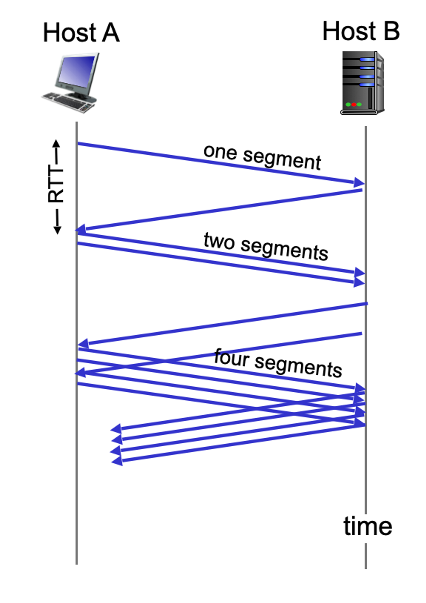
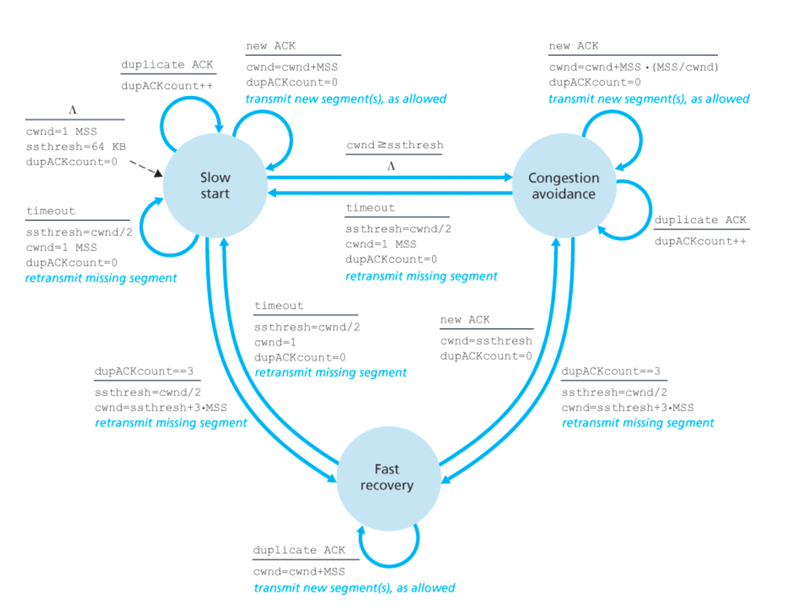
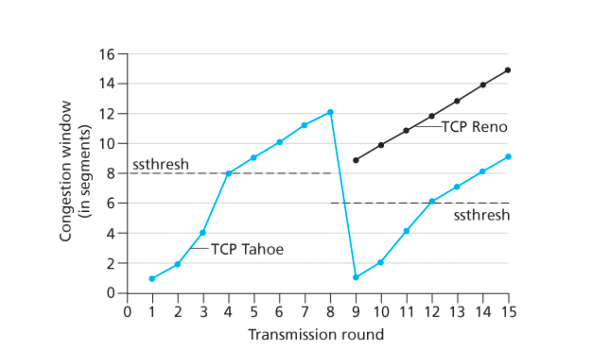
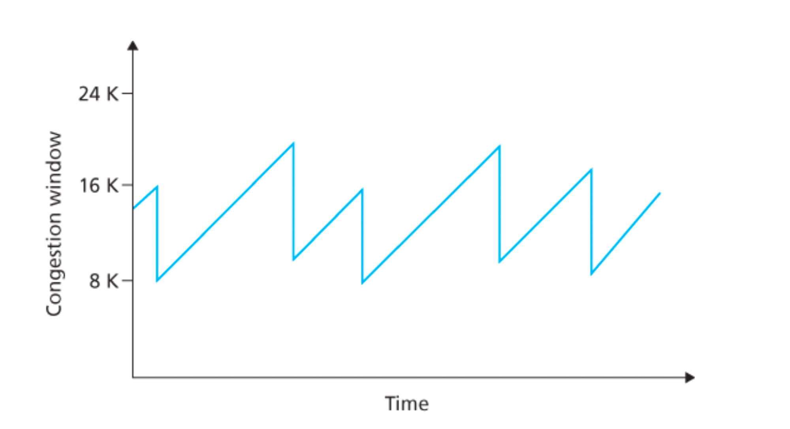
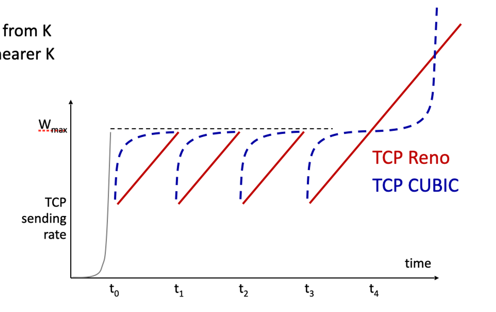
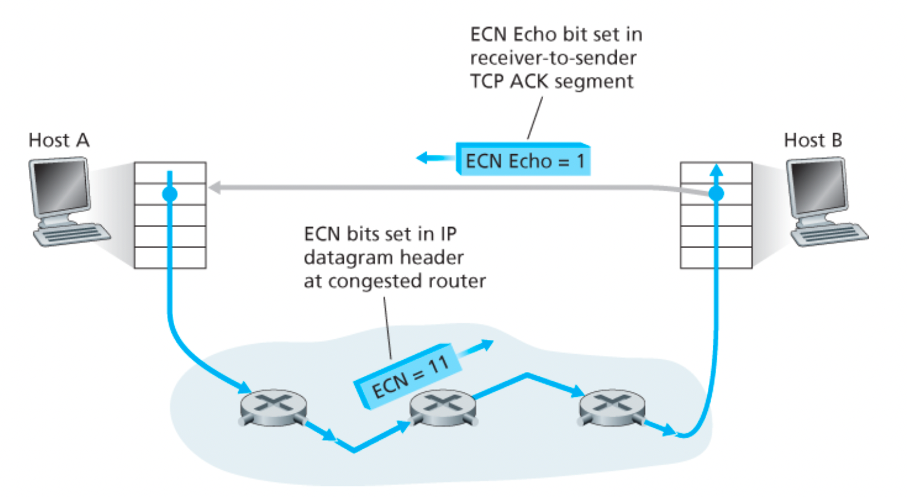
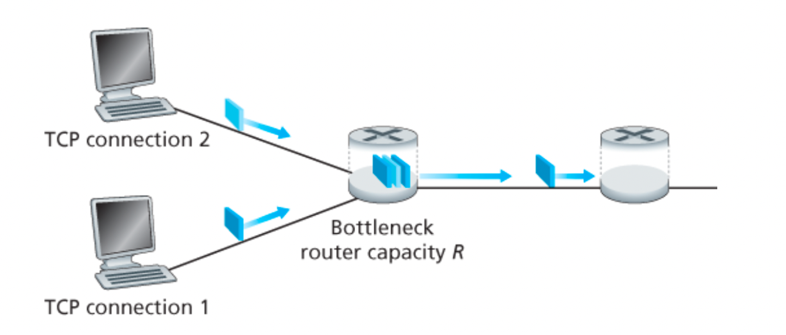
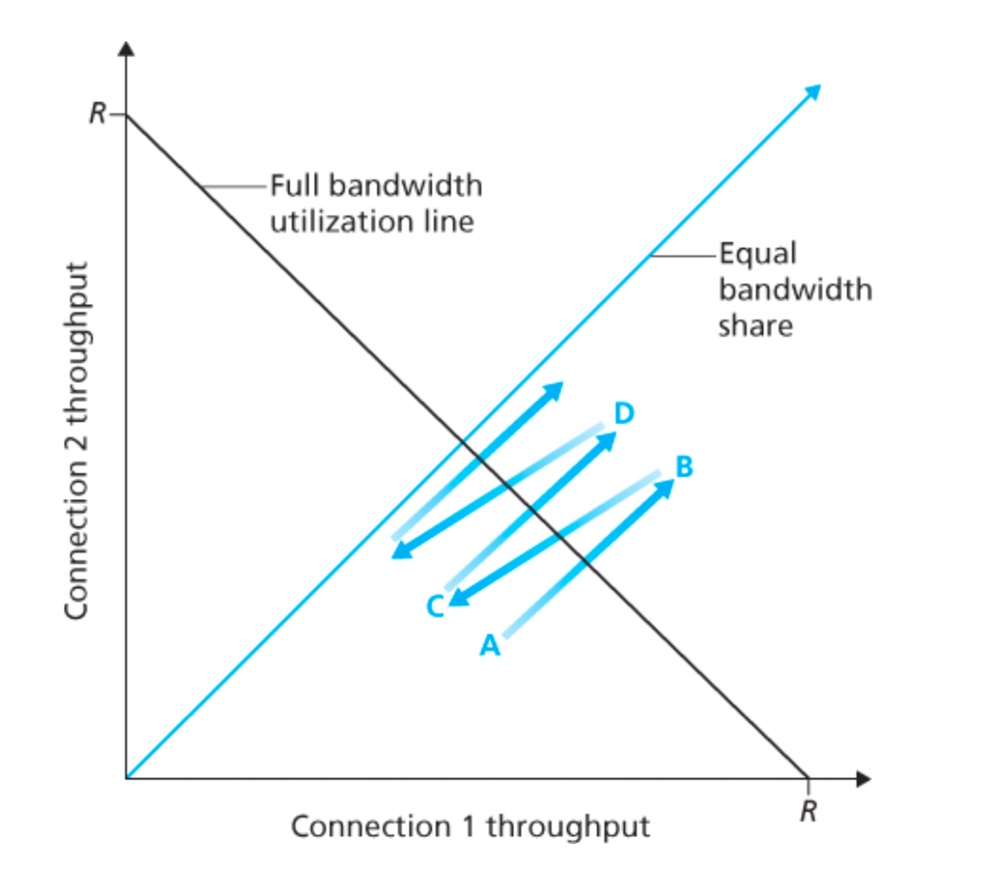

# 3.7 TCP 혼잡 제어

네트워크 계층 즉 IP 계층이 네트워크 혼잡에 관해 종단 시스템에게 어떠한 직접적인 피드백도 제공하지 않는다.

그렇기에 ‘전통적인’ TCP는 네트워크 지원 혼잡 제어보다는 종단 간의 혼잡 제어를 사용

## 전통적인 TCP의 혼잡 제어

- TCP가 취한 접근 방식은 네트워크 혼잡에 따라 연결에 트래픽을 보내는 전송률을 각 송신자가 제한하도록 하는 것
- 송신자와 수신자 사이에 혼잡이 없다면 송신율을 높이고 혼잡이 발생하면 송신율을 낮춘다.
- 그럼 세 가지 의문이 발생한다.
    1. TCP 송신자는 자신의 연결에 송신자 전송 트래픽 전송률을 어떻게 제한하는가
    2. TCP 송신자는 자신과 목적지 사이 경로의 혼잡을 어떻게 감지하는가
    3. 송신자는 종단 간의 혼잡을 감지함에 따라 송신율을  변화시키기 위해 어떤 알고리즘을 사용해야 하는가

### TCP 송신자는 자신의 연결에 송신자 전송 트래픽 전송률을 어떻게 제한하는가

- 3.5절에서 TCP 연결 양 끝의 각 호스트는 수신 버퍼와 송신 버퍼, 그리고 몇 가지 변수로 구성된 것을 보았다.
- 송신 측에서 동작하는 TCP 혼잡 제어 메커니즘은 추가적인 변수인 혼잡 윈도를 추적
- cwnd로 표시되는 혼잡 윈도는 TCP 송신자가 네트워크로 트래픽을 전송할 수 있는 속도에 제약을 가한다.
- 송신하는 쪽에서 확인 응답이 안 된 데이터의 양은 cwnd와 rwnd의 최솟값을 초과하지 않는다.

→ 그렇기에 cwnd의 값을 조절하여 송신자는 링크에 데이터를 전송하는 속도를 조절할 수 있다.

→ 매 왕복 시간의 시작 때 , 송신자는 cwnd 바이트만큼의 데이터를 전송할 수 있고, RTT가 끝나는 시점에 데이터에 대한 확인 응답을 수신

→ 그러므로 송신자의 송신 속도는 대략 cwnd/RTT 바이트/초다.

### TCP 송신자는 자신과 목적지 사이 경로의 혼잡을 어떻게 감지하는가

<aside>
💡 타임아웃 또는 수신자로부터 3개의 중복된 ACK의 수신이 발생했을 때, TCP 송신자 측에 ‘손실 이벤트’가 발생한 경우

</aside>

- 과도한 혼잡이 발생하면, 경로에 있는 하나 이상의 라우터 버퍼들이 오버플로되고, 그 결과 데이터그램이 버려진다.
- 버려진 데이터그램은 송신 측에서 손실 이벤트(타임아웃 또는 3개의 중복된 ACK의 수신)를 발생시키고, 송신자는 송신자와 수신자 사이의 경로상의 혼잡이 발생했음을 알게된다.

<aside>
💡 손실 이벤트가 발생하지 않은 경우

</aside>

- 확인 응답이 안된 세그먼트들에 대한 확인응답들이 TCP 송신자에서 수신된다.
- TCP는 확인응답을 혼잡 윈도 크기의 증가를 유발하는 트리거 또는 클록으로 사용하므로, TCP는 자체 클로킹이라호 한다.
- 확인응답이 늦은 속도로 도착한다면 → 혼잡 윈도는 상대적으로 낮은 속도로 증가
- 확인응답이 높은 속도로 도착한다면 → 혼잡 윈도는 더 빨리 증가

### 송신자는 종단 간의 혼잡을 감지함에 따라 송신율을  변화시키기 위해 어떤 알고리즘을 사용해야 하는가

- 너무 빠르게 송신하면, 혼잡 붕괴가 일어남
- 너무 천천히 송신하다면, 네트워크 내의 대역폭을 다 활용하지 못 함

TCP는 다음과 같은 3가지 처리 원칙에 따라 자신이 송신할 속도를 결정하게 된다.

1. 손실된 세그먼트는 혼잡을 의미하며, 이에 따라 TCP 전송률은 한 세그먼트를 손실했을 때 줄여야 한다.
    - 타임아웃 이벤트나 4개의 확인 응답의 수신은 손실 세그먼트의 재전송을 야기한다.(나의 원래의 ACK + 3개의 중복된 ACK)
2. 확인응답된 세그먼트는 네트워크가 송신자의 세그먼트를 수신자에게 전송된다는 것이고, 이에 따라 이전에 확인응답되지 않은 세그먼트에 대해 ACK가 도착하면 송신자의 전송률은 증가
    - 확인응답은 수신자가 성공적으로 받았다는 의미고, 혼잡하지 않다는 의미이깅 혼잡 윈도 크기를 증가 시킨다.
3. 대역폭 탐색
    - 혼잡이 없는 출발지에서 목적지까지의 경로를 표시하는 ACK와 혼잡한 경로를 표시하는 손실 이벤트가 주어지면, 손실 이벤트가 발생할 때까지는 ACK가 도착함에 따라 전송률을 증가시키고, 손실 이벤트가 발생한 시점에 감소시킨다.
    - TCP 송신자는 혼잡이 발생하는 시점까지 전송률을 증가시키고
    - 그 시점 이후로부터는 줄인 후,
    - 다시 혼잡 시작이 발생했는지를 보기 위한 탐색을 시작한다.

그럼 어떤 알고리즘으로 제어하는가?

1. 슬로 스타트
2. 혼잡 회피
3. 빠른 회복

### 슬로 스타트

- TCP 연결시 cwnd는 1MSS로 초기화 → 전송률은 MSS/RTT
    - ex) MSS = 500byte, RTT = 200ms 이면 전송률은 약 20kbps
- 송신자에게 가용 대역폭은 MSS/RTT보다 훨씬 클 것이므로, TCP 송신자는 가용 대역폭 양을 조속히 찾는다.

> 슬로 스타트는 cwnd 값을 1 MSS에서 시작하여, 한 전송 세그먼트가 첫 번째로 확인응답을 받을 때마다 1MSS씩 증가
> 

- TCP 전송률은 작은 값으로 시작하지만 슬로 스타트 단계 동안에 지수적으로 증가
- 계속 지수적으로 증가하는 것은 아니고 임계값에 도달하면 1씩 증가한다.
- 그럼 언제 끝나는가?
    - 만약 타임아웃으로 표시되는 손실 이벤트가 있을 경우 TCP 송신자는 cwnd 값을 1로 설정하고 새로운 슬로 스타트를 시작한다.
    - cwnd 값이 sthresh와 같으면, 슬로 스타트는 종료되고 TCP는 혼잡 회피 모드로 전환
        - TCP 송신자는 두 번째 상태 변수인 ssthresh(slow start threshold(슬로 스타트 임곗값))의 값을 cwnd/2로 정한다.
        - TCP는 혼잡 회피 모드에서 cwnd를 좀 더 조심스럽게 증가시킨다.
    - 만약 3개의 중복 ACK가 검출되면, TCP는 빠른 재전송을 수행하여 빠른 회복 상태로 들어간다.

### 혼잡 회피

- 혼잡 회피 상태로 들어가는 시점에서 cwnd의 값은 대략 혼잡이 마지막으로 발견된 시점에서의 값의 반이 된다.
- 그러므로 RTT마다 cwnd 값을 두 배로 하기보다는 TCP는 좀 더 보수적인 접근법을 채택하여 RTT마다 하나의 MSS만큼 cwnd 값을 증가시킨다.
    - 새로운 승인이 도착할 때마다 TCP 송신자가 cwnd를 MSS바이트만큼 증가시킨다.
- 그럼 언제 혼잡 회피의 (RTT딩 1MSS의) 선형 증가가 끝나는가?
    - 타임아웃이 발생했을 때 슬로 스타트의 경우와 같이 cwnd의 값은 1MSS로 설정하고, ssthresh의 값은 손실 이벤트가 발생할 때의 cwnd 값의 반으로 설정
    - 그러나 손실 이벤트는 송신자로부터의 세그먼트를 수신자에게 계속 전달하고 있다.
    - TCP는 3개의 중복 ACK를 수신한 시점에서 cwnd의 값을 반으로 줄이고, ssthresh 값을 cwnd 값의 반으로 기록.
    - 이후 빠른 회복 상태로 들어간다.

 

### 빠른 회복

- cwnd 값을 손실된 세그먼트에 대해 수신된 모든 중복된 ACK에 대해 1MSS만큼씩 증가시킨다.
- 손실된 세그먼트에 대한 ACK가 도착하면 TCP는 cwnd 혼잡 회피 상태로 들어간다.
- 만약 타임아웃 이벤트가 발생한다면 빠른 회복은 슬로 스타트 및 혼잡 회피에서와 같은 동작을 수행한 후 슬로 스타트로 전이
    - cwnd 값은 1MSS로 하고, ssthresh 값은 손실 이벤트가 발생할 때의 cwnd 값의 반으로 한다.
- 빠른 회복은 TCP의 구성요소로 권고사항이지만 필수는 아님
- TCP 타호라 불리는 초기 버전은 타임아웃으로 표시되거나 3개의 중복 ACK로 표시되는 손실이 발생하면 무조건 혼잡 윈도를 1MSS로 줄이고, 슬로 스타트 단계로 들어간다.
- 새로운 버전인 리노는 빠른 회복을 채택

- 임계값은 초기에 둘 다 8MSS이다.
- 처음 8번의 전송 동안은 똑같이 동작한다.
- 8번째에 송신 후 3개의 중복 ACK가 발생한다.
- 이 손실 이벤트가 발생했을 때 타호는 혼잡 윈도를 1MSS로 줄이고 임계값을 이벤트가 발생했을 때의 cwnd의 절반으로 설정한다.
- 리노에서는 혼잡 윈도가 9MSS로 설정된다.
    - 중복 ACK가 3개 감지되면, ssthresh를 현재 cwnd의 절반으로 설정하고, cwnd를 ssthresh + 3 MSS로 설정
    - 이후 중복 ACK를 받을 때마다 cwnd를 1 MSS씩 증가

### TCP 혼잡 제어: 복습

- 연결이 시작되고 초기 슬로 스타트 기간을 무시하고, 손실이 타임아웃이 아니라 3개의 중복 ACK로 표시된다고 가정
- TCP의 혼잡 제어는 RTT마다 1MSS씩 cwnd의 선형 증가와 3개의 중복 ACK 이벤트에서 cwnd의 절반화로 구성
- TCP의 혼잡 제어는 종종 가법적 증가, 승법적 감소(AIMD)의 혼잡 제어 형식이라고 불림
- TCP는 3개의 중복 ACK 이벤트가 발생할 때까지 선형으로 그 혼잡 윈도 크기를 증가시킨다.
- 그러고 혼잡 윈도 크기를 반으로 감소시키지만, 다시 추가적인 가용 대역폭이 있는지를 탐색하기 위해 선형으로 증가시킨다.

### TCP 큐빅

- 패킷 손실이 발생한 혼잡한 링크의 상태가 많이 변경되지 않은 경우 전송 속도를 더 빠르게 높여 손실 전 전송 속도에 근접한 다음 대역폭을 신중하게 조사
- TCP 큐빅은 리노와 다르다. ACK 수신 시에만 혼잡 윈도를 늘리고 슬로 스타트 단계와 빠른 복구 단계는 동일하게 유지되지만, 큐빅은 혼잡 회피 단계가 수정되었다.
    - 몇 가지 조율 가능한 큐빅 매개변수들이 k 값, 즉 프로토콜의 혼잡 윈도 크기가 얼마나 빨리 Wmax에 도달하는지를 결정
        - k는 특정 시각,  Wmax는 혼잡 제어 윈도 크기
    - 큐빅은 혼잡 윈도를 현재 시각 t와 K 시각 사이 거리의 세제곱 함수로 증가 시킨다.
        - t가 K에 가까울 때보다 t가 K에서 멀어지면 혼잡 윈도 크기 증가가 훨씬 커진다.
        - 큐빅은 손실 전 속도인 Wmax에 가까워지도록 빠르게 증가시키고, 가까워지면 대역폭을 조심스럽게 탐지
    - t가 여전히 K에 가까울 때는 큐빅의 혼잡 윈도 증가가 작으나, t가 K를 크게 초과함에 따라 급격히 증가한다.

- 슬로 스타트 단계는 t0에서 끝타고 t1, t2, t3에서 혼잡 손실이 발생하면 큐빅은 Wmax에 가깝게 더 빠르게 증가.
- TCP 큐빅이 혼잡 임곗값 바로 아래에서 가능한 한 오랫동안 흐름을 유지하려고 시도

## 네트워크 지원 명시적 혼잡 알림과 지연 기반 혼잡 제어

- TCP 송신자는 네트워크에서 명시적인 혼잡 표시를 수신하지 않는 대신, 관찰된 패킷 손실을 통해 혼잡을 추론
- 최근에는 네트워크가 TCP 송신자와 수신자에게 명시적으로 혼잡 신호를 보낼 수 있도록 만들어졌다.

### 명시적 혼잡 알림

- 네트워크에서 지원하는 혼잡 제어의 한 형태
- 네트워크 계층에서 IP 데이터그램 헤더의 서비스 유형 필드에 있는 2비트가 명시적 혼잡 알림에 사용
- 혼잡해진 라우터에서 데이터그램 헤더에 있는 ECN 비트들을 설정하고 목적지 호스트로 전달되고 그것을 송신 호스트에게 알린다.
- 언제 라우터가 혼잡해지는가의 기준은 라우터 공급업체가 가능하게 하고 네트워크 운영자가 결정한다.
- 그래도 이게 좋은 점은 직관적으로 손실이 발생하기 전에 혼잡 시작을 송신자에게 알릴 수 있다는 것이다.
- ECN 비트의 두 번째 설정은 발신 호스트가 라우터에게 송신자와 수신자가 ECN을 사용할 수 있음을 알리고, 이에 따라 ECN으로 표시된 네트워크 혼잡에 대한 응답으로 조치를 취할 수 있음을 알리는데 사용
- 수신 호스트의 TCP가 수신 데이터 그램을 통해 ECN 혼잡 알림 표시를 수신하면 수신 호스트의 TCP는 수신자-송신자 TCP ACK 세그먼트의 ECE 비트를 설정하여 송신 호스트 TCP에 혼잡 표시 알림
- TCP 송신자는 빠른 재전송을 사용하여 손실된 세그먼트에 반응하는 것처럼 혼잡 윈도를 절반으로 줄이고 다음 전송되는 TCP 수신자 세그먼트 헤더에 CWR 비트를 1로 설정

### 지연 기반 혼잡 제어

- ECN에서 혼잡해지는 라우터는 그 라우터에서 버퍼가 가득 차서 패킷들이 삭제되기 전에 송신자에게 혼잡 시작을 알린다.
- 이 방식도 패킷 손실이 발생하기 전에 혼잡 시작을 사전에 감지한다.
- 출발지에서 목적지까지의 경로의 RTT의 최솟값을 RTTmin이라고 한다.
- 혼잡 윈도가 cwnd인 경우 혼잡하지 않을 때의 처리율은 cwnd/RTTmin이 된다.
- 그럼 이 값에 가까우면 정체되지 않은 것이고 커지면 정체되는 것이다. 이것으로 더 넣을지 말지를 결정
- TCP 송신자가 파이프를 가득 채우되 그 이상으로 채우지 않도록 해야 한다.
- 파이프가 가득 찬 상태에서 큰 큐가 쌓이도록 허용하는 것은 좋을게 없다.
- BBR 혼잡 제어 프로토콜은 위의 아이디어를 기반으로 동작한다.
- 최근 구글이 큐빅을 BBR로 대체하고 있다고 한다.

### 공평성

- 각각 다른 종단 간의 경로를 갖지만, 모두 R bps의 전송률인 병목 링크를 지나는 k개의 TCP 연결을 생각해보자
- 각 연결의 평균 전송률이 R/K에 가깝다면 혼잡 제어 메커니즘이 공평하다고 한다.
- 서로 다른 TCP 연결들이 서로 다른 시점에서 시작하고, 주어진 시점에서 다른 윈도 크기를 갖는다고 했을 때, TCP의 AIMD 알고리즘은 공평한가?

- 위의 그림처럼 두 연결이 같은 MSS와 RTT를 가지며, 송신할 많은 양의 데이터가 있고, 어떠한 다른 TCP 연결이나 UDP 데이터그램도 이 공유된 링크를 통과하지 않는다고 가정하자
- 또한 TCP의 슬로 스타트 현상을 무시하고, TCP 연결이 언제나 혼잡 회피 방식으로 동작한다고 가정하자

- 만약 TCP가 두 연결 사이에서 링크 대역폭을 똑같이 공유한다면,실제 처리율은 원점에서부터 발산하면서 45º 각도의 화살표(동등한 대역폭 공유)를 따라야 한다.
- 이상적으로는 두 처리율의 합이 R과 같아야 한다.

1️⃣ TCP 윈도 크기가 어느 주어진 시점에서 연결 1과 2가 `A 지점`으로 나타내는 처리율을 실현한다고 하자.

- 두 연결에 의해 공동으로 소비되는 링크 대역폭의 양이 R보다 적기 때문에
    
    **어떠한 손실도 발생하지 않을 것이다.**
    
- 양 연결은 `TCP 혼잡 회피 알고리즘`의 결과로서 **RTT당 1 MSS씩 이들의 윈도우를 증가**시킬 것이다.

따라서 두 연결의 공동 처리율은 A 지점에서 시작하는 45º 각도의 선을 따라서 계속되며,

2️⃣ 결국 두 연결에 의해 공동으로 소비되는 **링크 대역폭은 R보다 커질 것이다. → 패킷 손실이 발생**

(`B 지점`에 의해 나타내는 처리율을 실현할 때 패킷 손실을 경험한다고 하자)

그러므로 연결 1과 2는 **반으로 그들의 윈도를 감소시킨다.**

3️⃣ 결과적으로 실현된 처리율은 `C 지점`에 있게 되는데, 이는 B와 원점의 중간이다.

공동 대역폭 사용이 C 지점에서 R보다 낮으므로,

두 연결은 다시 C로부터 시작하는 45º 각도의 선을 따라 처리율을 증가시킨다.

4️⃣ 결국 손실은 다시 발생할 것이고(`D 지점`), 두 연결은 다시 반으로 윈도 크기를 감소시킨다.

> 즉, 두 연결에 의해 실현되는 대역폭은 동등한 대역폭 공유선을 따라서 결국에는 변동하며
> 
> 
> 2차원 공간 어디에 있든지 간에 상관없이 **수렴한다.**
> 

*→ 왜 TCP가 연결 사이에서 대역폭을 똑같이 공유하는지에 대한 직관적 느낌*

현실에서는 클라이언트-서버 애플리케이션들은 **링크 대역폭의 각기 다른 양**을 얻을 수 있다.

특히 여러 연결이 공통의 병목 링크를 공유할 때, 더 작은 RTT를 갖는 세션은 **대역폭이 좀 더 빠르게 비워지므로** 링크에서 가용한 대역폭을 점유할 수 있고, 그래서 큰 RTT를 갖는 연결보다 더 높은 처리율을 갖는다.

### 공평성과 UDP

- UDP 상에서 동작할 때, 애플리케잇녀은 혼잡 시 ‘공평한’ 레벨로 그들의 등급을 낮추고 어떠한 패킷도 손실하지 않기보다는 일정한 속도로 네트워크에 공급하기를 좋아하지만, 때론 패킷을 잃는다.
- TCP 관점에서는 UDP는 공평하지 못 하다.
- 다른 연결들과 협력하지도 않으며, 그들의 전송률을 적당하게 조정하지도 않는다.
- TCP 혼잡 제어는 홉잡 증가에 대해 전송률을 감소시키므로 그럴 필요가 없는 UDP 송신자들이 TCP 트래픽을 밀어낼 가능성이 있다.
- 그래서 이런 것을 방지하는 혼잡 제어 방식을 개발한다.

### 공평성과 병렬 TCP 연결

- 아직도 TCP 기반 애플리케이션의 다중 병렬 연결의 사용을 막을 방법이 없다.
- 예를 들어, 웹 브라우저는 종종 웹 페이지에 다중 객체를 전송하기 위해 다중 병렬 TCP 연결을 사용
- 다중 병렬 TCP 연결을 하면 링크 대역폭의 더 많은 부분을 차지한다.
- 그렇기에 불공평한 할당을 얻게 되는 것이다.