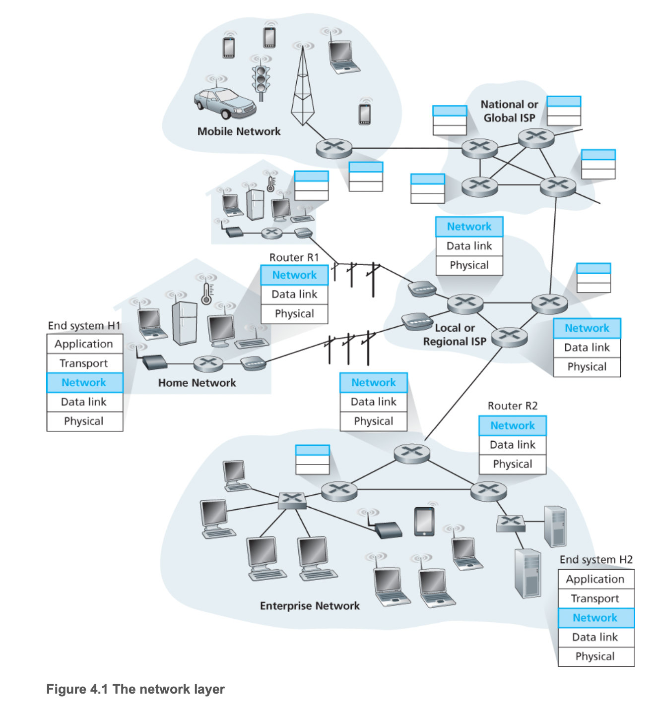
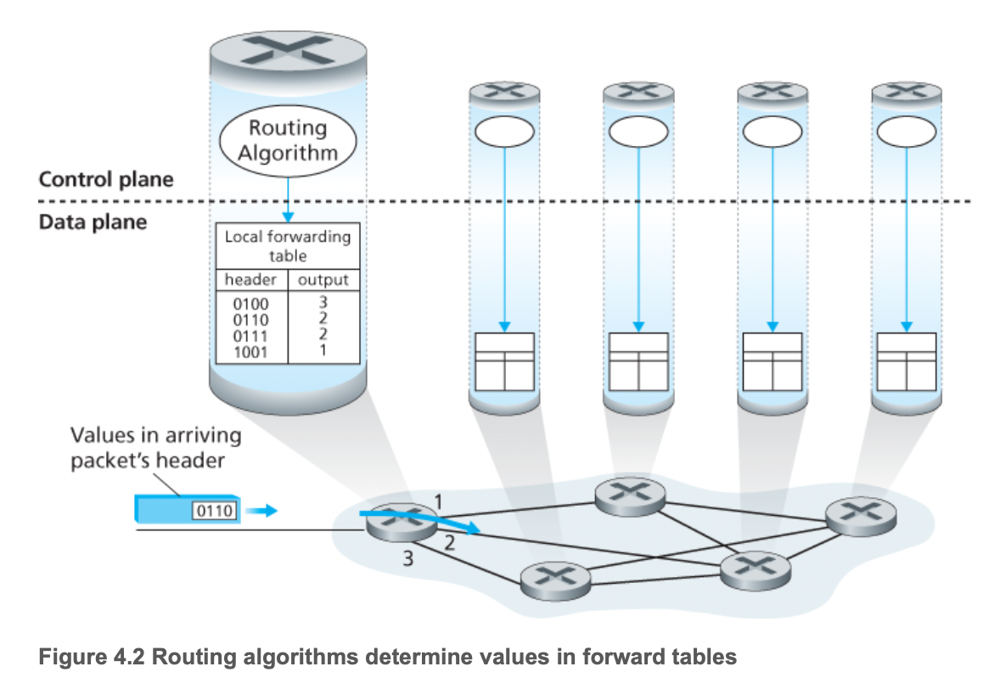
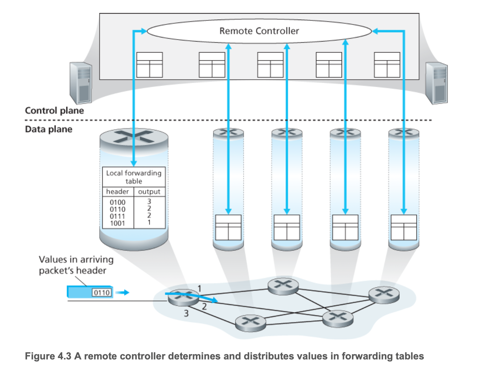

# 4.1 네트워크 계층 개요

- H1에서 H2에게 정보를 보낸다고 하자
- H1 네트워크 계층은 H1의 트랜스포트 계층으로부터 세그먼트를 얻어 각 세그먼트를 데이터그램을 캡슐화하고, 인접한 라우터 R1에게 데이터그램을 보낸다.
- H2의 네트워크 계층은 트랜스포트 계층 세그먼트를 추출하여 트랜스포트 계층까지 전달
- 각 라우터의 데이터 평면의 역할은 입력 링크에서 출력 링크로 데이터그램을 전달하는 것
- 네트워크 제어 평면의 역할은 출발지에서 목적지로 잘 전달되게 로컬 포워딩, 라우터별 포워딩을 대응시키는 것

## 4.1.1 포워딩과 라우팅: 데이터 평면과 제어 평면

네트워크 계층의 중요한 기능 두 가지

- 포워딩
    - 패킷이 라우터의 입력 링크에 도달했을 때 라우터는 그 패킷을 적절한 출력 링크로 이동시켜야 한다.
    - 포워딩에서 예외적으로 한 기능은 데이터 평면에서 실행된다.
    - 패킷이 라우터에서 나갈 때 막힐 수도 있고(패킷이 악의가 있는 호스트로부터 보내지거나 금지된 목적지 호스트로 가고자 할 때), 또는 복제되어 여러 링크로 전송될 수 있다.
- 라우팅
    - 송신자가 수신자에게 패킷을 전송할 때 네트워크 계층은 패킷 경로를 결정해야한다.
    - 이러한 경로 계산 알고리즘을 라우팅 알고리즘이라고 함
    - 패킷 전송 라우팅은 네트워크 계층의 제어 평면에서 실행

포워딩과 라우팅이라는 용어가 쉽게 혼용될 수 있는데 포워딩은 매우 짧은 시간(보통 몇 나노초) 단위를 갖기에, 대표적으로 하드웨어에서 실행된다. 반면, 라우팅은 네트워크 전반에 걸쳐 출발지에서 목적지까지 데이터그램의 종단 간 경로를 결정. 라우팅은 더 긴 시간(보통 초) 단위를 갖기에 소프트웨어에서 보통 실행된다.

네트워크 라우터의 필수 요소 → **포워딩 테이블**

- 라우터는 도착한 패킷 헤더의 필드값을 조사하여 패킷을 전달한다.
- 이 값을 라우터의 포워딩 테이블의 내부 색인으로 사용
- 포워딩 테이블 엔트리에 저장되어 있는 헤더의 값은 해당 패킷이 전달되어야 할 라우터의 외부 링크 인터페이스
- 포워딩은 네트워크 계층 데이터 평면에 의해 실행되는 매우 중요 기능

### 제어 평면: 전통적인 접근 방법

그럼 첫 포워딩 테이블은 어떻게 구성 되는가?

- 위 그림처럼 라우팅 알고리즘은 라우터의 포워딩 테이블의 내용을 결정
- 한 라우터의 라우팅 알고리즘 기능은 다른 라우터의 라우팅 알고리즘과 소통하며 포워딩 테이블의 값을 계산
- 어떻게 소통하는가?
    - 라우팅 프로토콜에 따라 라우팅 정보에 포함된 라우팅 메시지를 교환하며 이루어진다.

### 제어 평면: SDN 접근 방법

- 위 그림은 물리적으로 분리된(라우터로부터) 원격 컨트롤러 컴퓨터와 각각의 라우터에 의해 사용될 포워딩 테이블을 분배하는 다른 접근법을 보여준다.
- 위 그림은 평면 라우팅 기능이 물리적 라우터와는 다르다(원격 제어가 포워딩 테이블을 계산 및 배분하는 동안 라우팅 기기는 포워딩만을 수행한다.)
- 원격 컨트롤러가 높은 신뢰성과 중복성을 갖춘 원격 데이터 센터에 설치될 수 있으며, ISP 혹은 다른 제 3자에 의해 관리될 수 있다.
- 라우터와 원격 컨트롤러는 어떻게 소통하는가?
    - 포워딩 테이블과 그 밖의 라우팅 정보를 포함한 메시지를 교환함으로써 소통할 수 잇따.
- 위 그림에서의 제어 평면적 접근 방법은 SDN(software defined networking)의 중심이다.
- 네트워크가 ‘소프트웨어적으로 정의되었을 때’, 포워딩 테이블을 계산하는 컨트롤러는 라우터와 상호작용을 하며 소프트웨어에서 실행되기 때문

## 4.1.2 네트워크 서비스 모델

- 송신 호스트의 트랜스포트 계층이 패킷을 네트워크에 보낼 때 트랜스포트 계층은 네트워크 계층이 목적지까지 패킷을 전달한다는 것을 믿을 수 있는가?
- 여러 패킷이 전송될 때, 보낸 순서와 동일하게 수신 호스트의 트랜스포트 계층에 전달될 수 있는가?
- 연속적인 두 패킷 사이의 송신 시간이 이들 패킷의 수신 시 걸리는 시간과 동일한가?
- 네트워크가 네트워크 혼잡에 대한 피드백을 제공할 수 있는가?
- 송신 호스트와 수신 호스트에서 트랜스포트 계층을 연결하는 채널의 추상적인 관점은 무엇인가?

이러한 질문에 대한 답은 네트워크 계층이 제공하는 서비스 모델에 따라 결정된다. **네트워크 서비스 모델**은 송수신 호스트 간 패킷 전송 특성을 정의한다.

다음은 네트워크 계층에서 제공할 수 있는 서비스

- 보장된 전달: 패킷이 출발지 호스트에서부터 목적지 호스트까지 도착하는 것을 보장
- 지연 제한 이내의 보장된 전달: 호스트 간의 특정 지연 제한(예: 100ms 이내) 안에 전달
- 순서화 패킷 전달: 패킷이 목적지에 송신된 순서대로 도착하는 것을 보장
- 최소 대역폭 보장: 송신과 수신 호스트 사이에 특정한 비트율(예: 1Mbps)의 전송 링크를 에뮬레이트. 송신 호스트가 비트들을 특정한 비트율 이하로 전송하는 한, 모든 패킷이 목적지 호스트까지 전달
- 보안 서비스: 네트워크 계층은 모든 데이터그램을 출발지 호스트에서는 암호화, 목적지 호스트에서는 해독을 할 수 있게 하여 트랜스포트 계층의 모든 세그먼트에 대해 기밀성을 유지

인터넷 네트워크 계층은 **최선형 서비스(best-effort service)**라고 알려진 서비스를 제공

- 패킷을 보내는 순서대로 수신됨을 보장할 수 없을 뿐만 아니라, 목적지까지의 전송 자체도 보장할 수 없다.
- 종단 시스템 간 지연 또한 보장되지 않으며, 보장된 최소 대역폭 또한 없다.
- 이러한 최선형 모델은 DASH 프로토콜과 같이, 적절한 대역폭 공급 및 대역폭 적응형 애플리케이션 레벨의 프로콜과 결합하여 제공

이러한 최선형 네트워크 보다 더 나은 서비스 모델들이 구현 되었음

- ATM 네트워크 구조 → 순서화 패킷 전달 서비스, 지연 제한 이내의 보장된 전달, 최소 대역폭 보장
- Intserv 구조 → 종단 간 지연을 보장하고 혼잡 방지 통신을 목표