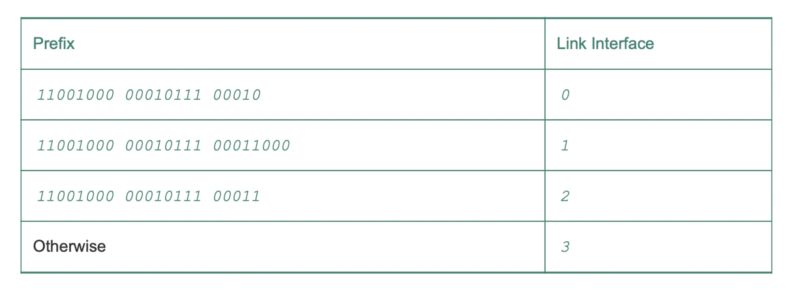

# 4.2 라우터 내부에는 무엇이 있을까?

라우터의 네 가지 요소

- 입력 포트
    - 위 그림에서 입력 포트의 맨 왼쪽 박스와 출력 포트의 맨 오른쪽 박스는 라우터로 들어오는 입력 링크로, 물리 계층 기능을 수행한다.
    - 입력 포트는 들어오는 링크의 반대편에 있는 링크 계층과 상호 운용하기 위해 필요한 링크 계층 기능을 수행
    - 입력 포트에서 검색 기능을 수행
        - 가장 오른쪽 박스에서 발생
        - 여기서 포워딩 테이블을 참조하여 도착된 패킷이 스위치 구조를 통해 라우터 출력 포트를 결정
    - 제어 패킷(예: 라우팅 프로토콜 정보를 전달하는 패킷)은 입력 포트에서 라우팅 프로세서로 전달
- 스위치 구조
    - 라우터의 입력 포트와 출력 포트를 연결
    - 스위치 구조는 라우터 내부에 포함되어 있다.
- 출력 포트
    - 스위치 구조에서 수신한 패킷을 저장하고 필요한 링크 계층 및 물리 계층 기능을 수행하여 출력 링크로 패킷을 전송
    - 링크가 양방향인 경우(즉, 양방향으로 트래픽을 전달), 출력 포트는 일반적으로 동일한 입력 포트와 한 쌍을 이룬다.
- 라우팅 프로세서
    - 제어 평면 기능을 수행한다.
    - 기존의 라우터에서는 라우팅 프로토콜을 실행하고 라우팅 테이블과 연결된 링크 상태 정보를 유지 관리하며, 라우터의 포워딩 테이블을 계산
    - SDN 라우터에서 라우팅 프로세서는 원격 컨트롤러와 통신하여 원격 컨트롤러에서 계산된 포워딩 테이블 엔트리를 수신하고 라우터의 입력 포트에 이러한 엔트리를 설치한다.
    

라우터의 입력 포트, 출력 포트, 스위치 구조는 거의 항상 하드웨어로 구현된다. 

> 100Gbps 입력 링크와 64 바이트 IP 데이터그램이 있는 경우
입력 포트는 다른 데이터그램이 도착하기 전에 데이터그램을 처리하는 데 5.12ns만을 갖는다고 가정
> 
- 만약 N 포트가 라인 카드에서 결합되는 경우, 데이터그램 처리 파이프라인은 소프트웨어 구현에 대해 N배 더 빠르게 작동해야한다.
- 데이터 평면이 나노초(ns) 단위로 작동하는 동안 라우터의 제어 기능은 밀리초(ms) 또는 2초 단위로 작동한다.
- 따라서 이러한 제어 평면 기능은 일반적으로 소프트웨어로 구현되며 라우팅 프로세서에서 실행

- 목적지 기반 포워딩
- 일반화된 포워딩

## 4.2.1 입력 포트 처리 및 목적지 기반 전송

- 입력 포트의 라인 종단 기능과 링크 계층 처리는 라우터의 개별 입력 링크와 관련된  물리 계층 및 데이터 링크 계층을 구현한다.
- 라우터는 포워딩 테이블을 사용하여 도착 패킷이 스위치 구조를 통해 전달되는 출력 포트를 검색한다.
- 포워딩 테이블은 라우팅 프로세서에서 계산되거나 갱신되거나 원격 컨트롤러에서 수신된다.
- 포워딩 테이블은 라우팅 프로세서에서 입력 라인 카드로 복사
- 각 라인 카드에서 이와 같은 섀도 복사본을 사용하면 패킷 단위로 중앙 집중식 라우팅 프로세서를 호출하지 않게 되고, 병목 현상을 피함

32비트 IP 주소의 경우, 포워딩 테이블을 억지로 구현한다면 모든 가능한 목적지 주소마다 하나의 엔트리가 필요하다. 따라서 40억 개 이상의 가능한 주소가 있어야 한다.

그럼 어떻게 해결하는가?

목적지 주소 범위로 포워딩 테이블을 구성할 경우 4개의 엔트리를 갖는 포워딩 테이블이면 된다.

위의 경우 40억 개의 엔트리는 필요 없고 4개의 엔트리면 충분하다. 이런 형식의 포워딩 테이블에서 라우터는 패킷의 목적지 주소의 프리픽스를 테이블의 엔트리와 매치 시킨다.

예를 들어 보자. 패킷의 목적지 주소가 11001000 00010111 00010110 10100001 이라고 하자. 이 주소의 앞 21 개의 비트 프리픽스가 테이블의 첫 번째 엔트릐와 매치되므로 라우터는 이 패킷을 링크 인터페이스 0으로 보낸다. 여기서 중요한 것은 목적지 주소가 1개 엔트리 이상에 매치 될 수 있다. 다수의 매치가 있을 때 라우터는 **최장 프리픽스 매치 규칙**을 사용한다.

그럼 검색은?

- 하드웨어 로직은 포워딩 테이블을 검색하여 가장 긴 프리픽스와 매치되는 것을 찾는다.
- 그러나 기가바이트 전송률에서 이 검색은 나노초 단위로 수행되어야 한다.
- 따라서 하드웨어에서 검색해야 할 뿐만 아니라 대형 테이블을 통한 단순 선형 검색 이외의 기술이 필요하다.
- 메모리 접속 시간에 주의를 기울여야 하기에 내장형 DRAM과 빠른 SRAM 메모리가 있는 설계가 필요(TCAM도 사용될 수 있다.)
- 검색을 통해 패킷의 출력 포트가 결정되면 패킷을 스위치 구조로 보낼 수 있다.
- 만약 다른 입력 포트에 패킷이 사용 중이라면 잠시 대기하여 예약 한다.
- 입력 포트에서 검색을 위한 추가 조치
    - 물리 및 링크 계층 처리가 되어야 한다.
    - 패킷의 버전 번호, 체크섬, TTL 필드를 확인하고 이후 두 필드를 다시 사용해야 한다.
    - 네트워크 관리에 사용되는 카운터를 갱신해야 한다.

## 4.2.2 스위칭

스위치 구조는 패킷이 입력 포트에서 출력 포트로 실제로 스위칭(즉, 포워딩)되는 구조를 통과하므로 라우터의 핵심

### 메모리를 통한 교환

- 가장 단순한 초기의 라우터는 CPU를 직접 제어해서 입력 포트와 출력 포트 사이에서 패킷을 스위칭하는 전통적인 컴퓨터
- 입력 포트와 출력 포트는 전통적인 운영체제에서 전통적인 I/O 장치처럼 작동
- 패킷이 도착하면 입력 포트는 라우팅 프로세서에게 인터럽트를 보내 패킷을 프로세서 메모리에 복사
- 라우팅 프로세서는 헤더에서 목적지 주소를 추출하고 포워딩 테이블에서 출력 포트 찾고 출력 포트의 버퍼에 복사
- 이 시나리오에서 메모리 대역폭이 초당 최대 B인 패킷을 메모리에 쓰거나 메모리에서 읽을 수 있는 경우 전체 전달 처리량은 B/2보다 작아야함
- 목적지 포트가 다른 경우라도 공유 시스템 버스를 통해 한 번에 하나의 메모리 읽기/쓰기 작업을 수행할 수 있기에 두 패킷을 동시에 전달 x
- 일부 최근 라우터는 메모리 방식을 쓰지만 목적지 주소를 검색하고 해당 메모리 위치에 패킷을 저장하는 것이 입력 라인 카드에서 처리한다.
- 라인 카드에서 패킷을 처리하여 적절한 출력 포트의 메모리로 스위칭

### 버스를 통한 교환

- 입력 포트는 라우팅 프로세서의 개입 없이 공유 버스를 통해 직접 출력 포트로 패킷을 전송
- 미리 준비된 입력 포트 스위치 내부 레이블(헤더)이 로컬 출력 포트를 나타내는 패킷에게 전송되거나 버스에 패킷을 전송하여 수행
- 모든 출력 포트에 패킷이 수신되지만 레이블과 매치되는 포트만 패킷을 유지한다.
- 레이블은 스위치 내에서 버스를 통과하기 위해서만 사용되므로 출력 포트에서 제거
- 동시에 여러 패킷이 다른 입력 포트에 있는 라우터에 도착하면 한 번에 하나의 패킷만 버스를 통과할 수 있기 때문에 하나를 제외한 모든 패킷 대기
- 모든 패킷이 하나의 버스를 건너야 하므로, 라우터의 교환 속도는 버스 속도에 의해 제한

### 상호연결 네트워크를 통한 교환

- 크로스바 스위치는 N개의 입력 포트를 N개의 출력 포트에 연결하는 2N 버스로 구성된 상호연결 네트워크다.
- 각 수직 버스는 교차점에서 각 수평 버스와 교차하며 스위치 구조 컨트롤러에 의해 언제든지 열거나 닫을 수 있다.
- 패킷이 포트 A에 도착하여 포트 Y로 전달되어야 하는 경우, 스위치 컨트롤러는 A와 Y 버스들과 포트 A의 교차로에서 교차점을 닫고, 버스로 패킷을 전달한다.
- A에서 Y로, B에서 X로의 패킷들은 다른 입출력 버스를 사용하므로 B포트에서의 패킷은 동시에 X로 전달될 수 있다.
- 이전의 두 가지 스위칭 방식과는 달리 여러 패킷을 병렬로 처리 가능
- 출력 포트로 전달되는 패킷을 다른 패킷이 현재 해당되는 출력 포트로 전달되지 않는 한 해당 출력 포트에 도달하는 것을 차단하지 않는다.
- 하지만 동일 출력 포트로 가면 그것은 기다려야 한다.
- 좀 더 정교한 상호연결 네트워크는 다단계 스위치 구조를 통해 각기 다른 입력 포트의 패킷이 동일한 출력 포트를 향해 동시 전달할 수 있도록 여러 단계의 스위칭 요소를 사용

## 4.2.3 출력 포트 처리

- 출력 포트 처리는 출력 포트의 메모리에 저장된 패킷을 가져와서 출력 링크를 통해 전송
- 여기에는 전송을 위한 패킷 선택(즉, 스케줄링) 및 큐 제거, 필요한 링크 계층 및 물리 계층 전송 기능을 수행하는 것을 포함
    
    

    

## 4.2.4 어디에서 큐잉이 일어날까?

- 패킷 큐는 입력 포트와 출력 포트 모두에서 형성될 수 있다.
- 큐의 위치와 범위는 트래픽 로드, 스위치 구조의 상대 속도 및 라인 속도에 따라서 달라진다.
- 이 큐가 더 커지면 라우터의 메모리가 결국 소모될 수 있고 도착하는 패킷을 저장할 수 있는 메모리가 없을 때 패킷 손실이 발생한다.

### 입력 큐잉

- 지연 없이 구조를 통해 도착하는 모든 패킷을 전송하기에 스위치 구조가 충분히 빠르지 않다면 어떻게 되는가?
    - 패킷이 스위치 구조를 통해 출력 포트로 전송되기 위해 차례를 기다려야 한다.
- 이 큐잉의 결과를 살펴보기 위해 크로스바 스위치 구조를 가정해보면
1. 모든 링크의 속도는 같다.
2. 입력 링크가 패킷을 받는 것과 같은 속도로 하나의 패킷을 입력 포트에서 주어진 출력 포트로 전달한다.
3. FCFS 방식으로 패킷은 입력 큐에서 출력 큐로 이동된다.
- 출력 포트가 다르다면 여러 패킷이 병렬로 전달될 수 있지만, 두 패킷이 같은 출력 큐로 향한다면 이 중 한 패킷은 차되어 큐에서 기다려야 한다.

- 위는 입력 큐 앞쪽에 있는 2개의 패킷(짙은 색)이 동일한 오른쪽 상단의 출력 포트로 보내지는 예
- 이럴 경우 하단의 패킷이 대기해야 한다.
- 아래쪽 밝은 패킷은 이동하려는 출력 링크가 경쟁이 없는 상태이지만 바로 앞의 검정 패킷 때문에 기다려야 한다.
- 이 현상은 입력 대기 중인 스위치에서의 HOL 블로킹이라고 한다.

### 출력 큐잉

- R 스위치가 다시 Rline 보다 N배 빠르면 N개의 입력 포트 각각에 도착하는 패킷이 동일한 출력 포트로 향하는 것을 가정
- 이 경우, 출력 링크에 단일 패킷을 보내는 데 걸리는 시간에 N개의 새로운 패킷이 출력 포트에 도착
- 출력 포트는 시간 단위(패킷 전송 시간)에 단일 패킷만을 전송할 수 있기 때문에 N개의 패킷 중에서 하나를 전송할 때 다시 N개의 새로운 패킷이 도착할 수 있다.
- 따라서 스위치 구조가 포트 라인 속도보다 N배 빠른 경우에도 패킷 큐잉이 출력 포트에서 발생할 수 있다.
- 들어오는 패킷을 저장할 메모리가 충분하지 않을 때 도착한 패킷을 삭제하거나 이미 대기 중인 하나 이상의 패킷을 제거하여 새로 도착한 패킷을 저장하기 위한 공간을 확보해야 한다.

- 위 그림이 출력 포트 큐잉이다.
- 이러한 큐잉의 결과는 출력 포트의 패킷 스케줄러가 전송 대기 중인 패킷 중 하나의 패킷을 선택해야 한다는 것이다.

### 얼마나 많은 버퍼가 요구되는가?

- 불일치가 지속되는 시간이 길어질 수록 큐는 더 길어지며, 결국 포트의 버퍼가 가득차서 삭제된다.
- 그럼 포트에 얼마나 많은 버퍼링이 제공되어야 하는가?
- 몇 년 동안 [RFC 3439]의 버퍼 크기에 대한 규칙은 링크 용량이 C일 대, 버퍼링의 양 (B)은 평균 왕복 시간과 같아야 한다는 것이다.
- 따라서 RTT가 250ms인 10Gbps 링크는 버퍼들의 B = RTT*C = 2.5Gb와 같은 버퍼의 양이 필요하다.
- 이 결과는 상대적으로 작은 양의 TCP 흐름에 대한 큐잉 분석에 기반을 둔다.
- 최근의 실험과 이론에서는 많은 수의 독립적인 TCP 흐름 N이 링크를 통과할 때, 필요한 버퍼링은 `B = RTT x C / √N` 이라고 제안한다.

버퍼링이 클수록 라우터가 패킷 도착 속도의 큰 변동을 흡수하여 라우터의 패킷 손실률을 감소시킬 수 있기 때문에 버퍼링이 더 낫다고 생각하는 것보다 버퍼가 클수록 큐잉 지연이 길어진다고 생각하는 편이 낫다.

만약 버퍼의 양을 10배 늘린다고 생각해라. 그럼 종단 간 지연 시간은 10배 증가한다. 즉, 버퍼링은 양날의 검이다.

위의 가정들은 네트워크 코어 내의 라우터에 대해서는 맞지만 네트워크 가장자리에서는 이 가정이 유지되지 않을 수 있다.

- (a) 는 TCP 세그먼트를 원격 게임 서버로 보내는 홈 라우터에 대한 설명이다.
- 게이머의 TCP 세그먼트를 포함하는 패킷을 전송하는 데 20ms가 소요되며, 큐잉 지연이 무시해도 될 정도라고 가정한다.
- 대기 중인 패킷들 중 하나는 20ms 마다 한 번씩 전송되므로, 21번째 패킷이 전송되고 있는 것처럼 t = 200ms에서 첫 번째 ACK가 도착한다.
- 이 ACK 도착은 TCP 송신자가 다른 패킷을 보내게 하며, 이것은 다음과 같이 대기
    - 홈 하우터의 송신 링크 t = 220 에서 다음 ACK가 도착하고, 또 다른 ACK가 도착
    - TCP 세그먼트는 게이머에 의해 해제되며, 22번째 패킷은 전송되는 큐에 놓인다.
- 이 시나리오에서 ACK 클록은 대기 중인 패킷이 있을 때마다 새 패킷이 큐에 도착하게 되고, 전송되어 홈 라우터의 송신 링크에서 큐 크기가 항상 5 패킷이 된다.
- 즉, **종단 간 파이프는 꽉 찼지만 큐잉 지연의 양은 일정하고 지속적**이다.
- 결과로 게이머는 홈 네트워크에 다른 트래픽이 존재하지 않는 경우에도 지연이 지속적으로 지나치게 긴 이유를 이해하지 못하게 된다.
- 이러한 지속적 버퍼링으로 인한 긴 지연에 대한 위 과정을 버퍼블로트(bufferbloat)라고 한다.
- 이를 극복하기 위해 6장에서 연구할 케이블 네트워크용 DOCIS 3.1 표준은 AQM 메커니즘을 추가하여 대량 처리 성능을 보존했다.

## 4.2.5 패킷 스케줄링

- 큐에 있는 패킷이 출력 링크를 통해 전송되는 순서를 결정하는 문제로 돌아가 보자
- 흔히 사용되는 큐잉 처리 방법은 FCFS 방식이다.(FIFO라고도 함)
- 이것 말고도 우선 순위 큐잉, 라운드 로빈 큐잉이 있는데 하나씩 알아보자

### FIFO

- 위 그림은 FIFO 링크 스케줄링 분야의 큐 모델의 개념도이다.
- 링크가 현재 다른 패킷을 전송 중이면, 출력 링크 큐에 도착한 패킷은 전송을 기다린다.
- 도착한 패킷을 담을 버퍼 공간이 충분하지 않으면 공간 확보를 위해 큐의 패킷 폐기 정책은 패킷 손실 여부 또는 다른 패킷을 큐에서 제거할지 결정
- 패킷이 출력되는 링크를 통해 완전히 전송되면 큐에서 제거된다.
- FIFO 스케줄링 규칙은 출력 링크 큐에 도착한 순서와 동일한 순서로 출력 링크에서 전송할 패킷을 선택

### 우선순위 큐잉

- 우선순위 큐잉에서 출력 링크에 도착한 패킷은 큐에 도착하면 우선순위 클래스로 분류
- 실제로 네트워크 오퍼레이터는 네트워크 관리 정보를 운반하는 패킷이 사용자 트래픽보다 우선순위를 수신하도록 큐를 구성할 수 있다.
- 각 우선순위 클래스에는 일반적으로 고유한 큐가 있다.
- 전송할 패킷을 선택할 때 우선순위 큐는 전송 대기 중인 패킷으로 차 있는 상태이고 가장 높은 우선순위 클래스에서 패킷을 전송
- 우선순위가 동일한 패킷들 중에서의 선택은 전형적으로 FIFO 방식으로 행해진다.

- 위 그림은 우선순위 클래스가 2개인 경우의 큐 동작
- 1,2,3,4,5 순으로 도착하지만 1이 보내는 도중 2,3이 도착하더라도 3이 우선순위가 더 높기에 3이 먼저 전송된다.
- 또한 2가 보내고 있는 도중 우선순위가 높은 4가 오더라도 비선점 우선순위 큐잉에서는 패킷의 전송이 시작되면 중단하지 않는다.

### 라운드 로빈과 WFQ

- 라운드 로빈 큐잉 규칙에서 패킷은 우선순위 큐잉과 같이 클래스로 분류된다.
- 그러나 클래스 간에는 엄격한 서비스 우선순위가 존재하지 않으며, 라운드 로빈 스케줄러가 클래스 간에 서비스를 번갈아 제공한다.
- 1패킷 보내고 2패킷 보내고 다시 1패킷 보내고 2패킷 보내고
- 작업 보존 큐잉 규칙의 경우, 전송을 위해 큐에서 기다리는 패킷이 있다면 링크는 유휴 상태가 되는 것을 허용하지 않는다.
- 작업 보존 라운드 로빈 규칙에서는 클래스에서 패킷을 찾지만 아무것도 찾지 못하면 시퀀스의 다음 클래스를 즉시 검사

- 위는 2개의 클래스 라운드 로빈 큐의 작동을 보여준다.
- 1,2,4 는 클래스 1에 속하고 3,5는 클래스 2에 속한다.

- 라우터에서 널리 구현된 라운드 로빈 큐잉의 일반화된 형태는 소위 WFQ(Weighted Fair Queuing) 규칙이다.

- 도착하는 패킷은 적절한 클래스별 대기 영역에서 분류되며 대기
- 라운드 로빈 스케줄링에서처럼 WFQ 스케줄러는 순환 방식으로 동작
- 라운드 로빈과의 차이는 각 클래스마다 다른 양의 서비스 시간을 부여 받는다는 것이다.
- 특히 각 클래스 i는 가중치 Wi를 할당 받는다.
- WFQ에서는 전송할 클래스 i 패킷이 있는 동안에 클래스 i는 `w(i) / ∑w(i)` 만큼의 서비스 시간을 보장받으며, 이 식에서 분모 부분은 전송을 위해 큐에 패킷이 있는 모든 클래스의 합이다.
- 즉, 최악의 경우 모든 큐에 패킷이 있을 때도 위의 시간을 보장 받는다.
- 따라서 전송률 R인 링크에 대해 클래스 i는 항상 최소한 `R x w(i) / ∑w(i)`의 처리율을 갖는다.
- 패킷이 이상적인 단위 데이터라는 것과 패킷 전송이 다른 패킷을 전송하기 위해 방해되지 않는다는 사실을 고려하지 않았기 때문에 위 설명은 이상적이다.