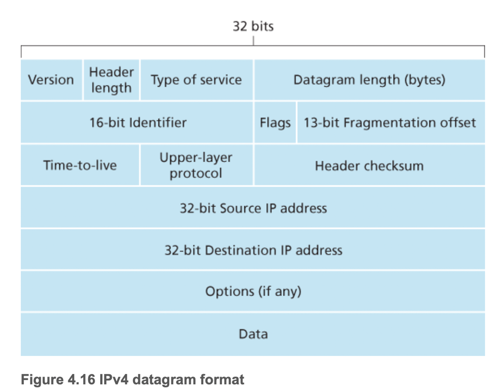
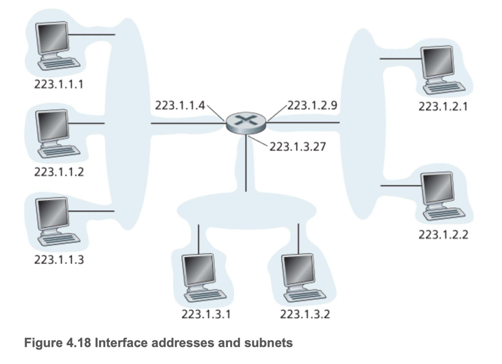
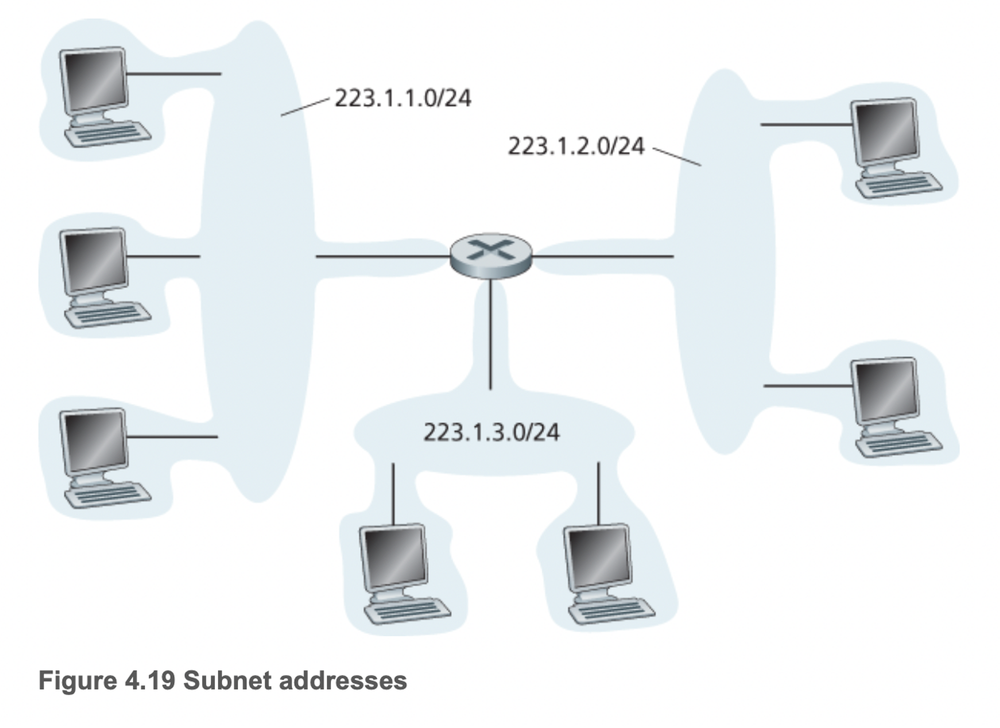
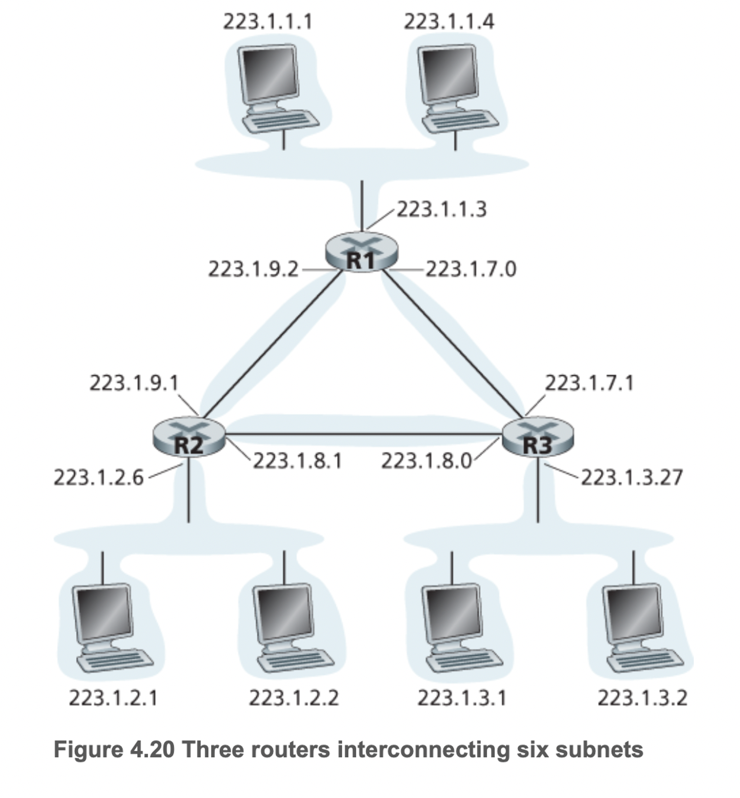
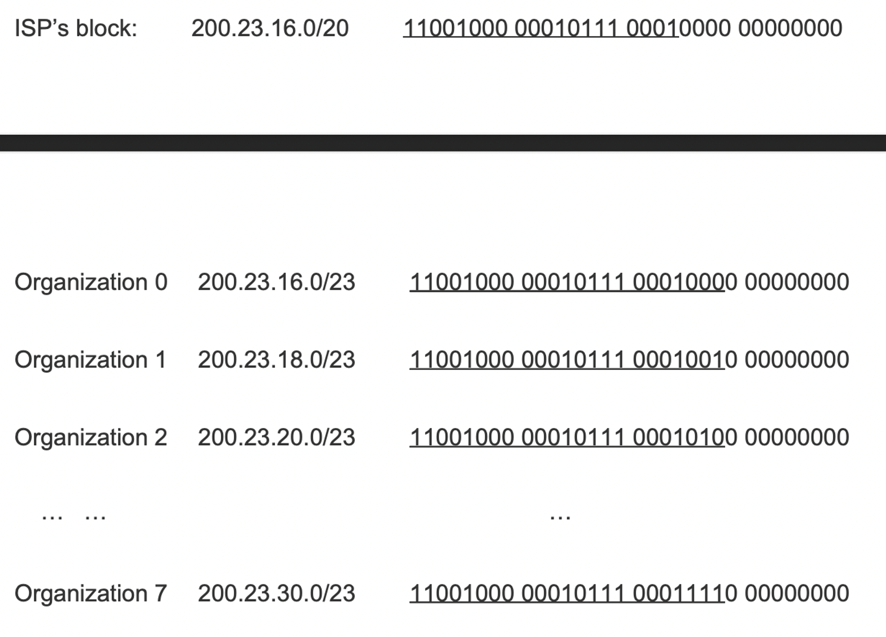
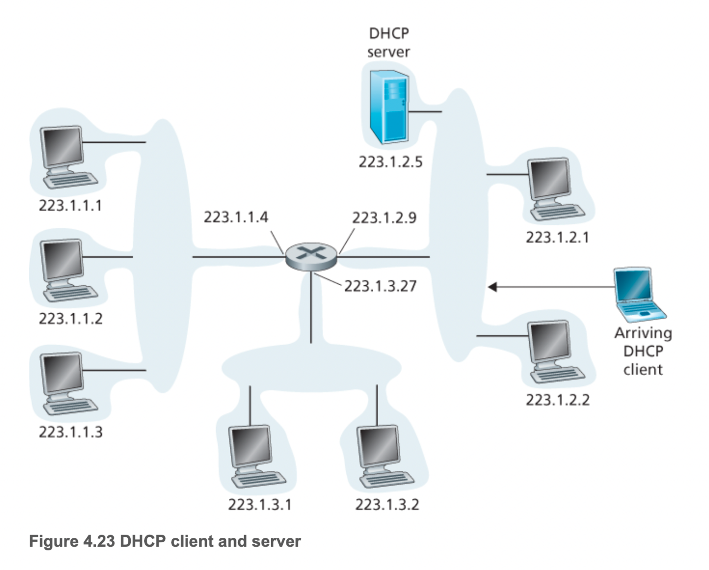
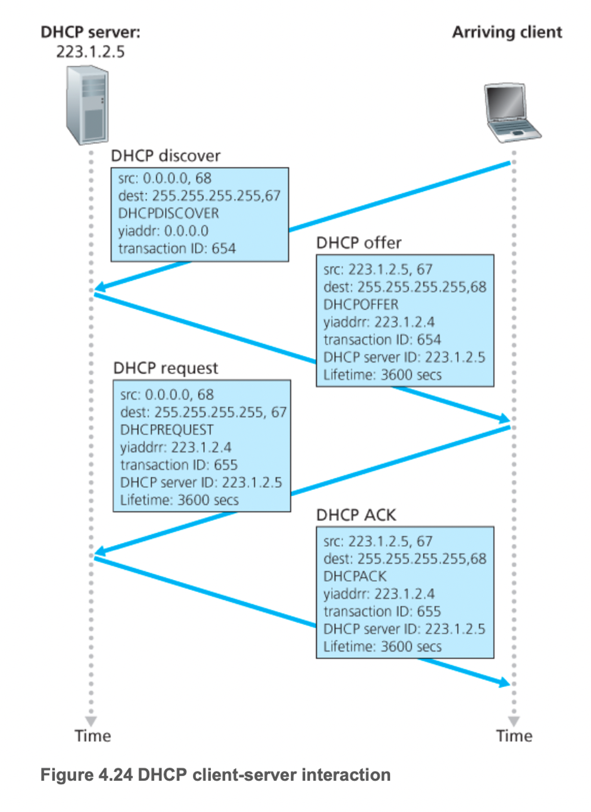
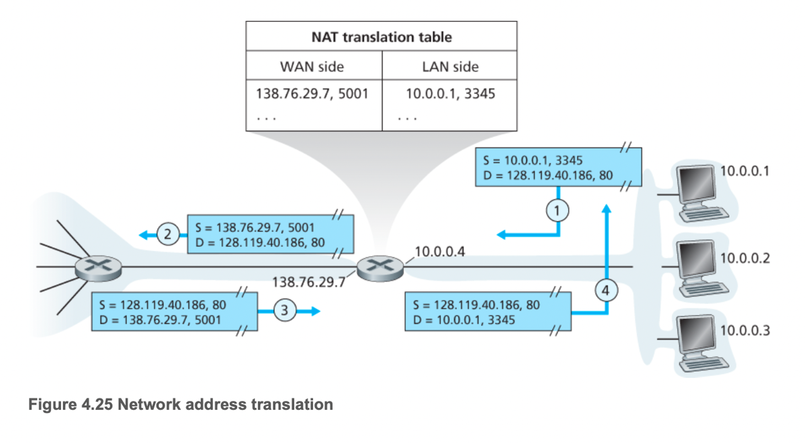
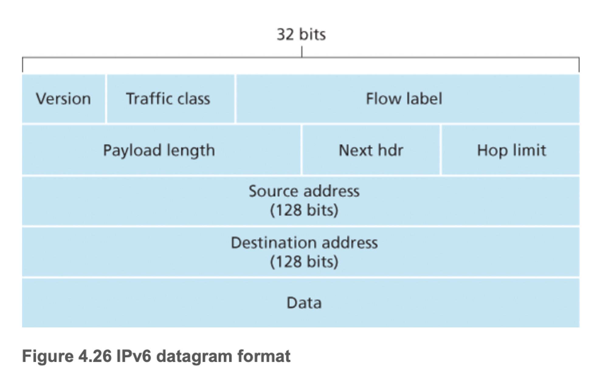
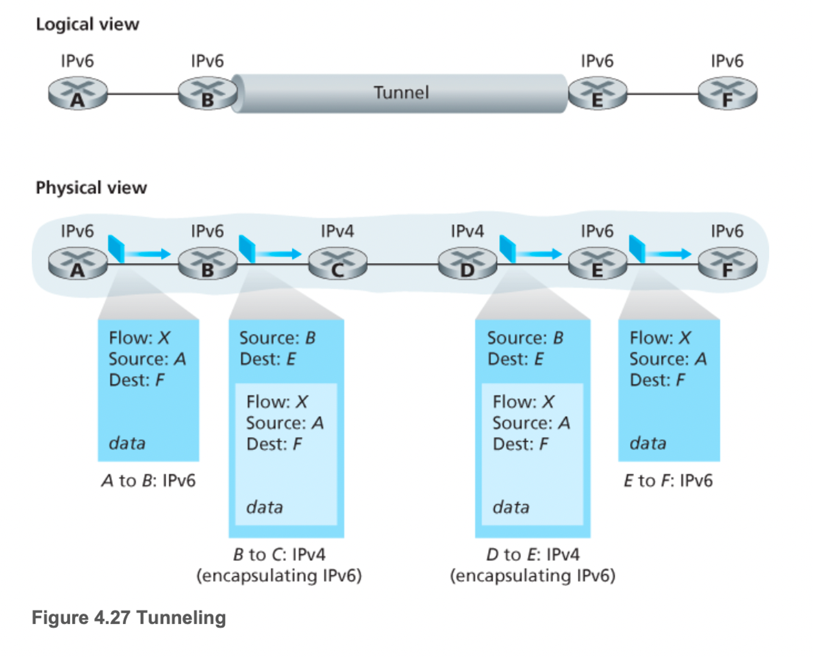

# 4.3 인터넷 프로토콜(IP): IPv2, 주소체계, IPv6 등

## 4.3.1 IPv4 데이터그램 포맷

- 인터넷 네트워크 계층 패킷을 데이터그램이라 부름
- IPv4 데이터그램의 주요 필드는 다음과 같다.
    - 버전 번호
        - 4비트로 데이터그램의 IP 프로토콜 버전을 명시한다. 라우터는 버전 번호를 읽고 데이터그램의 나머지 부분을 어떻게 해석할지 결정한다.
        - IPv4, IPv6
    - 헤더 길이
        - IPv4 데이터그램은 헤더에 가변 길이의 옵션을 포함하므로 이 네 비트로 IP 데이터그램에서 실제 페이로드가 시작하는 곳을 결정
        - 대부분의 IPv4는 옵션을 포함하지 않으므로 대체로 헤더는 20바이트
    - 서비스 타입(TOS)
        - 각기 다른 유형의 IP 데이터그램을 구별한다.
        - 예로는 실시간 데이터그램(IP 전화 통신 애플리케이션)과 비실시간 트래픽(FTP)를 구분
        - 제공될 특정 서비스 레벨은 해당 라우터의 네트워크 관리자가 결정하고 구성
        - TOS 비트 중 2개는 명시적 혼잡 알림에 사용
    - 데이터그램 길이
        - 바이트로 계산한 IP 데이터그램(헤더와 데이터)의 전체 길이
        - 필드의 길이가 16비트이므로 이론상 최대 길이는 65535바이트이지만 1500바이트보다 큰 경우는 거의 없다.
    - 식별자, 플래그, 단편화 오프셋
        - IP 단편화와 관련된 필드
        - 큰 IP 데이터그램이 여러 개의 작은 IP 데이터그램으로 분할된 다음 목적지로 독립적으로 전달되며, 여기서 페이로드 데이터가 최종 호스트의 트랜스포트 계층으로 전달되기 전에 다시 모이게 된다.
        - IPv6는 단편화를 사용하지 않는다.
    - TTL(time-to-live)
        - 네트워크에서 데이터그램이 무한히 순환하지 않도록 한다.
        - 라우터가 데이터그램을 처리할 때마다 감소한다.
        - 0이 되면 라우터가 데이터그램을 폐기한다.
    - 프로토콜
        - IP 데이터그램이 최종 목적지에 도착했을 때만 사용
        - 목적지의 트랜스포트 계층의 특정 프로토콜을 명시
        - 예) TCP는 6, UDP는 17로 표기
        - 프로토콜 번호는 네트워크 계층과 트랜스포트 계층을 묶는 역할을 한다.
    - 헤더 체크섬
        - 라우터가 수신한 IP 데이터그램의 비트 오류를 탐지하는데 도움을 준다.
        - 헤더에서 각 2바이트를 수로 처리하고 이 1의 보수를 합산하여 계산
        - 라우터는 각 수신한 각 IP 데이터그램마다 헤더 체크섬을 계산하고 이 값과 데이터그램 헤더의 체크섬이 다르면 오류 상태임을 감지
        - 라우터는 보통 오류를 검출하면 폐기
        - TTL 필드와 옵션 필드의 값은 변경되므로 체크섬은 각 라우터에서 재계산되고 저장되어야 한다.
        - 그럼 왜 TCP/IP 계층에서 오류 검사를 하는가?
        - 첫째, IP 헤더만 IP 계층에서 체크섬을 수행하지만 TCP/UDP 체크섬은 전체 TCP/UDP 세그먼트를 계산한다.
        - 둘째, TCP/UDP와 IP는 동일한 프로토콜 스택에 속할 필요가 없다.
    - 출발지와 목적지 IP 주소
        - 출발지가 데이터그램을 생성할 때, 자신의 IP 주소를 출발지 IP 주소 필드에 삽입하고 목적지 IP 주소를 목적지 IP 주소 필드에 삽입
        - 2장에서 말한 것처럼 DNS 검색을 통해 목적지 주소 결정을 종종한다.
    - 옵션
        - IP 헤더를 확장
        - 모든 데이터그램 헤더 옵션 필드에 정보를 포함하지 않는 방법으로 오버헤드를 해결하기 위해 헤더 옵션은 거의 사용하지 않는다.
        - 이런 가변 길이 옵션은 데이터 필드 시작점을 초기에 결정할 수 없어 문제를 복잡하게 만들고 IP 데이터그램을 처리하는 데 필요한 시간이 크게 달라져 잘 사용하지 않는다.
    - 데이터(페이로드)
        - 대부분의 경우 IP 데이터그램의 데이터 필드는 목적지에 전달하기 위해 트랜스포트 계층 세그먼트(TCP/UDP)를 포함하지만 ICMP 메시지같은 유형의 데이터를 담기도 한다.

## 4.3.2 IPv4 주소체계

- 호스트는 일반적으로 네트워크와 연결되는 하나의 링크를 갖는다.
- 호스트 IP가 데이터그램을 보낼 때 이 링크를 통해 데이터링크를 보낸다.
- 호스트와 물리적 링크 사이의 경계를 인터페이스라 한다.

라우터의 작업은 한 링크로부터 데이터그램을 수신하여 다른 링크로 전달하는 것이므로 라우터는 2개 이상의 연결된 링크가 필요하다. 라우터와 이런 링크 사이의 경계 또한 인터페이스라 하는데, 각 링크마다 하나의 인터페이스를 갖고 하나의 라우터는 여러 개의 인터페이스를 갖는다. 모든 호스트와 라우터는 IP 데이터이그램을 송수신할 수 있으므로 IP는 각 호스트와 라우터 인터페이스가 IP 주소를 갖도록 요구한다.

**따라서 기술 면에서 IP 주소는 인터페이스를 포함하는 호스트 라우터보다는 인터페이스와 관련이 있다.**

- 각 IP 주소는 32비트 길이
- 따라서 2^32개의 주소를 사용할 수 있다.
- 이 주소는 일반적으로 주소의 각 바이트를 십진수로 표현하고 주소의 다른 바이트와 점(.)으로 구분하는 십진 표기법 사용
- 예) 192.32.216.9 ← 11000001 00100000 11011000 00001001

- 모든 호스트와 라우터의 각 인터페이스는 고유한 IP를 갖는다.
- 인터페이스의 IP 주소 일부는 연결된 ‘서브넷’ 이 결정한다.

- 위 그림에서 3개의 인터페이스를 갖는 하나의 라우터는 7개의 호스트를 연결한다.
- 왼쪽 3개의 호스트와 연결된 인터페이스는 [223.1.1.xxx](http://223.1.1.xxx) 형식의 IP 주소를 갖는다.
- 즉, 동일한 왼쪽 24비트를 사용한다.
- IP 용어로 세 호스트들의 인터페이스들과 하나의 라우터 인터페이스로 연결된 네트워크는 서브넷을 구성한다고 말한다.
- 서브넷에 223.1.1.0/24라는 주소를 할당하는데, 여기서/24는 서브넷 마스크라 부르는데, 32비트 주소의 왼쪽 24비트가 서브넷 주소라는 것을 의미한다.

- 서브넷의 IP 정의는 여러 호스트를 라우터 인터페이스에 연결하는 이더넷 세그먼트만을 의미하는 것은 아님

- 각 라우터는 각 점재점 링크를 위해 2개, 두 호스트를 직접 연결하는 브로드캐스트 링크를 위해 1개, 모두 3개의 인터페이스를 갖는다.
- 여기서 어떤 IP 서브넷이 존재하는가?
- 3개의 서브넷 223.1.1.0/24, 223.1.2.0/24, 223.1.3.0/24는 서브넷 라우터를 연결하는 인터페이스용 서브넷이 포함된 것이다.

> **서브넷을 결정하려면 먼저 호스트나 라우터에서 각 인터페이스를 분리하고 고립된 네트워크를 만든다. 이 고립된 네트워크의 종단점은 인터페이스의 끝이 된다. 이렇게 고립된 네트워크 각각을 서브넷이라 부른다.**
> 

- 인터넷 주소 할당 방식에 CIDR(Classless InterDomain Routing)이라는 것이 있다.
- 서브넷 주소체계로서, 32비트 IP 주소는 두 부분으로 나누고, 이것은 다시 점으로 된 십진수 형태의 a.b.c.d/x를 가지며, 여기서 x는 주소 첫 부분의 비트 수
- 여기서 최상위 비트를 의미하는 x는 IP 주소의 네트워크 부분을 구성
- 이를 해당 주소의 프리픽스 또는 네트워크 프리픽스라고 한다.
- 외부 기관의 라우터에서 내부 기관인 데이터그램을 전달할 때, 단지 앞의 x비트들만을 고려
- 32-x 비트들은 기관 내부에 같은 네트워크 프리픽스를 갖는 모든 장비를 구별

- CIDR가 채택되기 전에는 IP 주소의 네트워크 부분을 8, 16, 24 비트로 제한했고 8, 16, 24 비트 서브넷 주소를 갖는 서브넷을 각각 A, B, C 클래스 네트워크로 분류했기에 이러한 주소체계를 클래스 주소체계로 부름.
- 이 체계의 문제점(?)은 A 클래스의 경우 정말 적은 호스트들만을 제공(254), B클래스는 너무 큰(65634) 호스트를 제공한다. 그렇기에 2000개의 호스트만 필요하다 할지라도 B클래스를 받으면 나머지는 사용하지 않게된다.

- IP 주소의 또 다른 형태인 브로드캐스트 주소 255.255.255.255가 있다.
- 해당 주소로 데이터그램을 보내면 서브넷에 있는 모든 호스트에게 전달된다.

### 주소 블록 획득

- 기관의 서브넷에서 사용하기 위한 IP 주소 블록을 얻기 위해, 네트워크 관리자는 먼저 이미 할당받은 주소의 큰 블록에서 주소를 제공하는 ISP와 접촉해야 한다.

- 다음과 같이 ISP는 주소 블록 200.23.30.0/20을 할당 받았다고 하자
- 그럼 ISP는 이 주소 블록을 작은 9개로 나누고 이것으로 8개의 조직을 지원할 수 있다.
- IP 주소 공간을 관리하고 ISP와 다른 조직에 주소 블록을 할당하는 최상위 국제 기관이 존재하나?
- IP 주소는 ICANN을 기반으로 관리
- ICANN의 역할은 IP 주소 할당과 DNS 루트 서버 관리

### 호스트 주소 획득: 동적 호스트 구성 프로토콜

- 한 기관은 ISP로부터 주소 블록을 획득하여, 개별 IP 주소를 기관 내부의 호스트와 라우터 인터페이스에 할당한다.
- 라우터 인터페이스 주소에 대해, 시스템 관리자는 라우터 안에 IP 주소를 할당한다.
- 호스트에 IP 주소를 할당하는 것은 수동으로 구성이 가능하지만 일반적으로 동적 호스트 구성 프로토콜(DHCP)을 더 많이 사용
- 네트워크 관리자는 해당 호스트가 네트워크에 접속하고자 할 때마다 동일한 IP 주소를 받도록 하거나, 다른 임시 IP 주소를 할당하도록 DHCP를 설정
- DHCP는 호스트 IP 주소의 할당뿐만 아니라, 서브넷 마스크, 첫 번째 홉 라우터 주소나 로컬 DNS 서버 주소 같은 추가 정보를 얻게 해준다.
- 이러한 자동으로 호스트 연결해주는 능력 때문에 플러그 앤 플레이 프로토콜 또는 제로 구성 프로토콜이라고도 한다.
- DHCP는 클라이언트-서버 프로토콜이다.
- 클라이언트는 일반적으로 IP 주소를 포함하며 네트워크 설정을 위한 정보를 얻고자 새롭게 도착한 호스트다.

- 위와 같은 경우 서브넷은 DHCP 서버를 가질 것이다.
- 만약 서버가 현재 서브넷에 없다면, 해당 네트워크에 대한 DHCP 서버 주소를 알려줄 DHCP 연결 에이전트가 필요하다.

- 위 그림은 새로운 호스트가 도착할 경우, 네트워크상에서 수행될 DHCP 프로토콜 4단계의 과정을 보여준다.
    - DHCP 서버 발견: DHCP 발견 메시지를 사용하여 수행되며, 클라이언트는 포트 67번으로 UDP 패킷을 보낸다. UDP 패킷은 IP 데이터 그램으로 캡슐화. 이 데이터그램을 이 메시지 내의 목적지 IP 주소를 브로드캐스트하여 보낸다.(출발지는 0.0.0.0, 목적지 255.255.255.255)
    - DHCP 서버 제공: DHCP 메시지를 받고 DHCP 제공 메시지를 클라이언트로 응답. 이때에도 IP 브로드캐스트 주소를 사용하여 모든 노드로 이 메시지를 보낸다. 서브넷에는 여러 DHCP 서버가 존재하기에 클라이언트는 가장 최적의 위치에 DHCP 서버를 선택한다. 각각의 서버 제공 메시지는 수신된 발견 메시지의 트랜잭션 ID, 클라이언트에 제공된 IP 주소, 네트워크 마스트, IP 주소 임대 기간을 포함
    - DHCP 요청: 클라이언트는 하나 또는 그 이상의 서버 제공자 중에서 선택하고 제공자에게 DHCP 요청 메시지로 응답
    - DHCP ACK: 서버는 DHCP 요청 메시지에 대해 요청된 파라미터를 확인하는 DHCP ACK 메시지로 응답
- 최종적으로 임대 기간 동안 IP를 사용할 수 있으며, 임대 기간 만료 후에도 이 주소를 사용하고 싶으면 클라이언트가 IP 주소 임대를 갱신할 수 있는 메커니즘을 제공한다.
- DHCP의 큰 결점은 노드가 새로운 서브넷에 연결하고자 할 때마다 새로운 IP 주소를 DHCP로부터 얻기 때문에, 이동 노드가 서브넷 사이를 이동할 때 원격 애플리케이션에 대한 TCP 연결을 유지할 수 없다.

## 4.3.3 네트워크 주소 변환(NAT)

- 모든 IP 활용 장치에는 IP 주소가 필요하다.
- 만약 이미 인접한 부분을 할당했거나 홈 네트워크 소유자가 IP 주소가 어떻게 관리되는지 알고자 한다면?

- 위 그림은 NAT 가능 라우터의 운영을 보여줌
- NAT 가능 라우터는 오른쪽처럼 홈 네트워크의 일부인 인터페이스를 갖는다.
- 홈 네트워크의 4개 인터페이스 모두 10.0.0.0/24를 갖는다.
- 주소 공간 10.0.0.0/8은 사설망 또는 사설 개인 주소를 갖는 권역을 위해 예약된 IP 주소 공간 세 부분 중의 하나다.
- 사설 주소를 갖는 권역이란 네트워크 주소들이 그 네트워크의 내부에 있는 장비에게만 의미가 있는 그런 네트워크를 의미한다.
- 홈 네트워크의 내부 장비는 10.0.0.0/24 주소 체계를 갖지만 홈 네트워크를 벗어나 글로벌 인터넷으로 가는 패킷 전달은 이 주소들을 사용할 수 없다.
- 왜냐면 이 주소들의 블록을 사용하는 수십만 개의 네트워크가 있기 때문. 즉 홈 네트워크 내에서만 의미가 있다. 이걸 NAT이 해결 해줌
- NAT 가능 라우터는 외부 세계로는 라우터처럼 보이지 않음
- 대신 NAT 라우터는 외부 세계로는 하나의 IP 주소를 갖는 하나의 장비로 동작한다.
- 위의 그림을 보면 해당 홈으로 들어오는 트래픽은 목적지 주소 138.75.29.7을 가져야한다.
- NAT은 홈 네트워크의 세부 사항을 숨긴다.
- 그럼 어떻게 홈 네트워크 컴퓨터가 어디에서 주소를 얻고 라우터가 한 IP를 어디에서 얻는가? → DHCP!

- 그럼 어떻게 데이터그램을 전달하는 내부 호스트를 알 수 있을까? → NAT 변환 테이블
- 한 피어가 NAT 서버 뒤에 있고 DHCP 제공 NAT 주소가 있는 다른 피어에 어떻게 연결할 수 있을까? → NAT 순회 도구

## 4.3.4 IPv6

- IPv4의 고갈을 대비하여 IPv6를 개발

### IPv6 데이터그램 포맷

- 확장된 주소 기능
    - IPv6는 IP 주소 크기를 32비트에서 128비트로 확장했으므로 IP 주소가 고갈되는 일은 발생하지 않을 것이다.
    - IPv6는 유니캐스트, 멀티캐스트 주소뿐만 아니라 새로운 주소 형태인 애니캐스트 주소가 도입되었다.
    - 애니캐스트 주소로 명시된 데이터그램은 호스트 그룹의 어떤 이에게든 전달될 수 있다.
- 간소화된 40바이트 헤더
    - IPv4의 많은 필드가 생략되거나 옵션으로 남음
    - 40바이트 고정 길이 헤더는 라우터 IP 데이터그램을 더 빨리 처리하게 해준다.
- 흐름 레이블링
    - IPv6는 정의하기 어려운 흐름을 갖고 있다.
    - “비 디폴트 품질 서비스나 실시간 서비스 같은 특별한 처리를 요청하는 송신자에 대해 특정 흐름에 속하는 패킷 레이블링”

- 버전
    - IP 버전 번호를 인식
    - IPv6의 필드 값은 6
- 트래픽 클래스
    - IPv4의 TOS 필드와 비슷한 의미
    - 흐름 내의 SMTP 이메일 같은 애플리케이션의 데이터그램보다 VoIP 같은 특정 애플리케이션 데이터그램에 우선순위를 부여하는 데 사용
- 흐름 레이블
    - 데이터그램의 흐름을 인식하는데 사용
- 페이로드 길이
    - 데이터그램에서 고정 길이 40바이트 패킷 헤더 뒤에 나오는 바이트 길이이며, 부호 없는 정수
- 다음 헤더
    - 데이터그램의 내용이 전달될 프로토콜을 구분(TCP, UDP)
- 홉 제한
    - 데이터그램을 전달할 때마다 1씩 감소
    - 제한 수가 0보다 작아지면 라우터는 데이터그램을 버려야 한다.
- 출발지와 목적지 주소
- 데이터
    - 데이터그램의 페이로드 부분

그럼 IPv4에서는 존재했으나 IPv6에서는 사라진 필드는 무엇이 있을까?

- 단편화/재결합
    - IPv6에서는 단편화와 재결합을 출발지와 목적지만이 수행한다.
    - 라우터가 처리하기에는 데이터그램이 너무 크다
    - 그렇기에 라우터는 패킷이 너무 크면 ‘너무 크다’라는 ICMP 오류 메시지를 송신자에게 보낸다.
- 헤더 체크섬
    - 트랜스포트 계층 프로토콜과 데이터 링크 프로토콜은 체크섬을 수행하므로 IP 설계자는 네트워크 계층의 체크섬이 반복되는 것으로 판단하여 생략
- 옵션
    - 완전히 사라진 것은 아니고 IPv6 헤더에서 ‘다음 헤더’ 중 하나가 될 수 있다.

### IPv4에서 IPv6로의 전환

- 이미 IPv4로 구축된 시스템은 IPv6 데이터그램을 처리할 수 없다
- 이를 해결하기 위해 여러 방법이 존재

플래그 데이를 선언하는 방법

- 모든 인터넷 장비를 끄고 IPv4에서 IPv6로 업그레이드하는 시간과 날짜를 정하는 것
- 수억 개의 장비가 관련된 플래그 데이는 사실상 불가능함.

터널링

- 두 IPv6 노드가 IPv6 데이터그램을 사용해서 작동한다고 가정
- 물론 이들은 IPv4 라우터를 통해 연결되어 있다.

- 위 그림처럼 두 IPv6 사이에 있는 IPv4 라우터들을 터널이라고 한다.
- 터널의 송신 측에 있는 IPv6 노드는 IPv6 데이터그램을 받고 IPv4 데이터그램의 데이터 필드에 이것을 넣는다.
- 이 IPv4 데이터그램에 목적지 주소를 터널의 수신 측에 IPv6 노드로 적어서 터널의 첫 번째 노드에 보낸다.
- 터널 내부에 있는 IPv4 라우터는 IPv4 데이터그램이 IPv6 데이터그램을 갖고 있다는 사실을 모른 채 다른 데이터그램을 처리하는 방식으로 처리
- 터널 수신 측에서는 IPv4 데이터그램이 실제 IPv6 데이터그램임을 결정(프로토콜 포트 번호가 41)