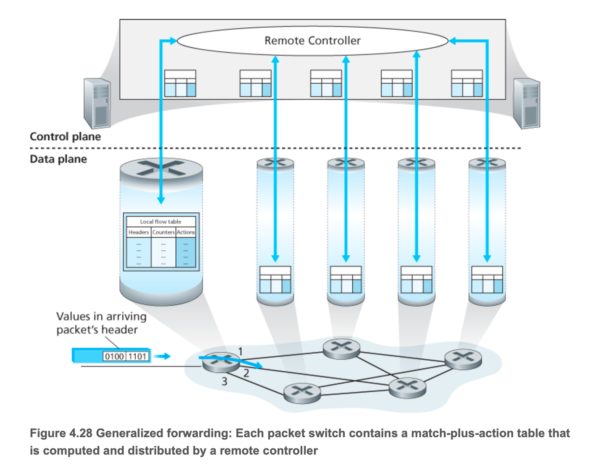
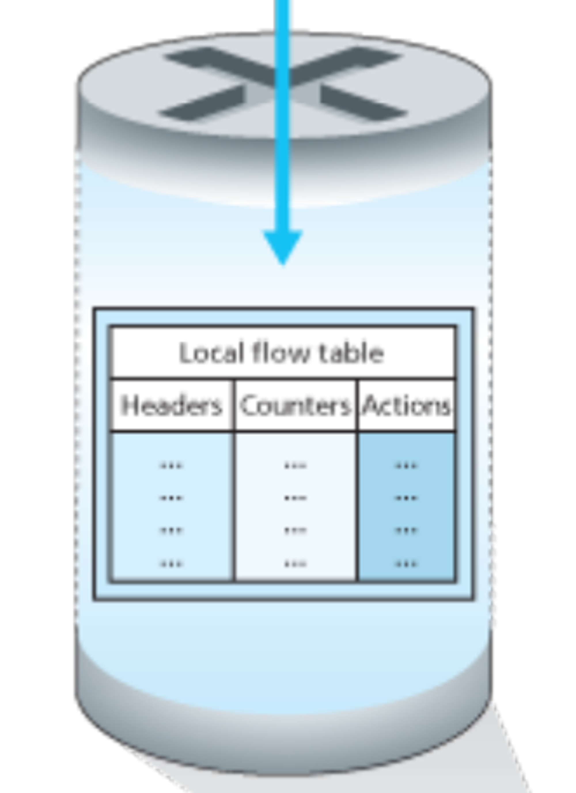
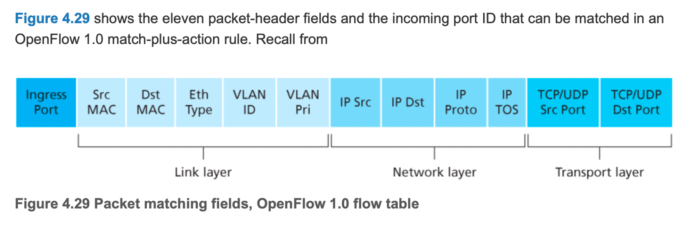
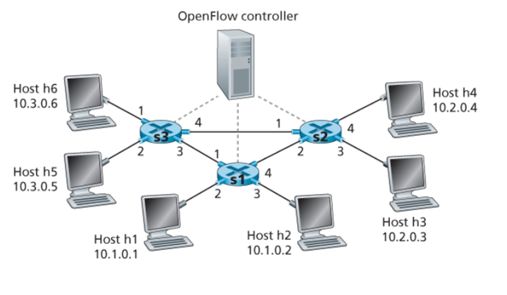
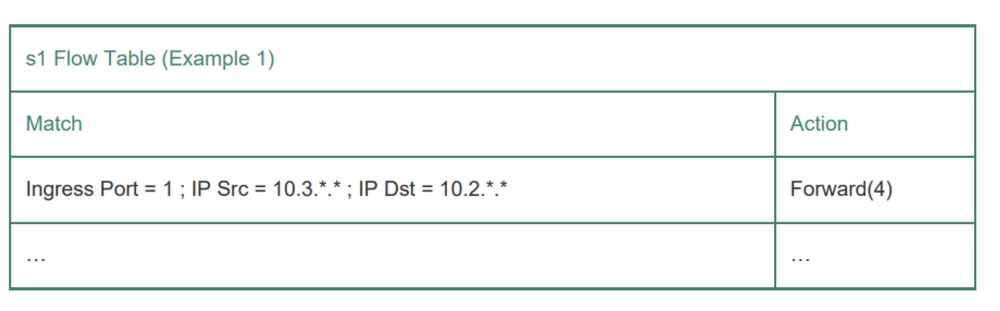
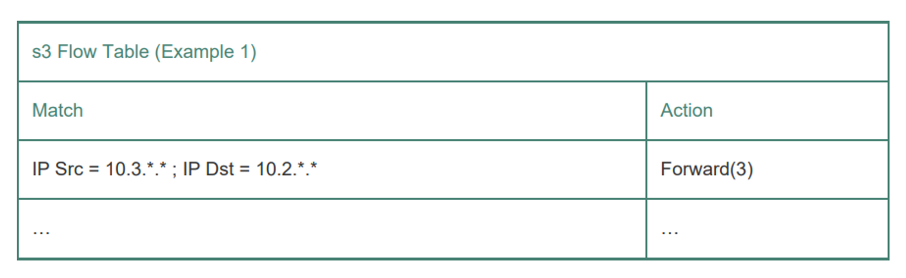
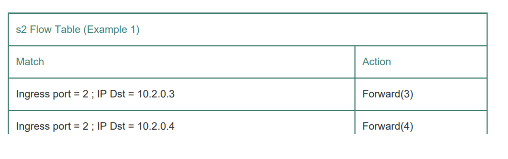
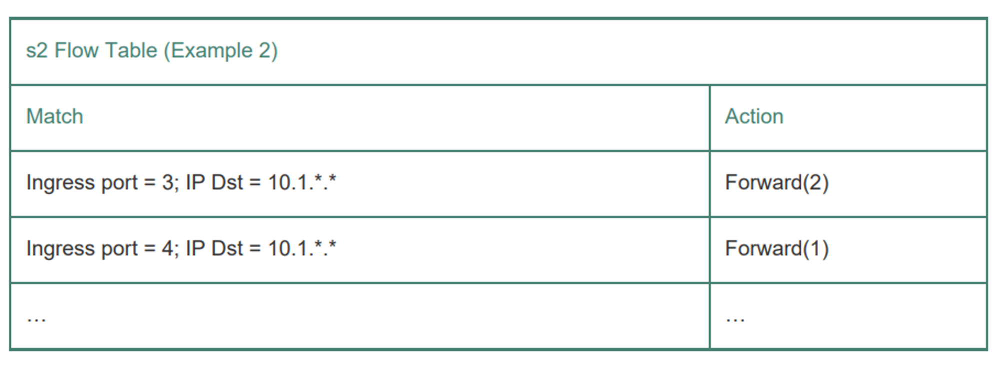
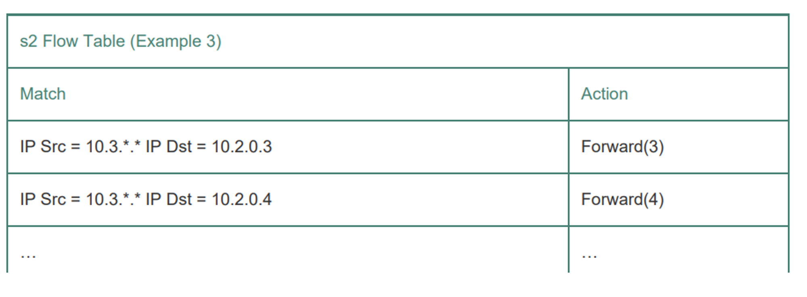

# 4.4 일반화된 포워딩 및 소프트웨어 기반 네트워크(SDN)

- 매치 플러스 액션(Match-Plus-Action)은 네트워크 패킷 처리의 한 방식으로, 주로 소프트웨어 정의 네트워킹(SDN)에서 사용되는 개념
- 프로토콜 스택의 다른 계층에서 서로 다른 프로토콜과 관련된 여러 헤더 필드에 대해 ‘매치’를 수행할 수 있는 일반적인 ‘매치 플러스 액션’ 방법을 생각해보자
- ‘액션’은 하나 이상의 출력 포트(목적지 기반 포워딩과 같이)로 패킷을 전달하고, 인터페이스에서 나가는 패킷을 로드 밸런싱하고 헤더값을 다시 쓰고, 의도적으로 패킷을 차단/삭제(방화벽과 같이) 및 추가 처리 작업을 위해 특수 서버로 패킷을 보내는 등의 작업을 수행

- 위 그림은 패킷 스위치의 ‘매치 플러스 액션’ 테이블을 보여주며 테이블은 원격 컨트롤러를 통해 계산, 설치, 갱신된다.
- 개별 패킷 스위치의 제어 구성요소가 서로 상호작용할 수는 있지만 실제로는 일반화된 ‘매치 플러스 액션’ 기능이 원격 컨트롤러를 통해 구현되고 이 테이블을 계산, 설치, 갱신
- 일반화된 포워딩에 대한 논의는 OpenFlow 기반이고, ‘매치 플러스 액션’ 포워딩의 개념화 및 컨트롤러 그리고 SDN 개념의 가시적인 표준
- OpenFlow의 플로우 테이블로 알려진 ‘매치 플러스 액션’ 포워딩 테이블의 각 엔트리는 다음을 포함
    - (매치 필드) 들어오는 패킷에 대한 헤더들의 세트가 매치될 것이다. 목적지 기반 포워딩의 경우와 마찬가지로, 하드웨어 기반 매치는 TCAM 메모리에서 가장 신속하게 수행되며, 백만 개가 넘는 주소를 동반. 플로우 테이블 엔트리와 매치되지 않은 패킷은 더 많은 처리를 위해 원격 컨트롤러로 전송될 수 있다.
    - (카운터) 패킷들에 의해 갱신되는 카운터 세트는 플로우 테이블 엔트리들과 매치. 카운터는 플로우 테이블 엔트리와 마지막으로 갱신된 테이블 엔트리 이후에 매치된 다수의 패킷을 포함
        - 매치된 패킷의 수, 바이트 수 등을 추적
        - 트래픽 모니터링하는데 사용. 특정 플로우 엔트리가 얼마나 자주 사용되는지 알 수 있음
    - (액션) 패킷이 플로우 테이블 엔트리와 매치될 때 여러 가지 액션이 가능해진다. 이러한 액션은 패킷을 지정된 출력 포트로 전달하고, 패킷을 삭제하고, 패킷의 복사본을 만들어 여러 출력 포트로 보내거나 선택한 헤더 필드를 다시 쓰는 것
        - 포워딩(출력 포트로 전달), 드롭(패킷을 삭제), 멀티캐스트(패킷의 복사본을 만들어 여러 출력 포트로 보낸다.), 헤더 재작성(선택된 헤더 필드를 다시 쓴다. mac주소 변경, ip 주소 변경)

## 4.4.1 매치

- OpenFlow 1.0 ‘매치 플러스 액션’ 규칙에서 매치될 수 있는 11개의 패킷 헤더 필드와 수신 포트 ID
- 패킷 스위치에 도달하는 링크 계층 프레임은 페이로드로 네트워크 계층 데이터그램을 포함하며, 트랜스포트 계층 세그먼트를 포함
- OpenFlow의 매치 개념은 프로토콜 헤더의 세 계층에서 선택된 필드에 매치되도록 허용
- 그렇기에 1.5절에서 말한 계층화 원칙을 무시
    - OpenFlow의 매치 개념은 네트워크의 세 계층(L2, L3, L4)에서 선택된 필드를 사용하여 매칭을 허용
    - 그럼 어떻게 한 번에 저걸 다 까봐? 분명 클라이언트가 서버로 보낼 때는 계층적으로 캡슐화하여 보낼텐데?
    - 그것은 바로 OpenFlow 스위치에서 패킷 캡처를 통해 패킷을 수신하고 헤더 추출에서 각 계층의 헤더를 동시에 확인하기 때문
    - 기존의 계층적 캡슐화를 통해 각 계층 별 처리를 하였던 것을 한 번에 사용하여 처리
- IP 주소가 아닌 이더넷 주소를 기반으로 전달함으로써 OpenFlow 지원 장치가 스위치 포워딩 프레임뿐만 아니라 라우터 포워딩 데이터그램과 동일한 성능을 발휘
    - 이게 의미하는 바는 OpenFlow 스위치는 전통적인 스위치처럼 이더넷 주소 즉, mac 주소로 패킷을 포워딩 할 수 있을 뿐만 아니라, 라우터처럼 IP 주소를 기반으로 데이터그램을 포워딩 할 수 있다는 의미이다.
- 진입 포트는 패킷이 수신되는 패킷 스위치의 입력 포트
- 패킷의 IP 출발지 주소, IP 목적지 주소, IP 프로토콜 필드, IP 서비스 타입 필드는 4.3.1에서 알아보았다.
- 플로우 테이블 엔트리에는 와일드카드도 있을 수 있음
    - 예를 들어 128.119.*.* IP 주소는 128.119를 주소의 첫 번째 16비트로 갖는 데이터그램의 해당 주소 필드와 매치된다.
    - 각 플로우 테이블 엔트리에는 관련 우선순위가 존재
    - 패킷이 여러 테이블 엔트리와 매치되면, 선별된 매치 엔트리에 해당하는 패킷이 엔트릐의 가장 높은 우선순위가 된다.
- IP 헤더의 모든 필드가 매치될 수 있는 것은 아니다.
    - 예를 들어 OpenFlow는 TTL 필드 또는 데이터그램 길이 필드에 기반한 매치를 허용하지 않는다.
    - 매치 되는 것이 있고 아닌 것이 존재

> 한 번에 한 가지 일을 하고, 잘하라. 인터페이스는 추상화의 최소 필수 요소를 차지한다. 일반화 하지 마라. 일반화는 일반적으로 잘못되었다.
> 

### OpenFlow 1.0에서 매치할 수 있는 필드

### 이더넷 (Ethernet) 필드:

1. **Ingress Port (수신 포트 ID)**: 패킷이 스위치에 들어온 포트
2. **Ethernet Source Address (이더넷 소스 주소)**: 패킷의 소스 MAC 주소
3. **Ethernet Destination Address (이더넷 목적지 주소)**: 패킷의 목적지 MAC 주소
4. **Ethernet Type (이더넷 타입)**: 이더넷 프레임의 타입 필드
5. **VLAN ID (VLAN 식별자)**: VLAN 태그 ID
6. **VLAN Priority (VLAN 우선순위)**: VLAN 태그 우선순위

### IPv4 필드:

1. **IP Source Address (IP 소스 주소)**: 패킷의 소스 IP 주소
2. **IP Destination Address (IP 목적지 주소)**: 패킷의 목적지 IP 주소
3. **IP Protocol (IP 프로토콜)**: IP 프로토콜 번호 (예: TCP, UDP)
4. **Type of Service (ToS) bits (IP ToS 필드)**: IP 헤더의 ToS(DSCP) 필드

### 트랜스포트 (Transport) 필드:

1. **TCP/UDP Source Port (TCP/UDP 소스 포트)**: TCP/UDP 소스 포트 번호
2. **TCP/UDP Destination Port (TCP/UDP 목적지 포트)**: TCP/UDP 목적지 포트 번호

### 매치할 수 없는 필드

1. **TTL (Time to Live) 필드**: IP 패킷의 생존 시간을 나타내는 필드
2. **데이터그램 길이 필드**: IP 헤더의 총 데이터그램 길이를 나타내는 필드
3. **프래그먼트 오프셋**: IP 패킷이 프래그먼트된 경우, 각 조각의 위치를 나타내는 필드
4. **플래그 필드**: IP 헤더의 플래그 (예: 더 이상 프래그먼트 금지(Don't Fragment), 마지막 프래그먼트(More Fragments))

## 4.4.2 액션

- 각 플로우 테이블 엔트리는 플로우 테이블 엔트리와 매치되는 패킷 처리를 결정하는 0개 이상의 액션 목록을 갖고 있다.
- 여러 액션이 있는 경우 목록에 지정된 순서대로 수행
- 포워딩
    - 들어오는 패킷은 특정 실제 출력 포트로 전달되거나 모든 포트를 통해 브로드캐스트되거나 선택된 포트 세트를 통해 멀티캐스트될 수 있다.
    - 패킷은 캡슐화되어 원격 컨트롤러로 전송 가능(패킷이 플로우 테이블 엔트리와 매치되지 않거나 특별한 처리가 필요한 경우)
    - 그럼 컨트롤러는 새 플로우 테이블 엔트리 설치하고 갱신된 플로우 테이블 규칙에 따라 포워딩을 위해 패킷을 장치로 반환
- 삭제
    - 아무 액션이 없는 플로우 테이블 엔트리는 매치된 패킷을 삭제해야함
- 필드 수정
    - 패킷이 선택된 출력 포트로 전달되기 전에 10개의 패킷 헤더 필드의 값을 다시 쓸 수 있다.

## 4.4.3 매치 플러스 액션 작업의 OpenFlow 예

- 네트워크에 6개의 호스트가 있으며 각각 4개의 로컬 인터페이스가 있다.
- 패킷 스위치는 s1, s2, s3

### 첫 번째 예: 간단한 포워딩

- h3 또는 h4로 예정된 h5 또는 h6의 패킷이 s3에서 s1으로 전달된 다음 s1에서 s2로 전달된다고 가정
- 그럼 s1의 테이블 엔트리는 다음과 같다.

- s3에 플로우 테이블 엔트리가 필요하므로 h5 또는 h6에서 전소오딘 데이터그램은 인터페이스 3을 통해 s1로 전달

- s1에서 도착한 데이터그램을 호스트 h3 또는 h4로 전달할 수 있도록 s2에 플로우 테이블 엔트리가 필요

### 두 번째 예: 로드 밸린싱

- h3에서 10.1.*.*로 향하는 데이터그램이 s2와 s1 사이의 링크를 통해 전달되는 반면, h4에서 10.1.*.*로의 데이터그램은 s2와 s3 사이의 링크를 통해 전달되는 로드 밸런싱 시나리오를 고려
- 이 동작은 ip의 목적지 기반 포워딩으로 수행될 수 없다.

- s2에서 수신한 데이터그램을 h1 또는 h2로 전달하려면 s1에서 플로우 테이블 엔트리가 필요하다.
- 인터페이스 4에서 수신한 데이터그램을 s2에서 인터페이스 3을 통해 s1로 전달하려면 s3에서 플로우 테이블 엔트리가 필요하다.

### 세 번째 예: 방화벽

- s2가 s3에 연결된 호스트에서 보낸 트래픽만 수신하려고 하는 방화벽 시나리오

- s2의 플로우 테이블에 다른 엔트리가 없으면 10.3.*.*의 트래픽만 s2에 연결된 호스트로 전달
- 위에서 매치되는게 없다면 컨트롤러로 요청을 보내어 엔트리를 추가한다고 하였다.
- 그럼 여기서는?
- 컨트롤러에 요청하는 것이 아니라 이 트래픽은 거부가 된다. 즉, 네트워크 관리자의 명시적 정책에 따라 달라질 수 있다.